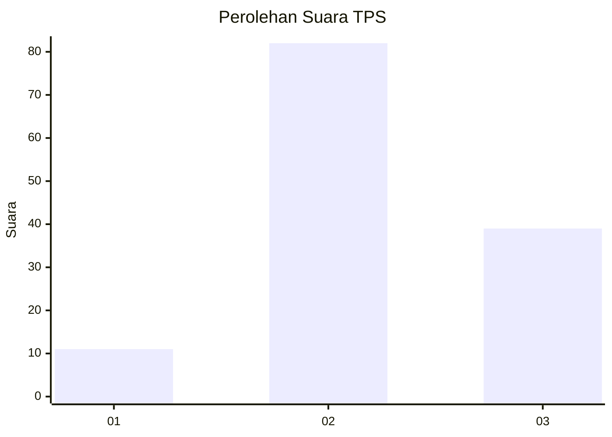
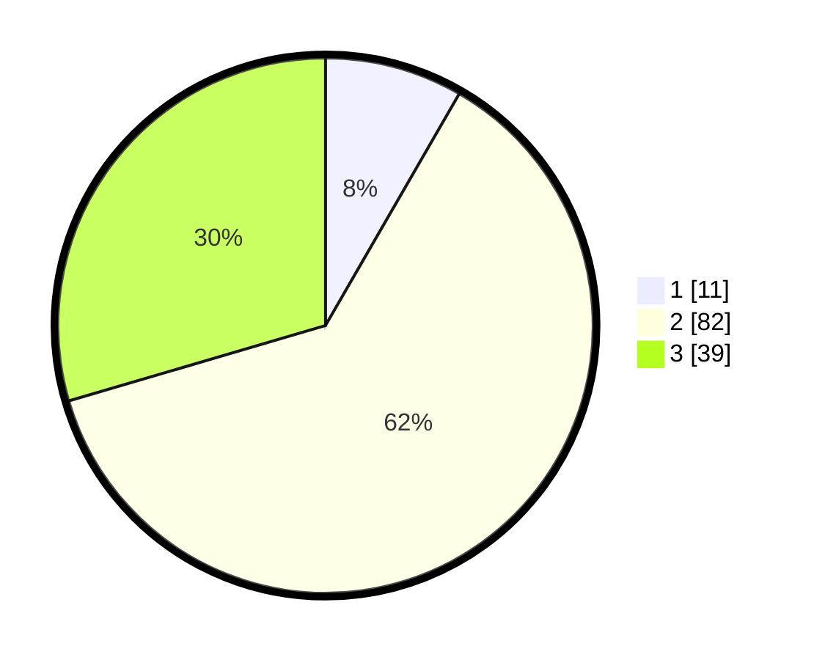

# Hasil

## Grafik

## Tabel

| No. | Nama Paslon    | Suara | Suara (raw) | Persentase |
|:--- |:-------------- | -----:| -----------:| ----------:|
| 1   | ANIES MUHAIMIN | 11    | [11][p-1]   | 8,33       |
| 2   | PRABOWO GIBRAN | 82    | [82][p-2]   | 62,12      |
| 3   | GANJAR MAHFUD  | 39    | [39][p-3]   | 29,55      |

[p-1]: https://github.com/gigit-pemilu/pemilu-2024-33-jawa-tengah/blob/main/pilpres/hitung-suara/sub/33-jawa-tengah/sub/06-purworejo/sub/11-pituruh/sub/2011-gumawangrejo/sub/001-tps/sub/paslon-1.txt
[p-2]: https://github.com/gigit-pemilu/pemilu-2024-33-jawa-tengah/blob/main/pilpres/hitung-suara/sub/33-jawa-tengah/sub/06-purworejo/sub/11-pituruh/sub/2011-gumawangrejo/sub/001-tps/sub/paslon-2.txt
[p-3]: https://github.com/gigit-pemilu/pemilu-2024-33-jawa-tengah/blob/main/pilpres/hitung-suara/sub/33-jawa-tengah/sub/06-purworejo/sub/11-pituruh/sub/2011-gumawangrejo/sub/001-tps/sub/paslon-3.txt

## Foto C Plano

https://sirekap-obj-formc.kpu.go.id/7955/pemilu/ppwp/33/06/11/20/11/3306112011001-20240215-010719--2658200c-c351-40ca-8a05-e5f2e1595e8e.jpg

https://sirekap-obj-formc.kpu.go.id/7955/pemilu/ppwp/33/06/11/20/11/3306112011001-20240215-012303--9a9a4dcc-9e8c-427e-b51a-1763a0e1c340.jpg

https://sirekap-obj-formc.kpu.go.id/7955/pemilu/ppwp/33/06/11/20/11/3306112011001-20240215-014456--2319aa9b-eeb7-4eab-87f7-fa7298ab5c34.jpg

## Metadata

| Key        | Value               |
| ---------- | ------------------- |
| Time Stamp | 2024-02-15 16:00:26 |

