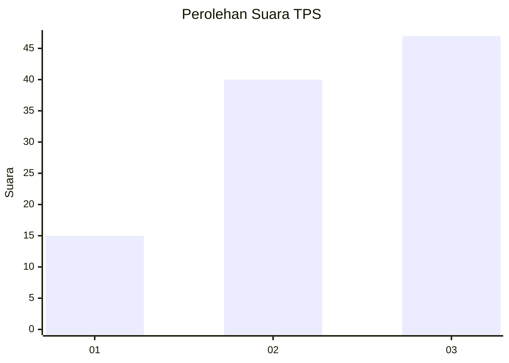
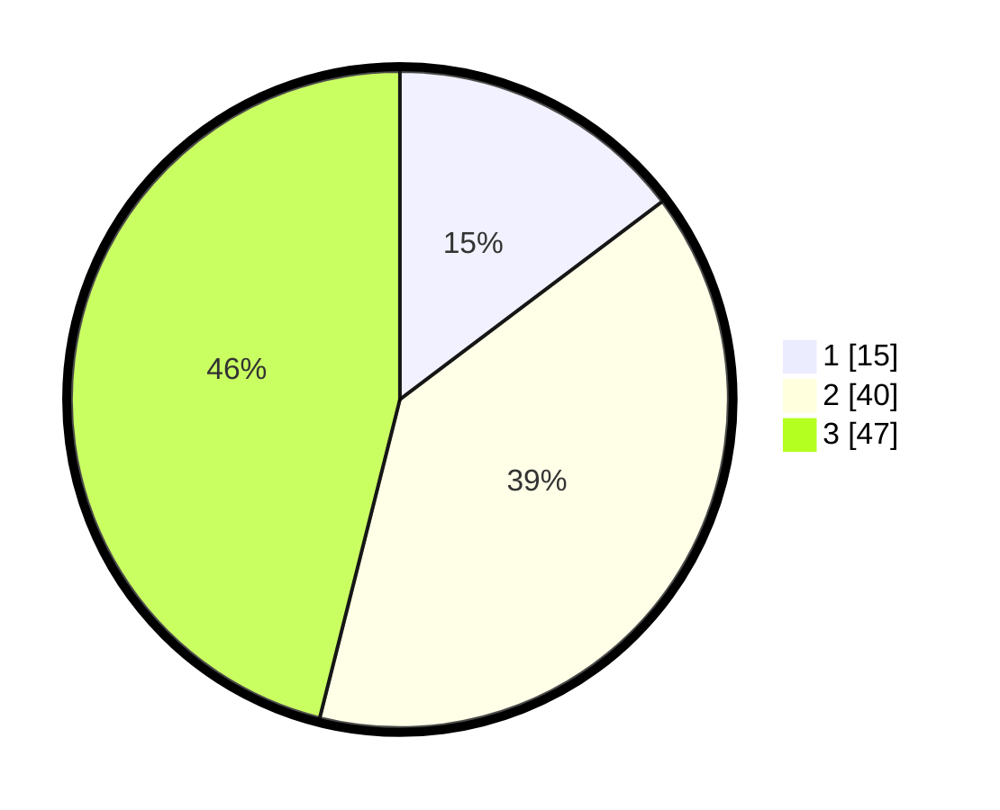

# Hasil

## Grafik

## Tabel

| No. | Nama Paslon    | Suara | Suara (raw) | Persentase |
|:--- |:-------------- | -----:| -----------:| ----------:|
| 1   | ANIES MUHAIMIN | 15    | [15][p-1]   | 14,71      |
| 2   | PRABOWO GIBRAN | 40    | [40][p-2]   | 39,22      |
| 3   | GANJAR MAHFUD  | 47    | [47][p-3]   | 46,08      |

[p-1]: https://github.com/gigit-pemilu/pemilu-2024-33-jawa-tengah/blob/main/pilpres/hitung-suara/sub/33-jawa-tengah/sub/06-purworejo/sub/11-pituruh/sub/2013-wonoyoso/sub/001-tps/sub/paslon-1.txt
[p-2]: https://github.com/gigit-pemilu/pemilu-2024-33-jawa-tengah/blob/main/pilpres/hitung-suara/sub/33-jawa-tengah/sub/06-purworejo/sub/11-pituruh/sub/2013-wonoyoso/sub/001-tps/sub/paslon-2.txt
[p-3]: https://github.com/gigit-pemilu/pemilu-2024-33-jawa-tengah/blob/main/pilpres/hitung-suara/sub/33-jawa-tengah/sub/06-purworejo/sub/11-pituruh/sub/2013-wonoyoso/sub/001-tps/sub/paslon-3.txt

## Foto C Plano

https://sirekap-obj-formc.kpu.go.id/6f1b/pemilu/ppwp/33/06/11/20/13/3306112013001-20240215-003559--a63a18d9-b815-4949-ba4f-113f1b8d3839.jpg

https://sirekap-obj-formc.kpu.go.id/6f1b/pemilu/ppwp/33/06/11/20/13/3306112013001-20240214-212540--140f5e0b-98d9-40a9-8618-2ba3adf42385.jpg

https://sirekap-obj-formc.kpu.go.id/6f1b/pemilu/ppwp/33/06/11/20/13/3306112013001-20240214-212700--a278647d-a93f-4f57-870f-0f68c04f46da.jpg

## Metadata

| Key        | Value               |
| ---------- | ------------------- |
| Time Stamp | 2024-02-15 15:00:29 |

