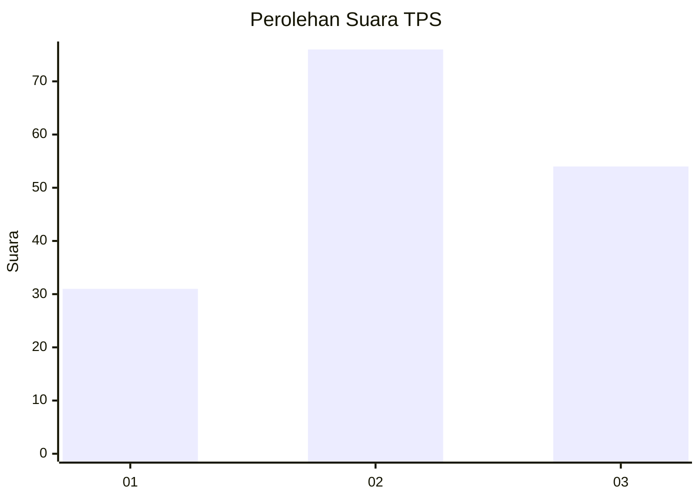
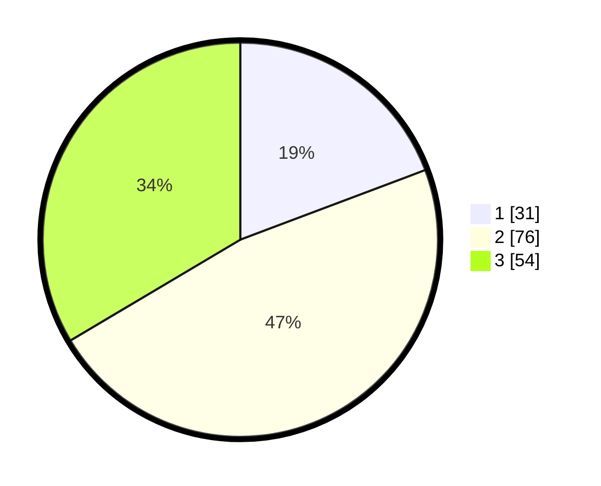

# Hasil

## Grafik

## Tabel

| No. | Nama Paslon    | Suara | Suara (raw) | Persentase |
|:--- |:-------------- | -----:| -----------:| ----------:|
| 1   | ANIES MUHAIMIN | 31    | [31][p-1]   | 19,25      |
| 2   | PRABOWO GIBRAN | 76    | [76][p-2]   | 47,20      |
| 3   | GANJAR MAHFUD  | 54    | [54][p-3]   | 33,54      |

[p-1]: https://github.com/gigit-pemilu/pemilu-2024/blob/main/pilpres/hitung-suara/sub/33-jawa-tengah/sub/06-purworejo/sub/11-pituruh/sub/2017-dlisen-wetan/sub/003-tps/sub/paslon-1.txt
[p-2]: https://github.com/gigit-pemilu/pemilu-2024/blob/main/pilpres/hitung-suara/sub/33-jawa-tengah/sub/06-purworejo/sub/11-pituruh/sub/2017-dlisen-wetan/sub/003-tps/sub/paslon-2.txt
[p-3]: https://github.com/gigit-pemilu/pemilu-2024/blob/main/pilpres/hitung-suara/sub/33-jawa-tengah/sub/06-purworejo/sub/11-pituruh/sub/2017-dlisen-wetan/sub/003-tps/sub/paslon-3.txt

## Foto C Plano

https://sirekap-obj-formc.kpu.go.id/1807/pemilu/ppwp/33/06/11/20/17/3306112017003-20240214-220627--963eff61-56ac-4da3-95f3-c9fa4a93e447.jpg

https://sirekap-obj-formc.kpu.go.id/1807/pemilu/ppwp/33/06/11/20/17/3306112017003-20240214-220902--5d3f2244-3805-4336-b975-ee3fd9535399.jpg

https://sirekap-obj-formc.kpu.go.id/1807/pemilu/ppwp/33/06/11/20/17/3306112017003-20240214-220751--b888b077-0725-4f07-983e-7136192c7f3f.jpg

## Metadata

| Key        | Value               |
| ---------- | ------------------- |
| Time Stamp | 2024-02-15 16:00:26 |

