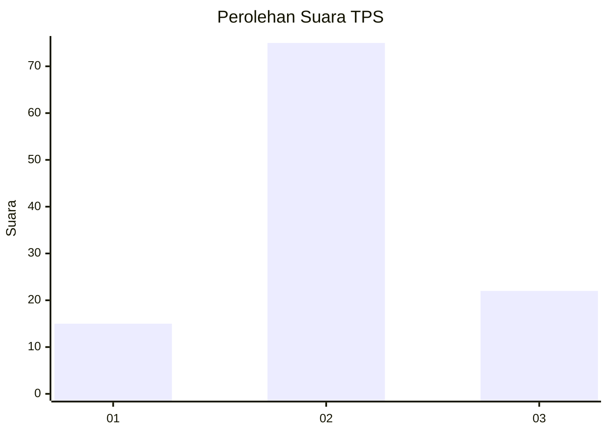
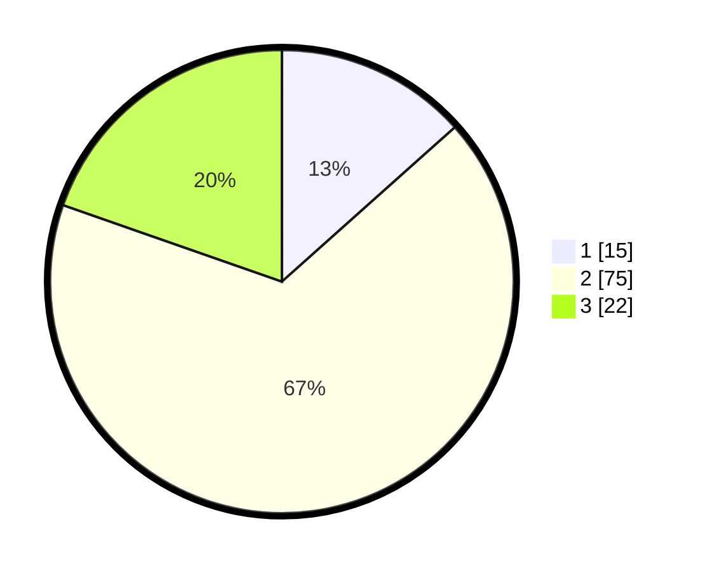

# Hasil

## Grafik

## Tabel

| No. | Nama Paslon    | Suara | Suara (raw) | Persentase |
|:--- |:-------------- | -----:| -----------:| ----------:|
| 1   | ANIES MUHAIMIN | 15    | [15][p-1]   | 13,39      |
| 2   | PRABOWO GIBRAN | 75    | [75][p-2]   | 66,96      |
| 3   | GANJAR MAHFUD  | 22    | [22][p-3]   | 19,64      |

[p-1]: https://github.com/gigit-pemilu/pemilu-2024/blob/main/pilpres/hitung-suara/sub/33-jawa-tengah/sub/06-purworejo/sub/11-pituruh/sub/2019-semampir/sub/001-tps/sub/paslon-1.txt
[p-2]: https://github.com/gigit-pemilu/pemilu-2024/blob/main/pilpres/hitung-suara/sub/33-jawa-tengah/sub/06-purworejo/sub/11-pituruh/sub/2019-semampir/sub/001-tps/sub/paslon-2.txt
[p-3]: https://github.com/gigit-pemilu/pemilu-2024/blob/main/pilpres/hitung-suara/sub/33-jawa-tengah/sub/06-purworejo/sub/11-pituruh/sub/2019-semampir/sub/001-tps/sub/paslon-3.txt

## Foto C Plano

https://sirekap-obj-formc.kpu.go.id/0359/pemilu/ppwp/33/06/11/20/19/3306112019001-20240215-080135--1805e6eb-2889-4a47-935b-83bfcf48d7ad.jpg

https://sirekap-obj-formc.kpu.go.id/0359/pemilu/ppwp/33/06/11/20/19/3306112019001-20240214-225502--c4381eb2-5e8a-443c-b823-b03d9aa92521.jpg

https://sirekap-obj-formc.kpu.go.id/0359/pemilu/ppwp/33/06/11/20/19/3306112019001-20240214-195941--9247decc-c57f-4316-a21d-9773b07b5f8f.jpg

## Metadata

| Key        | Value               |
| ---------- | ------------------- |
| Time Stamp | 2024-02-15 16:00:26 |

