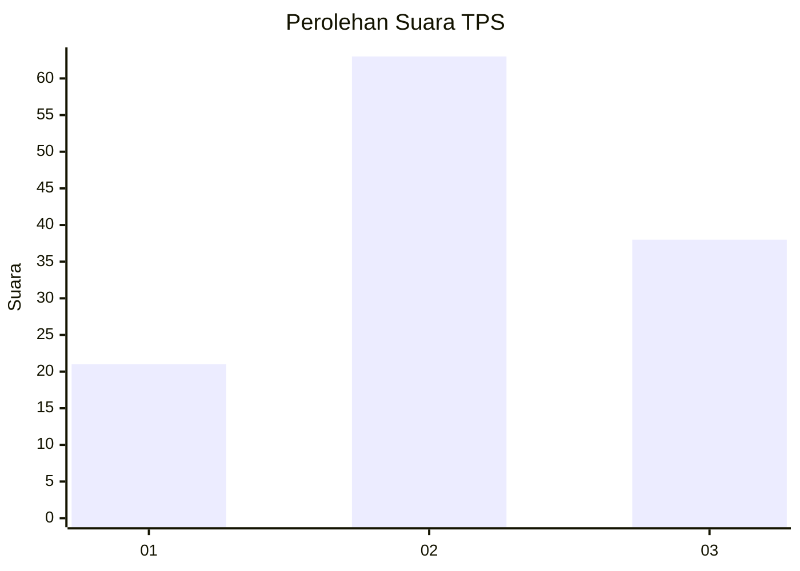
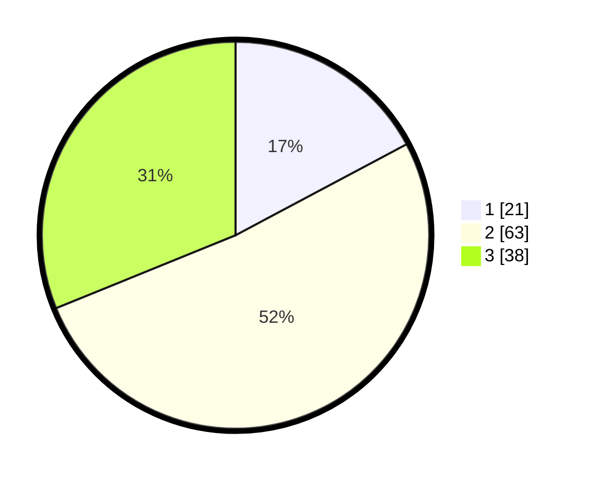

# Hasil

## Grafik

## Tabel

| No. | Nama Paslon    | Suara | Suara (raw) | Persentase |
|:--- |:-------------- | -----:| -----------:| ----------:|
| 1   | ANIES MUHAIMIN | 21    | [21][p-1]   | 17,21      |
| 2   | PRABOWO GIBRAN | 63    | [63][p-2]   | 51,64      |
| 3   | GANJAR MAHFUD  | 38    | [38][p-3]   | 31,15      |

[p-1]: https://github.com/gigit-pemilu/pemilu-2024-33-jawa-tengah/blob/main/pilpres/hitung-suara/sub/33-jawa-tengah/sub/06-purworejo/sub/11-pituruh/sub/2026-pituruh/sub/002-tps/sub/paslon-1.txt
[p-2]: https://github.com/gigit-pemilu/pemilu-2024-33-jawa-tengah/blob/main/pilpres/hitung-suara/sub/33-jawa-tengah/sub/06-purworejo/sub/11-pituruh/sub/2026-pituruh/sub/002-tps/sub/paslon-2.txt
[p-3]: https://github.com/gigit-pemilu/pemilu-2024-33-jawa-tengah/blob/main/pilpres/hitung-suara/sub/33-jawa-tengah/sub/06-purworejo/sub/11-pituruh/sub/2026-pituruh/sub/002-tps/sub/paslon-3.txt

## Foto C Plano

https://sirekap-obj-formc.kpu.go.id/d2b7/pemilu/ppwp/33/06/11/20/26/3306112026002-20240214-234422--53aee3f6-48bd-4152-a601-1a904adb9c1a.jpg

https://sirekap-obj-formc.kpu.go.id/d2b7/pemilu/ppwp/33/06/11/20/26/3306112026002-20240214-234604--aa81abcc-ad5d-4f9e-a26e-904e51f4514a.jpg

https://sirekap-obj-formc.kpu.go.id/d2b7/pemilu/ppwp/33/06/11/20/26/3306112026002-20240214-234806--0f93dd2d-b1cf-4220-b726-8e8cf151f9f3.jpg

## Metadata

| Key        | Value               |
| ---------- | ------------------- |
| Time Stamp | 2024-02-15 17:00:25 |

