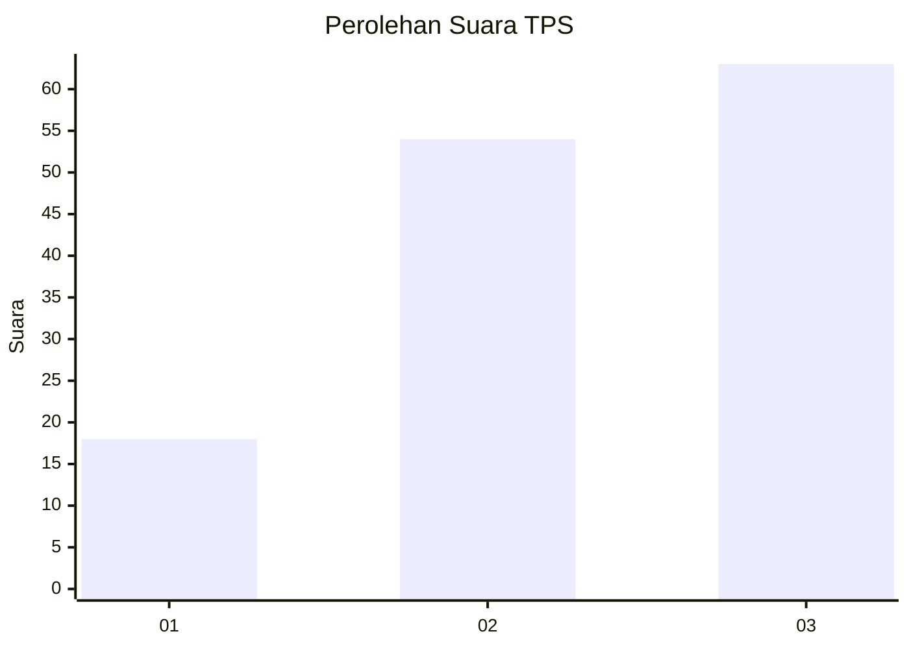
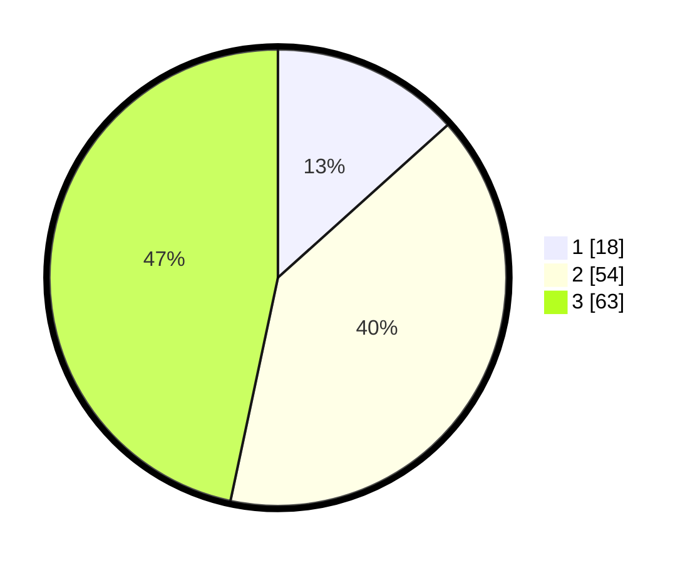

# Hasil

## Grafik

## Tabel

| No. | Nama Paslon    | Suara | Suara (raw) | Persentase |
|:--- |:-------------- | -----:| -----------:| ----------:|
| 1   | ANIES MUHAIMIN | 18    | [18][p-1]   | 13,33      |
| 2   | PRABOWO GIBRAN | 54    | [54][p-2]   | 40,00      |
| 3   | GANJAR MAHFUD  | 63    | [63][p-3]   | 46,67      |

[p-1]: https://github.com/gigit-pemilu/pemilu-2024/blob/main/pilpres/hitung-suara/sub/33-jawa-tengah/sub/06-purworejo/sub/11-pituruh/sub/2028-ngampel/sub/005-tps/sub/paslon-1.txt
[p-2]: https://github.com/gigit-pemilu/pemilu-2024/blob/main/pilpres/hitung-suara/sub/33-jawa-tengah/sub/06-purworejo/sub/11-pituruh/sub/2028-ngampel/sub/005-tps/sub/paslon-2.txt
[p-3]: https://github.com/gigit-pemilu/pemilu-2024/blob/main/pilpres/hitung-suara/sub/33-jawa-tengah/sub/06-purworejo/sub/11-pituruh/sub/2028-ngampel/sub/005-tps/sub/paslon-3.txt

## Foto C Plano

https://sirekap-obj-formc.kpu.go.id/e546/pemilu/ppwp/33/06/11/20/28/3306112028005-20240214-230411--e88bb76c-c96f-462a-934c-c78f38e9b6af.jpg

https://sirekap-obj-formc.kpu.go.id/e546/pemilu/ppwp/33/06/11/20/28/3306112028005-20240214-230546--4991dcad-b5d3-41a5-aa2a-1fa7afe288ec.jpg

https://sirekap-obj-formc.kpu.go.id/e546/pemilu/ppwp/33/06/11/20/28/3306112028005-20240214-230634--a35f37b7-a17b-4058-bc27-10c98e55b565.jpg

## Metadata

| Key        | Value               |
| ---------- | ------------------- |
| Time Stamp | 2024-02-15 21:30:27 |

