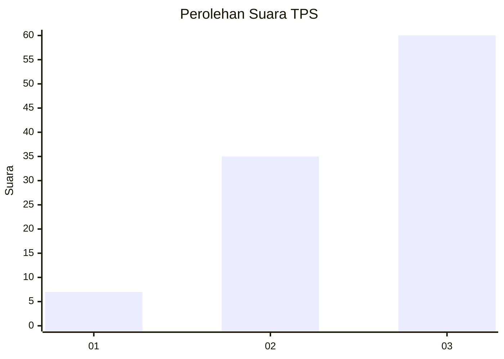
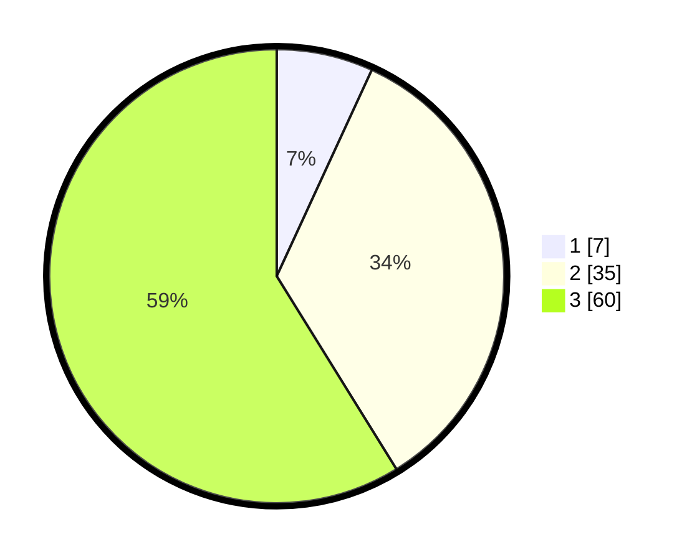

# Hasil

## Grafik

## Tabel

| No. | Nama Paslon    | Suara | Suara (raw) | Persentase |
|:--- |:-------------- | -----:| -----------:| ----------:|
| 1   | ANIES MUHAIMIN | 7     | [7][p-1]    | 6,86       |
| 2   | PRABOWO GIBRAN | 35    | [35][p-2]   | 34,31      |
| 3   | GANJAR MAHFUD  | 60    | [60][p-3]   | 58,82      |

[p-1]: https://github.com/gigit-pemilu/pemilu-2024/blob/main/pilpres/hitung-suara/sub/33-jawa-tengah/sub/06-purworejo/sub/11-pituruh/sub/2037-girigondo/sub/001-tps/sub/paslon-1.txt
[p-2]: https://github.com/gigit-pemilu/pemilu-2024/blob/main/pilpres/hitung-suara/sub/33-jawa-tengah/sub/06-purworejo/sub/11-pituruh/sub/2037-girigondo/sub/001-tps/sub/paslon-2.txt
[p-3]: https://github.com/gigit-pemilu/pemilu-2024/blob/main/pilpres/hitung-suara/sub/33-jawa-tengah/sub/06-purworejo/sub/11-pituruh/sub/2037-girigondo/sub/001-tps/sub/paslon-3.txt

## Foto C Plano

https://sirekap-obj-formc.kpu.go.id/80ed/pemilu/ppwp/33/06/11/20/37/3306112037001-20240216-140856--76e80d34-84cd-40d0-a9d8-558461558260.jpg

https://sirekap-obj-formc.kpu.go.id/80ed/pemilu/ppwp/33/06/11/20/37/3306112037001-20240216-140718--6b107a0a-23fe-47c8-a70d-5b61d475dc13.jpg

## Metadata

| Key        | Value               |
| ---------- | ------------------- |
| Time Stamp | 2024-02-16 23:00:00 |

