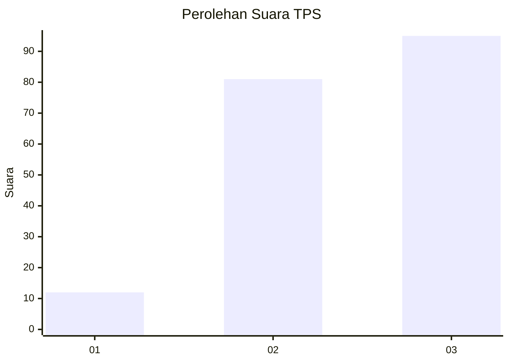
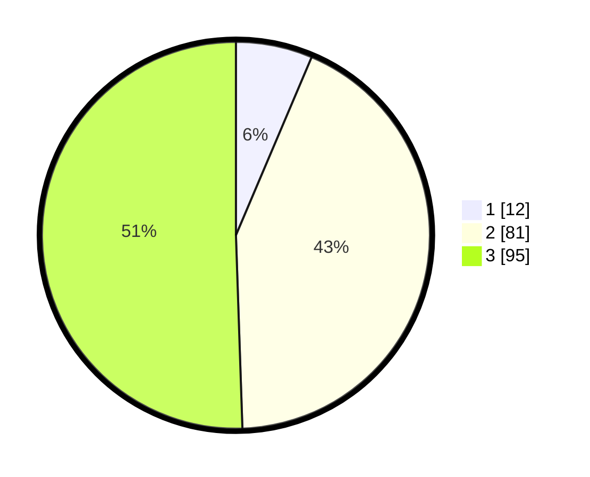

# Hasil

## Grafik

## Tabel

| No. | Nama Paslon    | Suara | Suara (raw) | Persentase |
|:--- |:-------------- | -----:| -----------:| ----------:|
| 1   | ANIES MUHAIMIN | 12    | [12][p-1]   | 6,38       |
| 2   | PRABOWO GIBRAN | 81    | [81][p-2]   | 43,09      |
| 3   | GANJAR MAHFUD  | 95    | [95][p-3]   | 50,53      |

[p-1]: https://github.com/gigit-pemilu/pemilu-2024/blob/main/pilpres/hitung-suara/sub/33-jawa-tengah/sub/06-purworejo/sub/11-pituruh/sub/2039-kalikotes/sub/007-tps/sub/paslon-1.txt
[p-2]: https://github.com/gigit-pemilu/pemilu-2024/blob/main/pilpres/hitung-suara/sub/33-jawa-tengah/sub/06-purworejo/sub/11-pituruh/sub/2039-kalikotes/sub/007-tps/sub/paslon-2.txt
[p-3]: https://github.com/gigit-pemilu/pemilu-2024/blob/main/pilpres/hitung-suara/sub/33-jawa-tengah/sub/06-purworejo/sub/11-pituruh/sub/2039-kalikotes/sub/007-tps/sub/paslon-3.txt

## Foto C Plano

https://sirekap-obj-formc.kpu.go.id/aaa7/pemilu/ppwp/33/06/11/20/39/3306112039007-20240214-222234--e36dd2a7-3f3a-453e-a941-39695a4f29da.jpg

https://sirekap-obj-formc.kpu.go.id/aaa7/pemilu/ppwp/33/06/11/20/39/3306112039007-20240214-223332--c55ad668-5f0d-4e47-b2f9-7137aa4827a1.jpg

https://sirekap-obj-formc.kpu.go.id/aaa7/pemilu/ppwp/33/06/11/20/39/3306112039007-20240214-222518--1d33eb9d-4fcb-4f88-9d4d-77e44cdf5515.jpg

## Metadata

| Key        | Value               |
| ---------- | ------------------- |
| Time Stamp | 2024-02-16 08:00:28 |

