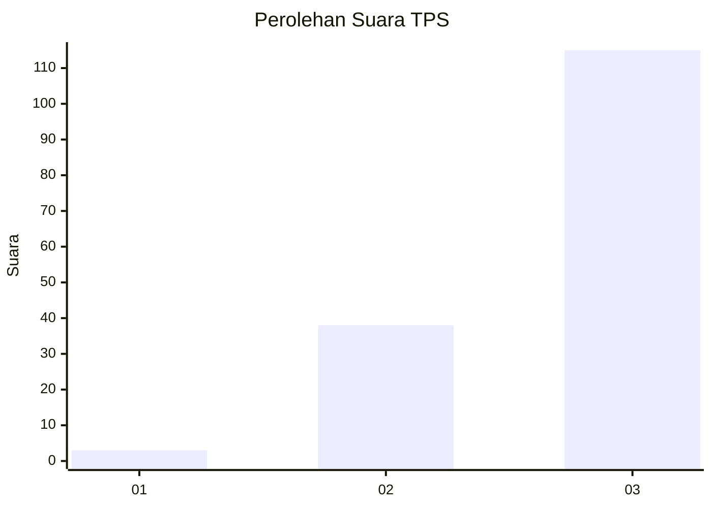
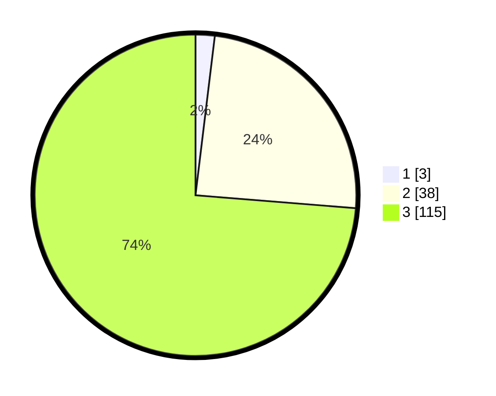

# Hasil

## Grafik

## Tabel

| No. | Nama Paslon    | Suara | Suara (raw) | Persentase |
|:--- |:-------------- | -----:| -----------:| ----------:|
| 1   | ANIES MUHAIMIN | 3     | [3][p-1]    | 1,92       |
| 2   | PRABOWO GIBRAN | 38    | [38][p-2]   | 24,36      |
| 3   | GANJAR MAHFUD  | 115   | [115][p-3]  | 73,72      |

[p-1]: https://github.com/gigit-pemilu/pemilu-2024-33-jawa-tengah/blob/main/pilpres/hitung-suara/sub/33-jawa-tengah/sub/06-purworejo/sub/11-pituruh/sub/2048-wonosido/sub/001-tps/sub/paslon-1.txt
[p-2]: https://github.com/gigit-pemilu/pemilu-2024-33-jawa-tengah/blob/main/pilpres/hitung-suara/sub/33-jawa-tengah/sub/06-purworejo/sub/11-pituruh/sub/2048-wonosido/sub/001-tps/sub/paslon-2.txt
[p-3]: https://github.com/gigit-pemilu/pemilu-2024-33-jawa-tengah/blob/main/pilpres/hitung-suara/sub/33-jawa-tengah/sub/06-purworejo/sub/11-pituruh/sub/2048-wonosido/sub/001-tps/sub/paslon-3.txt

## Foto C Plano

https://sirekap-obj-formc.kpu.go.id/6daa/pemilu/ppwp/33/06/11/20/48/3306112048001-20240214-140954--4edd06ee-f7d1-463f-a175-584bdfe56a32.jpg

https://sirekap-obj-formc.kpu.go.id/6daa/pemilu/ppwp/33/06/11/20/48/3306112048001-20240214-141652--d3f1f953-f155-4dfb-9754-3f0dca378445.jpg

https://sirekap-obj-formc.kpu.go.id/6daa/pemilu/ppwp/33/06/11/20/48/3306112048001-20240214-215712--96438148-5a01-45b8-a67d-5c361fac9f2e.jpg

## Metadata

| Key        | Value               |
| ---------- | ------------------- |
| Time Stamp | 2024-02-15 04:00:24 |

