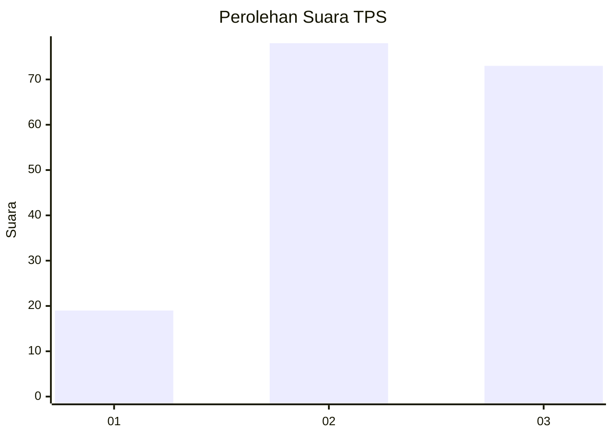
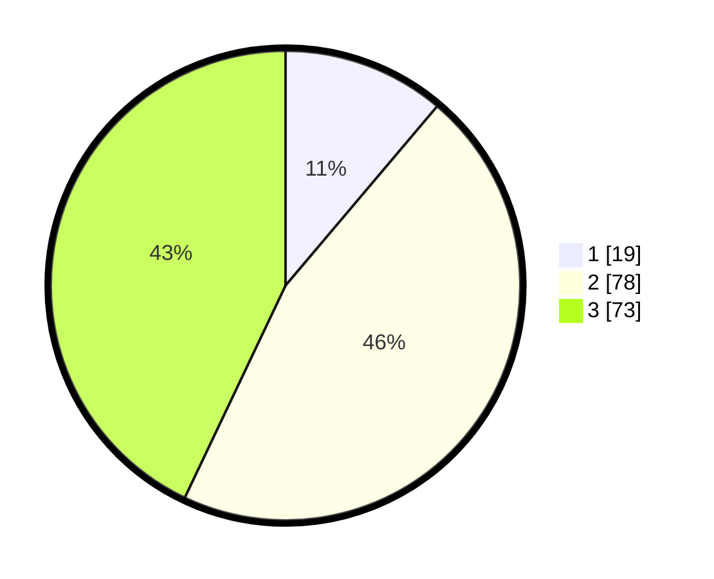

# Hasil

## Grafik

## Tabel

| No. | Nama Paslon    | Suara | Suara (raw) | Persentase |
|:--- |:-------------- | -----:| -----------:| ----------:|
| 1   | ANIES MUHAIMIN | 19    | [19][p-1]   | 11,18      |
| 2   | PRABOWO GIBRAN | 78    | [78][p-2]   | 45,88      |
| 3   | GANJAR MAHFUD  | 73    | [73][p-3]   | 42,94      |

[p-1]: https://github.com/gigit-pemilu/pemilu-2024/blob/main/pilpres/hitung-suara/sub/33-jawa-tengah/sub/06-purworejo/sub/12-kemiri/sub/2012-rebug/sub/003-tps/sub/paslon-1.txt
[p-2]: https://github.com/gigit-pemilu/pemilu-2024/blob/main/pilpres/hitung-suara/sub/33-jawa-tengah/sub/06-purworejo/sub/12-kemiri/sub/2012-rebug/sub/003-tps/sub/paslon-2.txt
[p-3]: https://github.com/gigit-pemilu/pemilu-2024/blob/main/pilpres/hitung-suara/sub/33-jawa-tengah/sub/06-purworejo/sub/12-kemiri/sub/2012-rebug/sub/003-tps/sub/paslon-3.txt

## Foto C Plano

https://sirekap-obj-formc.kpu.go.id/6fd9/pemilu/ppwp/33/06/12/20/12/3306122012003-20240215-032804--8ebc9374-964e-4a53-8ede-d558a286cdb9.jpg

https://sirekap-obj-formc.kpu.go.id/6fd9/pemilu/ppwp/33/06/12/20/12/3306122012003-20240215-033101--eabf76af-1cb1-4893-af4f-b910d85c400b.jpg

https://sirekap-obj-formc.kpu.go.id/6fd9/pemilu/ppwp/33/06/12/20/12/3306122012003-20240215-033230--f19f9c7d-5ad1-428d-8665-94443ea585c7.jpg

## Metadata

| Key        | Value               |
| ---------- | ------------------- |
| Time Stamp | 2024-02-15 16:30:25 |

