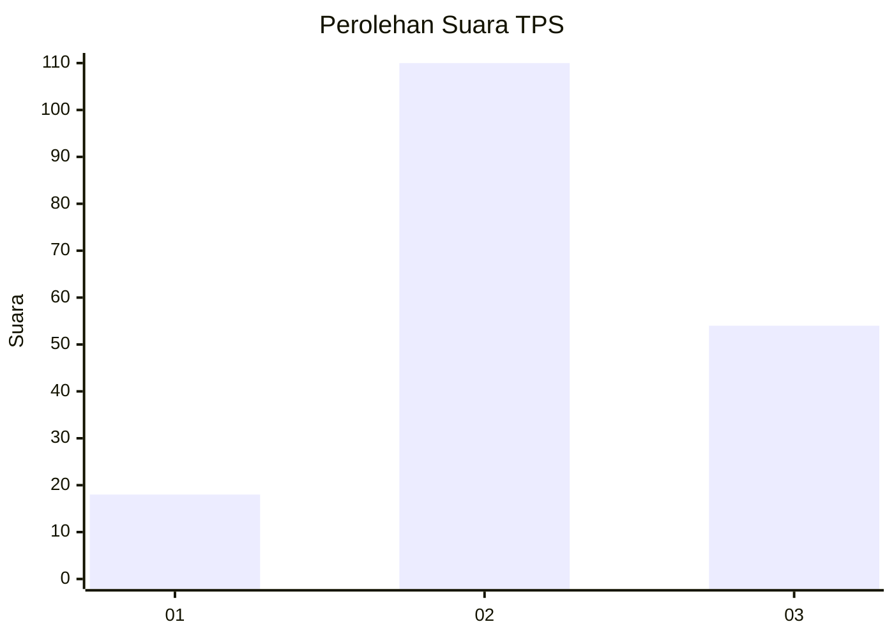
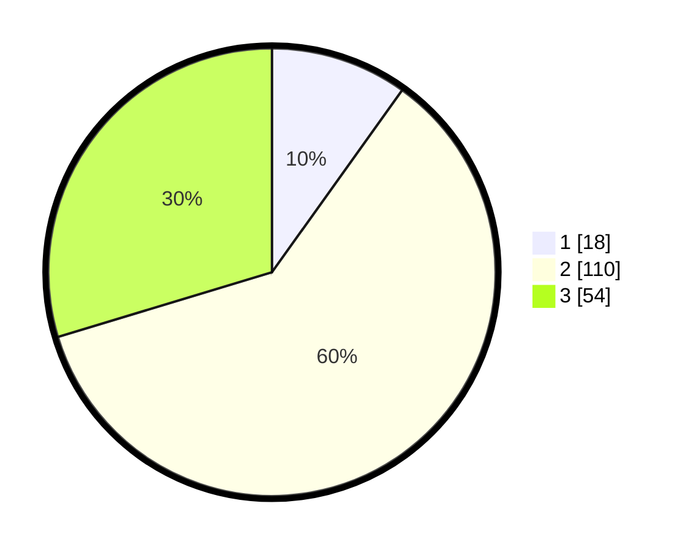

# Hasil

## Grafik

## Tabel

| No. | Nama Paslon    | Suara | Suara (raw) | Persentase |
|:--- |:-------------- | -----:| -----------:| ----------:|
| 1   | ANIES MUHAIMIN | 18    | [18][p-1]   | 9,89       |
| 2   | PRABOWO GIBRAN | 110   | [110][p-2]  | 60,44      |
| 3   | GANJAR MAHFUD  | 54    | [54][p-3]   | 29,67      |

[p-1]: https://github.com/gigit-pemilu/pemilu-2024/blob/main/pilpres/hitung-suara/sub/33-jawa-tengah/sub/06-purworejo/sub/12-kemiri/sub/2035-kedungpomahanwetan/sub/005-tps/sub/paslon-1.txt
[p-2]: https://github.com/gigit-pemilu/pemilu-2024/blob/main/pilpres/hitung-suara/sub/33-jawa-tengah/sub/06-purworejo/sub/12-kemiri/sub/2035-kedungpomahanwetan/sub/005-tps/sub/paslon-2.txt
[p-3]: https://github.com/gigit-pemilu/pemilu-2024/blob/main/pilpres/hitung-suara/sub/33-jawa-tengah/sub/06-purworejo/sub/12-kemiri/sub/2035-kedungpomahanwetan/sub/005-tps/sub/paslon-3.txt

## Foto C Plano

https://sirekap-obj-formc.kpu.go.id/6559/pemilu/ppwp/33/06/12/20/35/3306122035005-20240214-195505--0f17758a-d183-46ae-a7a8-8ef889a02380.jpg

https://sirekap-obj-formc.kpu.go.id/6559/pemilu/ppwp/33/06/12/20/35/3306122035005-20240214-200905--f7df96ba-1050-499f-af49-18279ed9c46e.jpg

https://sirekap-obj-formc.kpu.go.id/6559/pemilu/ppwp/33/06/12/20/35/3306122035005-20240215-013701--2dfa835b-2323-416b-b9a5-69c4ff6c2b7a.jpg

## Metadata

| Key        | Value               |
| ---------- | ------------------- |
| Time Stamp | 2024-02-15 12:00:28 |

