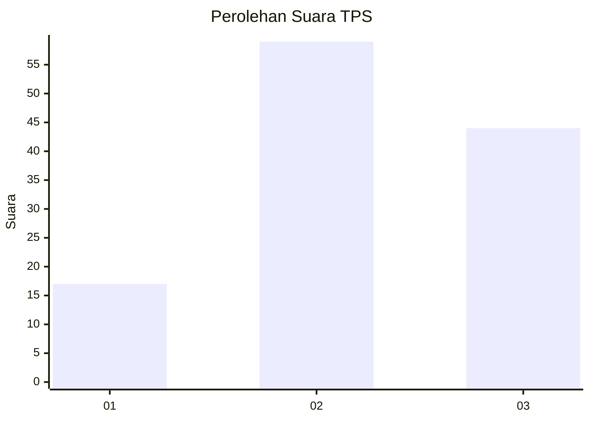
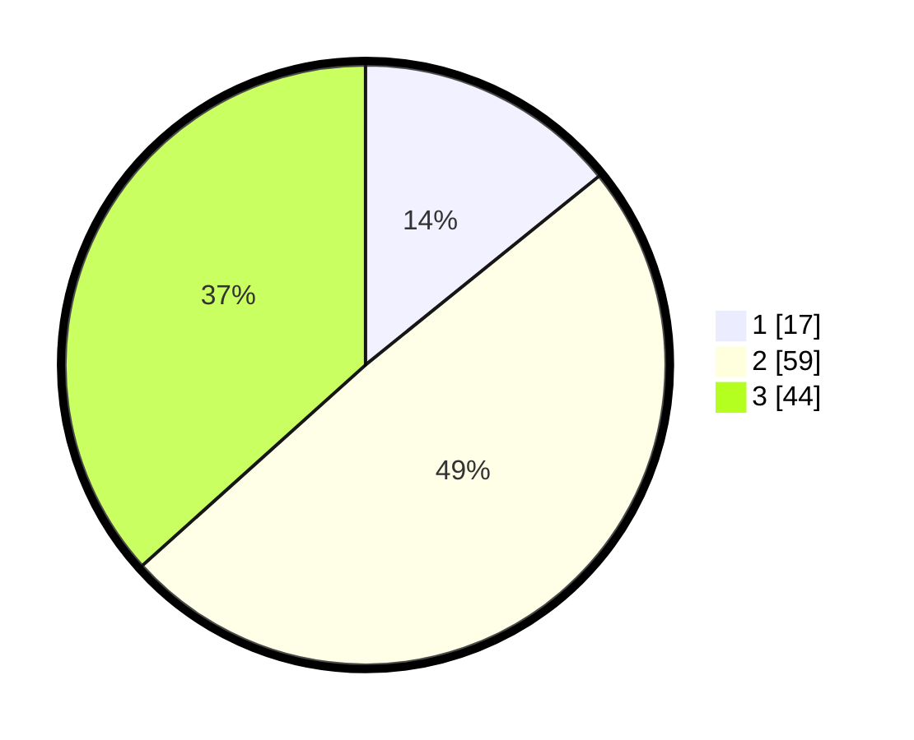

# Hasil

## Grafik

## Tabel

| No. | Nama Paslon    | Suara | Suara (raw) | Persentase |
|:--- |:-------------- | -----:| -----------:| ----------:|
| 1   | ANIES MUHAIMIN | 17    | [17][p-1]   | 14,17      |
| 2   | PRABOWO GIBRAN | 59    | [59][p-2]   | 49,17      |
| 3   | GANJAR MAHFUD  | 44    | [44][p-3]   | 36,67      |

[p-1]: https://github.com/gigit-pemilu/pemilu-2024-33-jawa-tengah/blob/main/pilpres/hitung-suara/sub/33-jawa-tengah/sub/06-purworejo/sub/13-bruno/sub/2003-pakisarum/sub/011-tps/sub/paslon-1.txt
[p-2]: https://github.com/gigit-pemilu/pemilu-2024-33-jawa-tengah/blob/main/pilpres/hitung-suara/sub/33-jawa-tengah/sub/06-purworejo/sub/13-bruno/sub/2003-pakisarum/sub/011-tps/sub/paslon-2.txt
[p-3]: https://github.com/gigit-pemilu/pemilu-2024-33-jawa-tengah/blob/main/pilpres/hitung-suara/sub/33-jawa-tengah/sub/06-purworejo/sub/13-bruno/sub/2003-pakisarum/sub/011-tps/sub/paslon-3.txt

## Foto C Plano

https://sirekap-obj-formc.kpu.go.id/7597/pemilu/ppwp/33/06/13/20/03/3306132003011-20240216-203922--48db36ec-d88e-42c7-a037-0afd3af913ea.jpg

https://sirekap-obj-formc.kpu.go.id/7597/pemilu/ppwp/33/06/13/20/03/3306132003011-20240216-200920--542b933e-b915-4b96-b5ed-a1f4425ac534.jpg

https://sirekap-obj-formc.kpu.go.id/7597/pemilu/ppwp/33/06/13/20/03/3306132003011-20240216-200148--c0323e74-780e-442a-b1f3-a7ee6a46f2f4.jpg

## Metadata

| Key        | Value               |
| ---------- | ------------------- |
| Time Stamp | 2024-02-19 06:16:00 |

