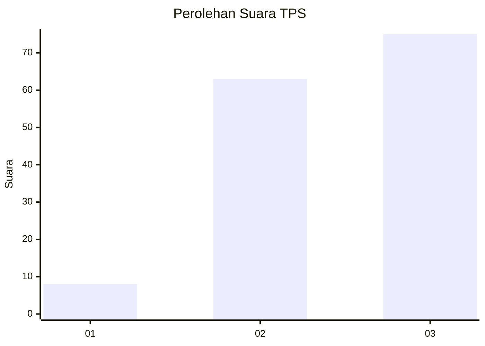
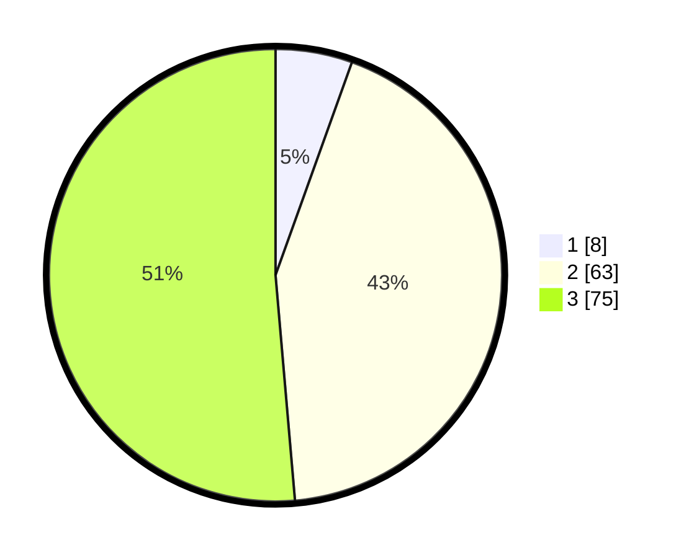

# Hasil

## Grafik

## Tabel

| No. | Nama Paslon    | Suara | Suara (raw) | Persentase |
|:--- |:-------------- | -----:| -----------:| ----------:|
| 1   | ANIES MUHAIMIN | 8     | [8][p-1]    | 5,48       |
| 2   | PRABOWO GIBRAN | 63    | [63][p-2]   | 43,15      |
| 3   | GANJAR MAHFUD  | 75    | [75][p-3]   | 51,37      |

[p-1]: https://github.com/gigit-pemilu/pemilu-2024-33-jawa-tengah/blob/main/pilpres/hitung-suara/sub/33-jawa-tengah/sub/06-purworejo/sub/13-bruno/sub/2004-brunorejo/sub/013-tps/sub/paslon-1.txt
[p-2]: https://github.com/gigit-pemilu/pemilu-2024-33-jawa-tengah/blob/main/pilpres/hitung-suara/sub/33-jawa-tengah/sub/06-purworejo/sub/13-bruno/sub/2004-brunorejo/sub/013-tps/sub/paslon-2.txt
[p-3]: https://github.com/gigit-pemilu/pemilu-2024-33-jawa-tengah/blob/main/pilpres/hitung-suara/sub/33-jawa-tengah/sub/06-purworejo/sub/13-bruno/sub/2004-brunorejo/sub/013-tps/sub/paslon-3.txt

## Foto C Plano

https://sirekap-obj-formc.kpu.go.id/8403/pemilu/ppwp/33/06/13/20/04/3306132004013-20240214-222605--8e53bf02-1ab0-4394-8230-03e85a2f59bd.jpg

https://sirekap-obj-formc.kpu.go.id/8403/pemilu/ppwp/33/06/13/20/04/3306132004013-20240214-222731--6f2080b1-76c1-4b3f-9793-8d738675fa76.jpg

https://sirekap-obj-formc.kpu.go.id/8403/pemilu/ppwp/33/06/13/20/04/3306132004013-20240214-222844--7610d8ac-1bbf-44b5-a243-a02bc3b18569.jpg

## Metadata

| Key        | Value               |
| ---------- | ------------------- |
| Time Stamp | 2024-02-15 16:00:26 |

