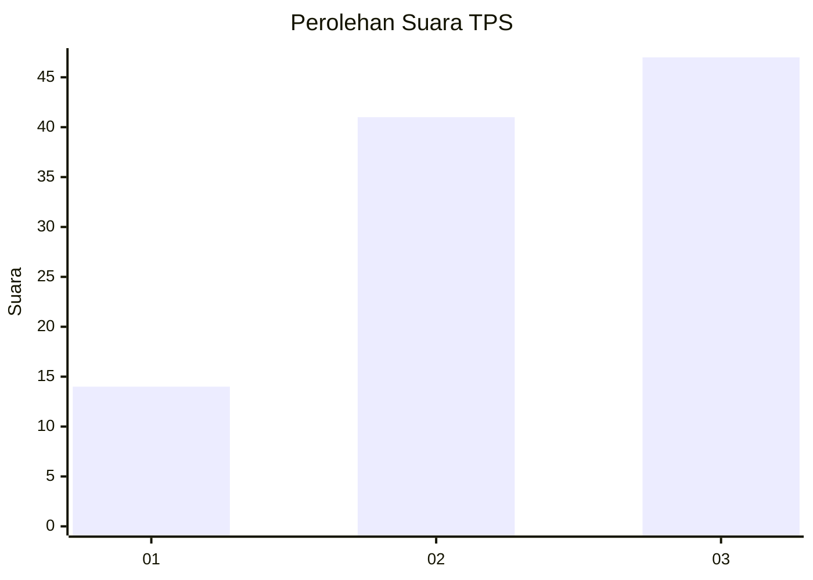
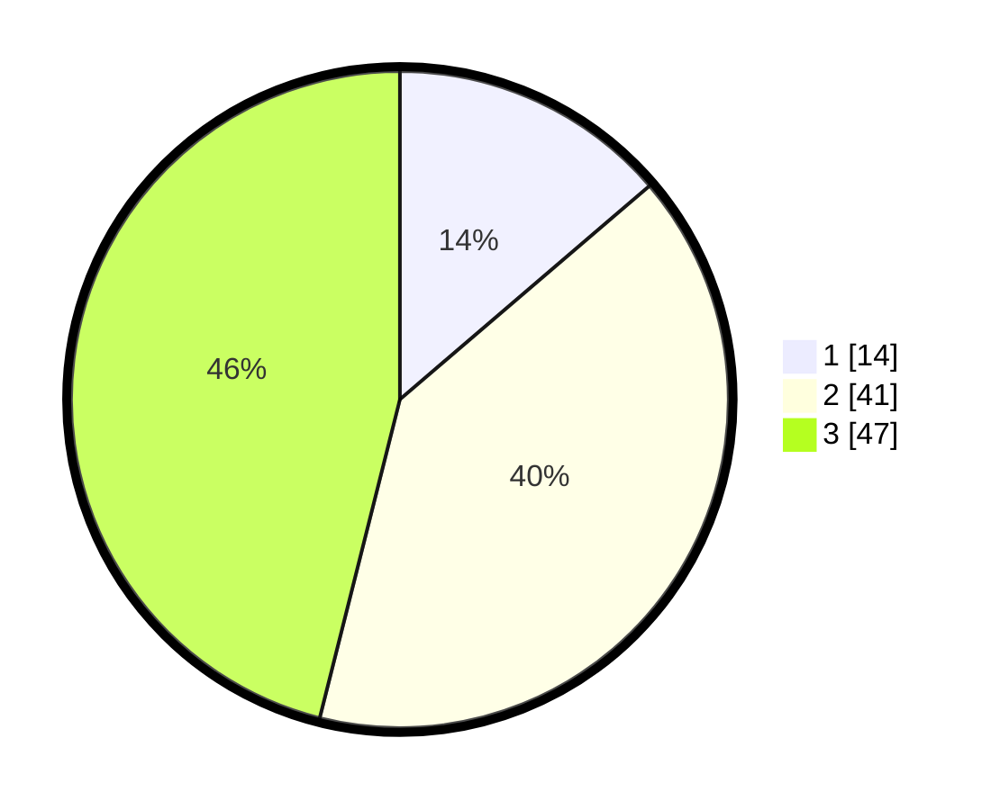

# Hasil

## Grafik

## Tabel

| No. | Nama Paslon    | Suara | Suara (raw) | Persentase |
|:--- |:-------------- | -----:| -----------:| ----------:|
| 1   | ANIES MUHAIMIN | 14    | [14][p-1]   | 13,73      |
| 2   | PRABOWO GIBRAN | 41    | [41][p-2]   | 40,20      |
| 3   | GANJAR MAHFUD  | 47    | [47][p-3]   | 46,08      |

[p-1]: https://github.com/gigit-pemilu/pemilu-2024-33-jawa-tengah/blob/main/pilpres/hitung-suara/sub/33-jawa-tengah/sub/06-purworejo/sub/13-bruno/sub/2007-blimbing/sub/014-tps/sub/paslon-1.txt
[p-2]: https://github.com/gigit-pemilu/pemilu-2024-33-jawa-tengah/blob/main/pilpres/hitung-suara/sub/33-jawa-tengah/sub/06-purworejo/sub/13-bruno/sub/2007-blimbing/sub/014-tps/sub/paslon-2.txt
[p-3]: https://github.com/gigit-pemilu/pemilu-2024-33-jawa-tengah/blob/main/pilpres/hitung-suara/sub/33-jawa-tengah/sub/06-purworejo/sub/13-bruno/sub/2007-blimbing/sub/014-tps/sub/paslon-3.txt

## Foto C Plano

https://sirekap-obj-formc.kpu.go.id/708c/pemilu/ppwp/33/06/13/20/07/3306132007014-20240214-225107--6680e345-3c2a-4d34-a941-4444625cf2e6.jpg

https://sirekap-obj-formc.kpu.go.id/708c/pemilu/ppwp/33/06/13/20/07/3306132007014-20240214-225321--b654bc95-edf8-47d9-a8b5-349a36b8e0ed.jpg

https://sirekap-obj-formc.kpu.go.id/708c/pemilu/ppwp/33/06/13/20/07/3306132007014-20240215-140926--947d147e-8e3b-420b-bac6-45446da7df49.jpg

## Metadata

| Key        | Value               |
| ---------- | ------------------- |
| Time Stamp | 2024-02-15 15:00:29 |

