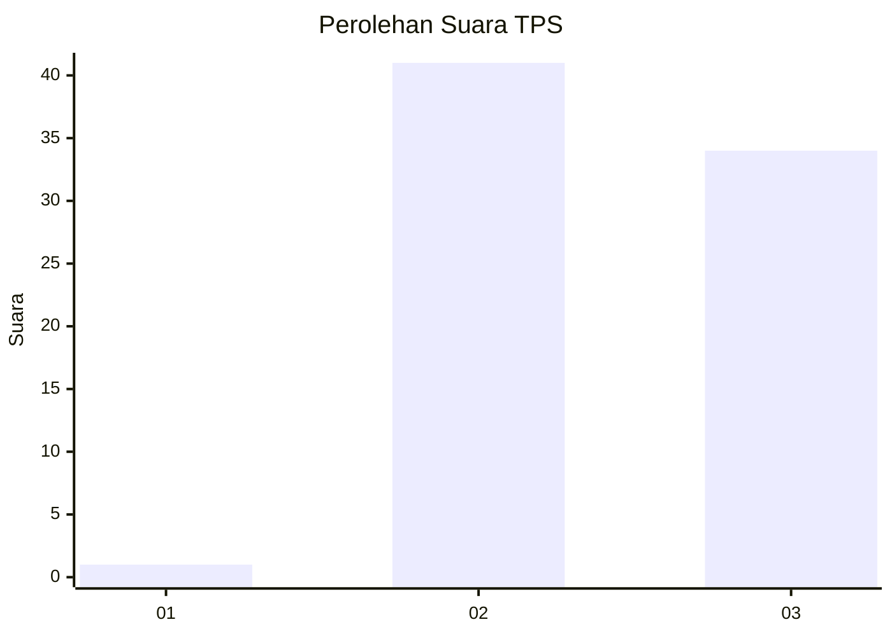
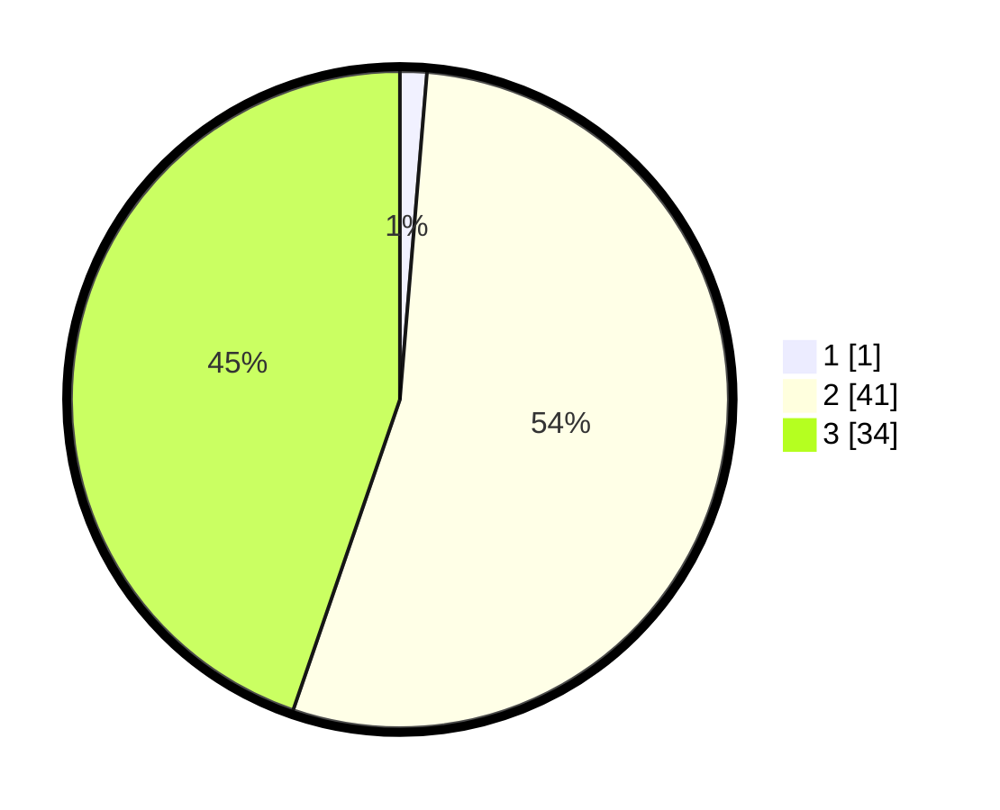

# Hasil

## Grafik

## Tabel

| No. | Nama Paslon    | Suara | Suara (raw) | Persentase |
|:--- |:-------------- | -----:| -----------:| ----------:|
| 1   | ANIES MUHAIMIN | 1     | [1][p-1]    | 1,32       |
| 2   | PRABOWO GIBRAN | 41    | [41][p-2]   | 53,95      |
| 3   | GANJAR MAHFUD  | 34    | [34][p-3]   | 44,74      |

[p-1]: https://github.com/gigit-pemilu/pemilu-2024/blob/main/pilpres/hitung-suara/sub/33-jawa-tengah/sub/06-purworejo/sub/13-bruno/sub/2012-kemranggen/sub/003-tps/sub/paslon-1.txt
[p-2]: https://github.com/gigit-pemilu/pemilu-2024/blob/main/pilpres/hitung-suara/sub/33-jawa-tengah/sub/06-purworejo/sub/13-bruno/sub/2012-kemranggen/sub/003-tps/sub/paslon-2.txt
[p-3]: https://github.com/gigit-pemilu/pemilu-2024/blob/main/pilpres/hitung-suara/sub/33-jawa-tengah/sub/06-purworejo/sub/13-bruno/sub/2012-kemranggen/sub/003-tps/sub/paslon-3.txt

## Foto C Plano

https://sirekap-obj-formc.kpu.go.id/6ea4/pemilu/ppwp/33/06/13/20/12/3306132012003-20240215-030531--ee00fa14-9494-405c-a93f-3716b2771514.jpg

https://sirekap-obj-formc.kpu.go.id/6ea4/pemilu/ppwp/33/06/13/20/12/3306132012003-20240215-005005--11631372-2436-4cae-87c8-06389f227f06.jpg

https://sirekap-obj-formc.kpu.go.id/6ea4/pemilu/ppwp/33/06/13/20/12/3306132012003-20240215-005104--1f478e13-940a-4945-8b4c-4781b4963cfa.jpg

## Metadata

| Key        | Value               |
| ---------- | ------------------- |
| Time Stamp | 2024-02-15 22:30:27 |

