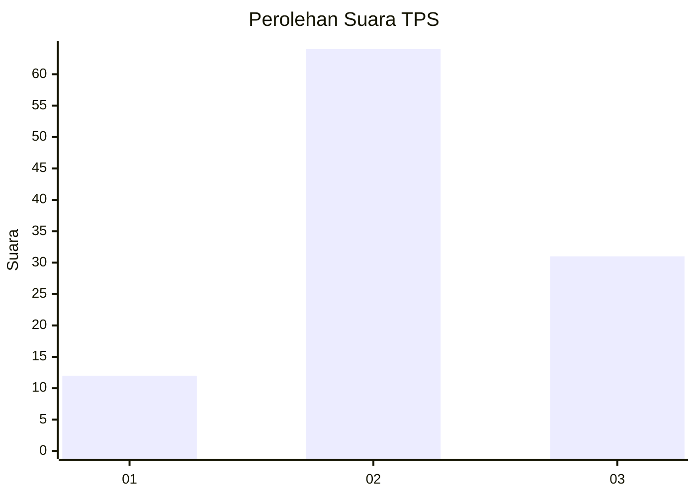
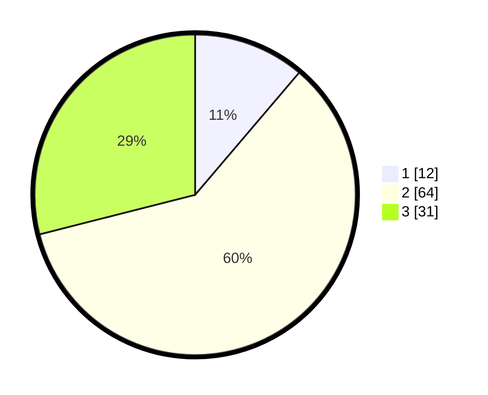

# Hasil

## Grafik

## Tabel

| No. | Nama Paslon    | Suara | Suara (raw) | Persentase |
|:--- |:-------------- | -----:| -----------:| ----------:|
| 1   | ANIES MUHAIMIN | 12    | [12][p-1]   | 11,21      |
| 2   | PRABOWO GIBRAN | 64    | [64][p-2]   | 59,81      |
| 3   | GANJAR MAHFUD  | 31    | [31][p-3]   | 28,97      |

[p-1]: https://github.com/gigit-pemilu/pemilu-2024-33-jawa-tengah/blob/main/pilpres/hitung-suara/sub/33-jawa-tengah/sub/06-purworejo/sub/13-bruno/sub/2016-watuduwur/sub/006-tps/sub/paslon-1.txt
[p-2]: https://github.com/gigit-pemilu/pemilu-2024-33-jawa-tengah/blob/main/pilpres/hitung-suara/sub/33-jawa-tengah/sub/06-purworejo/sub/13-bruno/sub/2016-watuduwur/sub/006-tps/sub/paslon-2.txt
[p-3]: https://github.com/gigit-pemilu/pemilu-2024-33-jawa-tengah/blob/main/pilpres/hitung-suara/sub/33-jawa-tengah/sub/06-purworejo/sub/13-bruno/sub/2016-watuduwur/sub/006-tps/sub/paslon-3.txt

## Foto C Plano

https://sirekap-obj-formc.kpu.go.id/8516/pemilu/ppwp/33/06/13/20/16/3306132016006-20240215-093033--30ec0c17-0fa0-40e8-8345-f4d3cd0855f3.jpg

https://sirekap-obj-formc.kpu.go.id/8516/pemilu/ppwp/33/06/13/20/16/3306132016006-20240215-093156--ca184900-ab68-4413-a380-f05e0bb6f248.jpg

https://sirekap-obj-formc.kpu.go.id/8516/pemilu/ppwp/33/06/13/20/16/3306132016006-20240215-093332--cd266645-68f1-4ddb-b7d1-ab2338b33e21.jpg

## Metadata

| Key        | Value               |
| ---------- | ------------------- |
| Time Stamp | 2024-02-17 11:00:02 |

