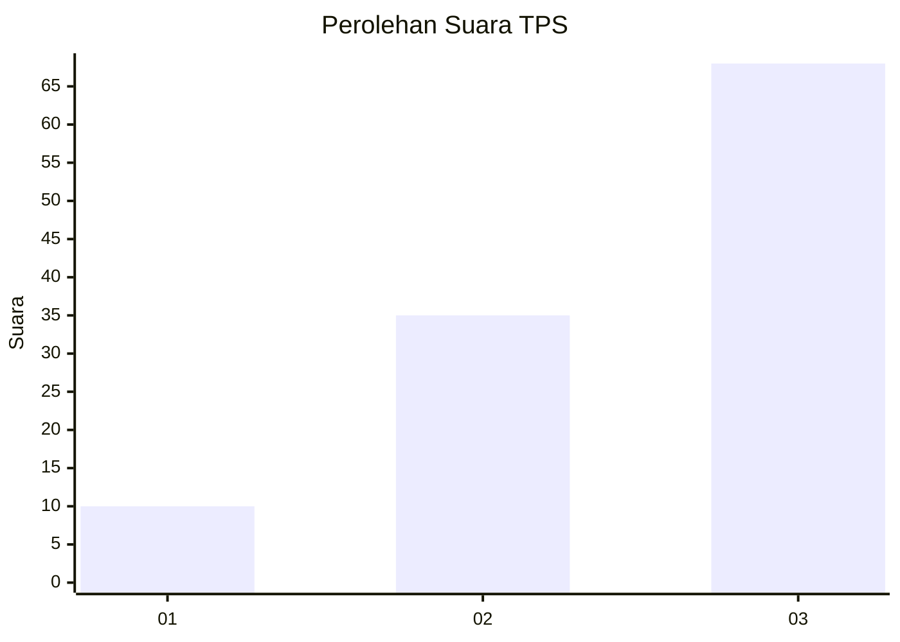
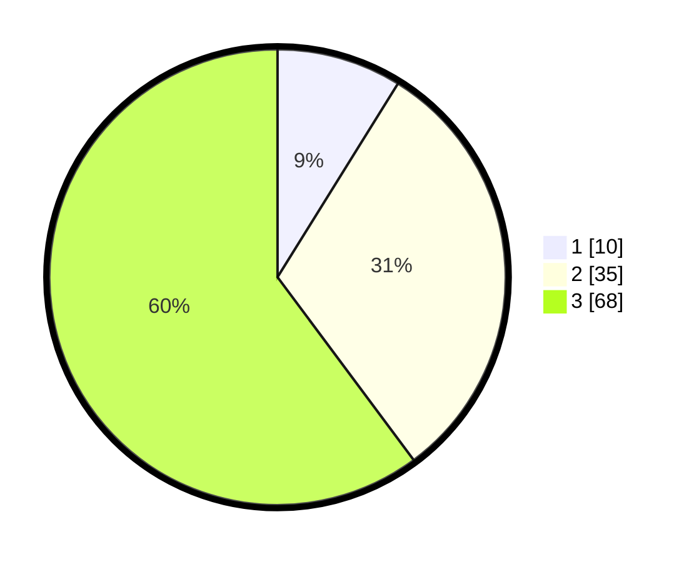

# Hasil

## Grafik

## Tabel

| No. | Nama Paslon    | Suara | Suara (raw) | Persentase |
|:--- |:-------------- | -----:| -----------:| ----------:|
| 1   | ANIES MUHAIMIN | 10    | [10][p-1]   | 8,85       |
| 2   | PRABOWO GIBRAN | 35    | [35][p-2]   | 30,97      |
| 3   | GANJAR MAHFUD  | 68    | [68][p-3]   | 60,18      |

[p-1]: https://github.com/gigit-pemilu/pemilu-2024-33-jawa-tengah/blob/main/pilpres/hitung-suara/sub/33-jawa-tengah/sub/06-purworejo/sub/13-bruno/sub/2017-kaliwungu/sub/017-tps/sub/paslon-1.txt
[p-2]: https://github.com/gigit-pemilu/pemilu-2024-33-jawa-tengah/blob/main/pilpres/hitung-suara/sub/33-jawa-tengah/sub/06-purworejo/sub/13-bruno/sub/2017-kaliwungu/sub/017-tps/sub/paslon-2.txt
[p-3]: https://github.com/gigit-pemilu/pemilu-2024-33-jawa-tengah/blob/main/pilpres/hitung-suara/sub/33-jawa-tengah/sub/06-purworejo/sub/13-bruno/sub/2017-kaliwungu/sub/017-tps/sub/paslon-3.txt

## Foto C Plano

https://sirekap-obj-formc.kpu.go.id/a006/pemilu/ppwp/33/06/13/20/17/3306132017017-20240215-003230--b212836d-027f-4b12-83aa-c51eafa8b67d.jpg

https://sirekap-obj-formc.kpu.go.id/a006/pemilu/ppwp/33/06/13/20/17/3306132017017-20240215-003437--aee696d1-a706-415f-a292-2fc9902b26a8.jpg

https://sirekap-obj-formc.kpu.go.id/a006/pemilu/ppwp/33/06/13/20/17/3306132017017-20240215-003528--1b85d5b0-c575-4591-95a2-ccc04cc82335.jpg

## Metadata

| Key        | Value               |
| ---------- | ------------------- |
| Time Stamp | 2024-02-15 16:00:26 |

