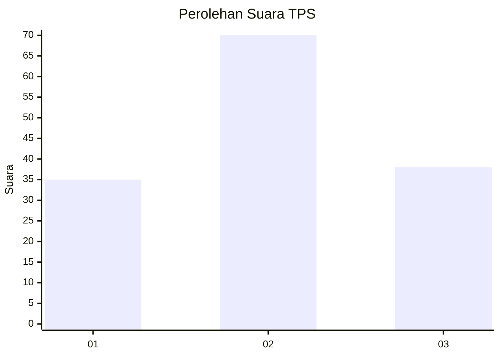
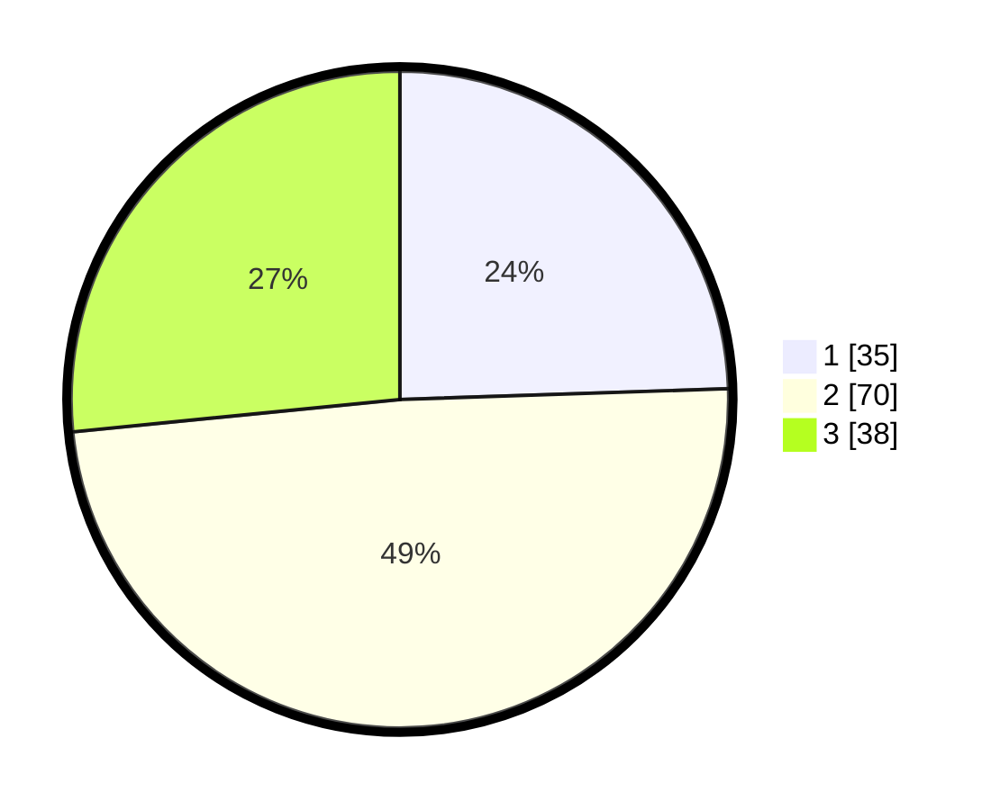

# Hasil

## Grafik

## Tabel

| No. | Nama Paslon    | Suara | Suara (raw) | Persentase |
|:--- |:-------------- | -----:| -----------:| ----------:|
| 1   | ANIES MUHAIMIN | 35    | [35][p-1]   | 24,48      |
| 2   | PRABOWO GIBRAN | 70    | [70][p-2]   | 48,95      |
| 3   | GANJAR MAHFUD  | 38    | [38][p-3]   | 26,57      |

[p-1]: https://github.com/gigit-pemilu/pemilu-2024-33-jawa-tengah/blob/main/pilpres/hitung-suara/sub/33-jawa-tengah/sub/06-purworejo/sub/14-gebang/sub/2002-seren/sub/010-tps/sub/paslon-1.txt
[p-2]: https://github.com/gigit-pemilu/pemilu-2024-33-jawa-tengah/blob/main/pilpres/hitung-suara/sub/33-jawa-tengah/sub/06-purworejo/sub/14-gebang/sub/2002-seren/sub/010-tps/sub/paslon-2.txt
[p-3]: https://github.com/gigit-pemilu/pemilu-2024-33-jawa-tengah/blob/main/pilpres/hitung-suara/sub/33-jawa-tengah/sub/06-purworejo/sub/14-gebang/sub/2002-seren/sub/010-tps/sub/paslon-3.txt

## Foto C Plano

https://sirekap-obj-formc.kpu.go.id/0606/pemilu/ppwp/33/06/14/20/02/3306142002010-20240214-141202--d85e3327-1b75-49bb-b902-ff3a011c24c6.jpg

https://sirekap-obj-formc.kpu.go.id/0606/pemilu/ppwp/33/06/14/20/02/3306142002010-20240214-141651--37d03bf5-003e-48cf-9aa7-e5e607141ed2.jpg

https://sirekap-obj-formc.kpu.go.id/0606/pemilu/ppwp/33/06/14/20/02/3306142002010-20240214-141540--b108e52f-e8c5-4013-ad08-4825f0bb762a.jpg

## Metadata

| Key        | Value               |
| ---------- | ------------------- |
| Time Stamp | 2024-02-14 21:46:01 |

