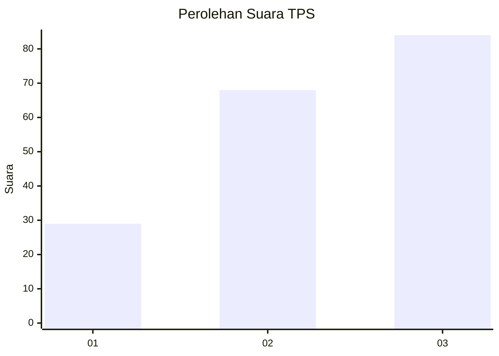
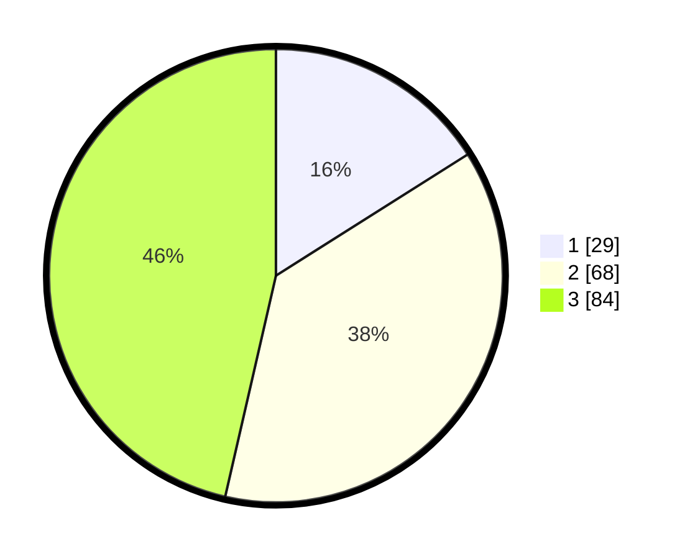

# Hasil

## Grafik

## Tabel

| No. | Nama Paslon    | Suara | Suara (raw) | Persentase |
|:--- |:-------------- | -----:| -----------:| ----------:|
| 1   | ANIES MUHAIMIN | 29    | [29][p-1]   | 16,02      |
| 2   | PRABOWO GIBRAN | 68    | [68][p-2]   | 37,57      |
| 3   | GANJAR MAHFUD  | 84    | [84][p-3]   | 46,41      |

[p-1]: https://github.com/gigit-pemilu/pemilu-2024/blob/main/pilpres/hitung-suara/sub/33-jawa-tengah/sub/06-purworejo/sub/14-gebang/sub/2006-rendeng/sub/005-tps/sub/paslon-1.txt
[p-2]: https://github.com/gigit-pemilu/pemilu-2024/blob/main/pilpres/hitung-suara/sub/33-jawa-tengah/sub/06-purworejo/sub/14-gebang/sub/2006-rendeng/sub/005-tps/sub/paslon-2.txt
[p-3]: https://github.com/gigit-pemilu/pemilu-2024/blob/main/pilpres/hitung-suara/sub/33-jawa-tengah/sub/06-purworejo/sub/14-gebang/sub/2006-rendeng/sub/005-tps/sub/paslon-3.txt

## Foto C Plano

https://sirekap-obj-formc.kpu.go.id/2f28/pemilu/ppwp/33/06/14/20/06/3306142006005-20240215-023915--7c510d80-cfac-4bba-b0a9-4e9fae026a93.jpg

https://sirekap-obj-formc.kpu.go.id/2f28/pemilu/ppwp/33/06/14/20/06/3306142006005-20240215-024002--f91b299e-be65-4b9d-a3a4-bf4fed0cb280.jpg

https://sirekap-obj-formc.kpu.go.id/2f28/pemilu/ppwp/33/06/14/20/06/3306142006005-20240216-121218--fca16d5b-ae5f-4ea6-86bc-062efde7e559.jpg

## Metadata

| Key        | Value               |
| ---------- | ------------------- |
| Time Stamp | 2024-02-16 12:51:22 |

