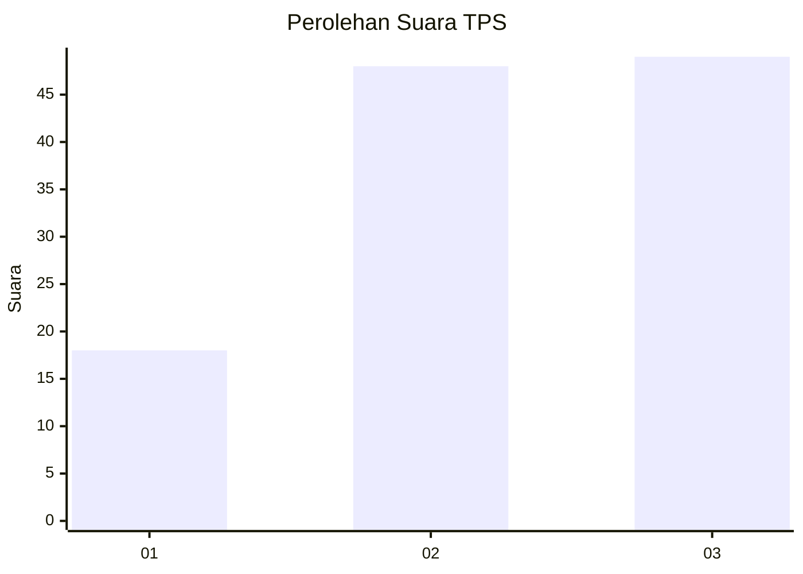
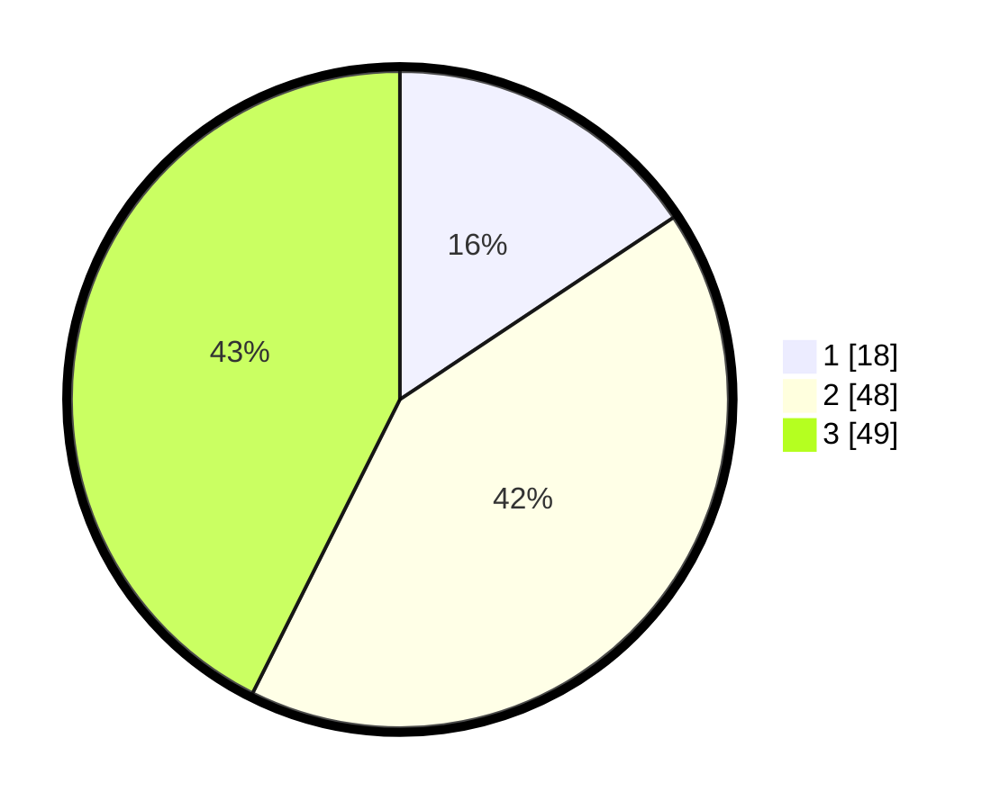

# Hasil

## Grafik

## Tabel

| No. | Nama Paslon    | Suara | Suara (raw) | Persentase |
|:--- |:-------------- | -----:| -----------:| ----------:|
| 1   | ANIES MUHAIMIN | 18    | [18][p-1]   | 15,65      |
| 2   | PRABOWO GIBRAN | 48    | [48][p-2]   | 41,74      |
| 3   | GANJAR MAHFUD  | 49    | [49][p-3]   | 42,61      |

[p-1]: https://github.com/gigit-pemilu/pemilu-2024/blob/main/pilpres/hitung-suara/sub/33-jawa-tengah/sub/06-purworejo/sub/14-gebang/sub/2007-kroyo/sub/003-tps/sub/paslon-1.txt
[p-2]: https://github.com/gigit-pemilu/pemilu-2024/blob/main/pilpres/hitung-suara/sub/33-jawa-tengah/sub/06-purworejo/sub/14-gebang/sub/2007-kroyo/sub/003-tps/sub/paslon-2.txt
[p-3]: https://github.com/gigit-pemilu/pemilu-2024/blob/main/pilpres/hitung-suara/sub/33-jawa-tengah/sub/06-purworejo/sub/14-gebang/sub/2007-kroyo/sub/003-tps/sub/paslon-3.txt

## Foto C Plano

https://sirekap-obj-formc.kpu.go.id/341d/pemilu/ppwp/33/06/14/20/07/3306142007003-20240216-200317--402867c4-4fd9-4af9-9204-b3d86d005192.jpg

https://sirekap-obj-formc.kpu.go.id/341d/pemilu/ppwp/33/06/14/20/07/3306142007003-20240216-201058--ed4623c6-1de3-4eb6-a41e-f2438727ffbe.jpg

https://sirekap-obj-formc.kpu.go.id/341d/pemilu/ppwp/33/06/14/20/07/3306142007003-20240216-201501--16b3c162-0e4e-49b0-90b9-3fee5df6c40b.jpg

## Metadata

| Key        | Value               |
| ---------- | ------------------- |
| Time Stamp | 2024-02-16 21:01:00 |

