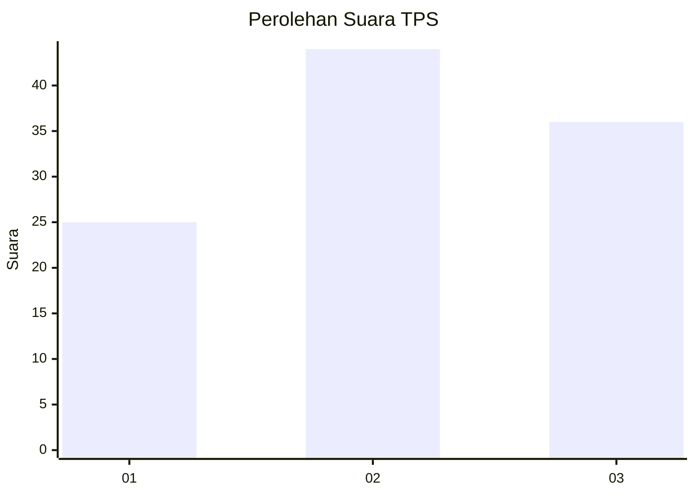
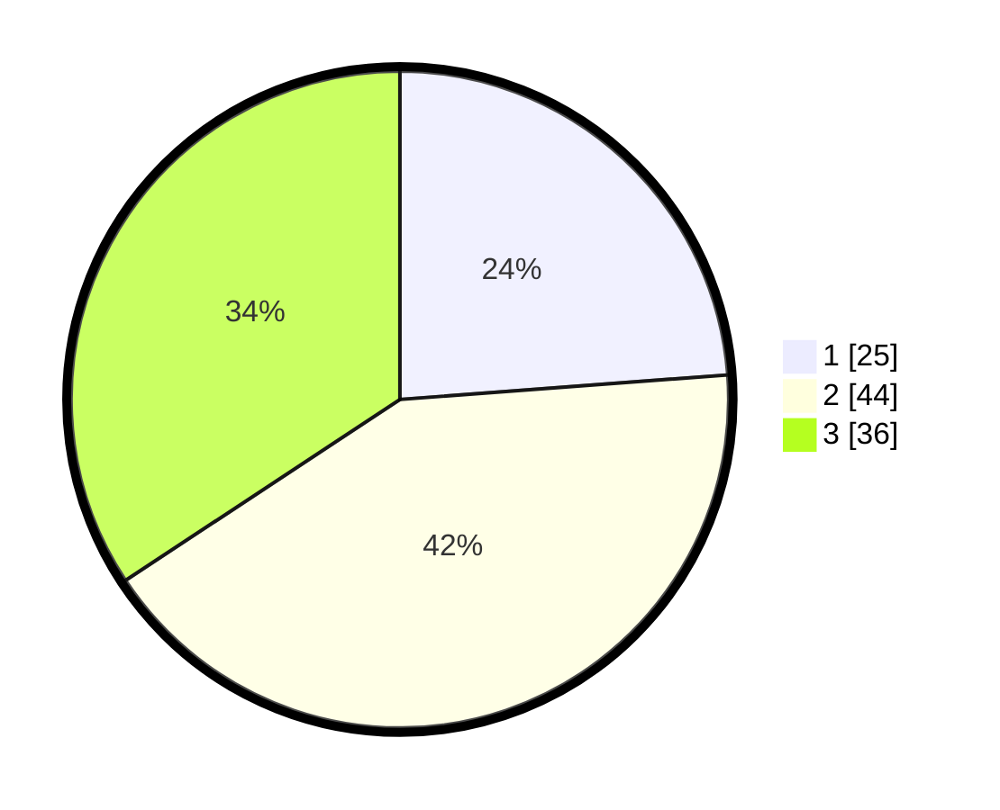

# Hasil

## Grafik

## Tabel

| No. | Nama Paslon    | Suara | Suara (raw) | Persentase |
|:--- |:-------------- | -----:| -----------:| ----------:|
| 1   | ANIES MUHAIMIN | 25    | [25][p-1]   | 23,81      |
| 2   | PRABOWO GIBRAN | 44    | [44][p-2]   | 41,90      |
| 3   | GANJAR MAHFUD  | 36    | [36][p-3]   | 34,29      |

[p-1]: https://github.com/gigit-pemilu/pemilu-2024-33-jawa-tengah/blob/main/pilpres/hitung-suara/sub/33-jawa-tengah/sub/06-purworejo/sub/14-gebang/sub/2010-pelutan/sub/004-tps/sub/paslon-1.txt
[p-2]: https://github.com/gigit-pemilu/pemilu-2024-33-jawa-tengah/blob/main/pilpres/hitung-suara/sub/33-jawa-tengah/sub/06-purworejo/sub/14-gebang/sub/2010-pelutan/sub/004-tps/sub/paslon-2.txt
[p-3]: https://github.com/gigit-pemilu/pemilu-2024-33-jawa-tengah/blob/main/pilpres/hitung-suara/sub/33-jawa-tengah/sub/06-purworejo/sub/14-gebang/sub/2010-pelutan/sub/004-tps/sub/paslon-3.txt

## Foto C Plano

https://sirekap-obj-formc.kpu.go.id/bbca/pemilu/ppwp/33/06/14/20/10/3306142010004-20240217-195249--5818267f-1660-48f0-958d-c3eb13997420.jpg

https://sirekap-obj-formc.kpu.go.id/bbca/pemilu/ppwp/33/06/14/20/10/3306142010004-20240217-195819--e95d41b2-7025-49ad-a7fe-dffb017e5fdf.jpg

https://sirekap-obj-formc.kpu.go.id/bbca/pemilu/ppwp/33/06/14/20/10/3306142010004-20240217-195935--5dea3a99-a261-4533-bae6-d07a9d5bb4c2.jpg

## Metadata

| Key        | Value               |
| ---------- | ------------------- |
| Time Stamp | 2024-02-24 22:31:28 |

