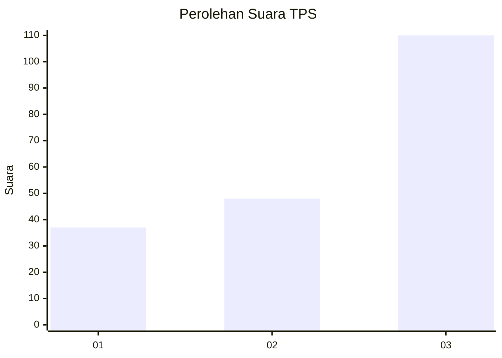
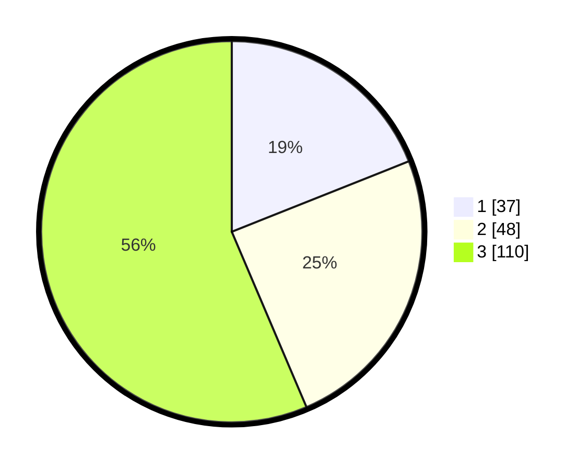

# Hasil

## Grafik

## Tabel

| No. | Nama Paslon    | Suara | Suara (raw) | Persentase |
|:--- |:-------------- | -----:| -----------:| ----------:|
| 1   | ANIES MUHAIMIN | 37    | [37][p-1]   | 18,97      |
| 2   | PRABOWO GIBRAN | 48    | [48][p-2]   | 24,62      |
| 3   | GANJAR MAHFUD  | 110   | [110][p-3]  | 56,41      |

[p-1]: https://github.com/gigit-pemilu/pemilu-2024-33-jawa-tengah/blob/main/pilpres/hitung-suara/sub/33-jawa-tengah/sub/06-purworejo/sub/14-gebang/sub/2017-penungkulan/sub/011-tps/sub/paslon-1.txt
[p-2]: https://github.com/gigit-pemilu/pemilu-2024-33-jawa-tengah/blob/main/pilpres/hitung-suara/sub/33-jawa-tengah/sub/06-purworejo/sub/14-gebang/sub/2017-penungkulan/sub/011-tps/sub/paslon-2.txt
[p-3]: https://github.com/gigit-pemilu/pemilu-2024-33-jawa-tengah/blob/main/pilpres/hitung-suara/sub/33-jawa-tengah/sub/06-purworejo/sub/14-gebang/sub/2017-penungkulan/sub/011-tps/sub/paslon-3.txt

## Foto C Plano

https://sirekap-obj-formc.kpu.go.id/b5ea/pemilu/ppwp/33/06/14/20/17/3306142017011-20240216-151440--37e3eba2-ceb6-4e61-b917-3cf15c81eb1e.jpg

https://sirekap-obj-formc.kpu.go.id/b5ea/pemilu/ppwp/33/06/14/20/17/3306142017011-20240216-151520--683d1b53-ab07-4847-a241-f69e6c691948.jpg

https://sirekap-obj-formc.kpu.go.id/b5ea/pemilu/ppwp/33/06/14/20/17/3306142017011-20240216-151558--abf59850-5311-4e8f-b327-08e43554d682.jpg

## Metadata

| Key        | Value               |
| ---------- | ------------------- |
| Time Stamp | 2024-02-16 21:01:00 |

