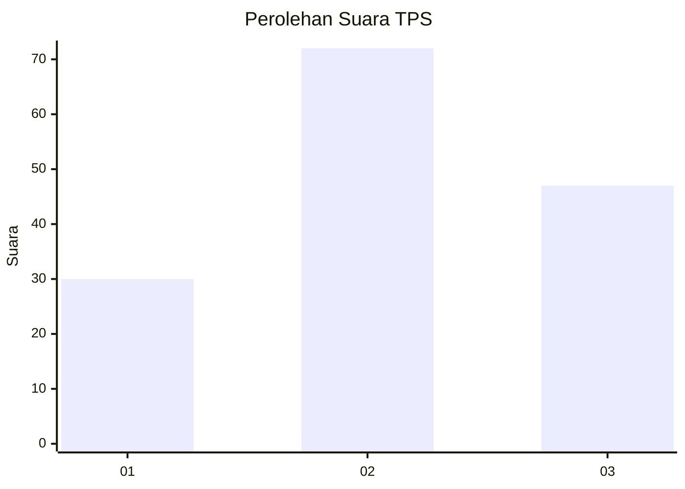
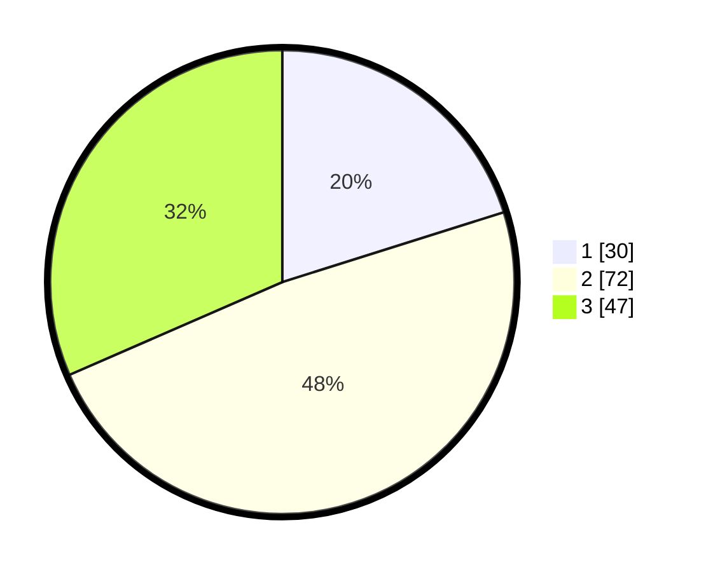

# Hasil

## Grafik

## Tabel

| No. | Nama Paslon    | Suara | Suara (raw) | Persentase |
|:--- |:-------------- | -----:| -----------:| ----------:|
| 1   | ANIES MUHAIMIN | 30    | [30][p-1]   | 20,13      |
| 2   | PRABOWO GIBRAN | 72    | [72][p-2]   | 48,32      |
| 3   | GANJAR MAHFUD  | 47    | [47][p-3]   | 31,54      |

[p-1]: https://github.com/gigit-pemilu/pemilu-2024/blob/main/pilpres/hitung-suara/sub/33-jawa-tengah/sub/06-purworejo/sub/14-gebang/sub/2020-ngemplak/sub/001-tps/sub/paslon-1.txt
[p-2]: https://github.com/gigit-pemilu/pemilu-2024/blob/main/pilpres/hitung-suara/sub/33-jawa-tengah/sub/06-purworejo/sub/14-gebang/sub/2020-ngemplak/sub/001-tps/sub/paslon-2.txt
[p-3]: https://github.com/gigit-pemilu/pemilu-2024/blob/main/pilpres/hitung-suara/sub/33-jawa-tengah/sub/06-purworejo/sub/14-gebang/sub/2020-ngemplak/sub/001-tps/sub/paslon-3.txt

## Foto C Plano

https://sirekap-obj-formc.kpu.go.id/8520/pemilu/ppwp/33/06/14/20/20/3306142020001-20240215-210715--8f4074f9-8fe5-4fde-8ffa-d0da3d3c93bf.jpg

https://sirekap-obj-formc.kpu.go.id/8520/pemilu/ppwp/33/06/14/20/20/3306142020001-20240215-210722--619d3919-0040-483e-add6-a5127db5c156.jpg

https://sirekap-obj-formc.kpu.go.id/8520/pemilu/ppwp/33/06/14/20/20/3306142020001-20240215-210727--1a76f657-8d72-4629-80ed-04fa5e1f0f6c.jpg

## Metadata

| Key        | Value               |
| ---------- | ------------------- |
| Time Stamp | 2024-02-15 23:29:50 |

