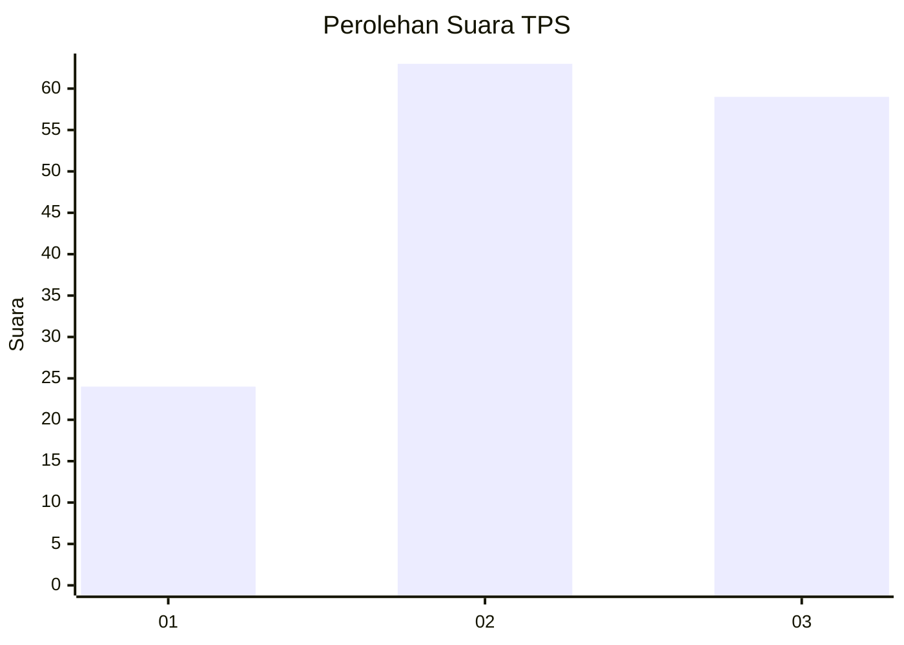
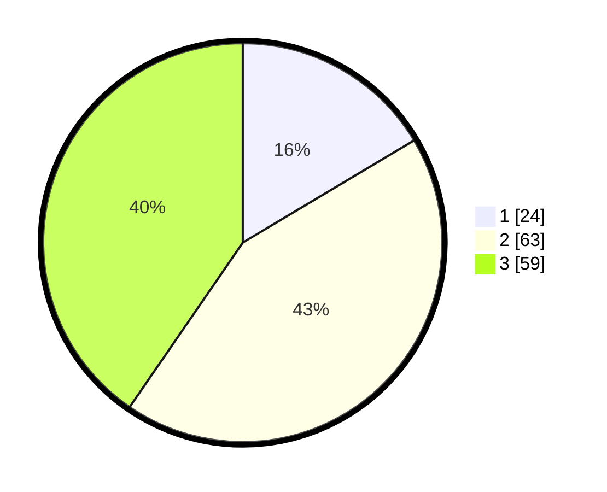

# Hasil

## Grafik

## Tabel

| No. | Nama Paslon    | Suara | Suara (raw) | Persentase |
|:--- |:-------------- | -----:| -----------:| ----------:|
| 1   | ANIES MUHAIMIN | 24    | [24][p-1]   | 16,44      |
| 2   | PRABOWO GIBRAN | 63    | [63][p-2]   | 43,15      |
| 3   | GANJAR MAHFUD  | 59    | [59][p-3]   | 40,41      |

[p-1]: https://github.com/gigit-pemilu/pemilu-2024/blob/main/pilpres/hitung-suara/sub/33-jawa-tengah/sub/06-purworejo/sub/14-gebang/sub/2023-ngaglik/sub/005-tps/sub/paslon-1.txt
[p-2]: https://github.com/gigit-pemilu/pemilu-2024/blob/main/pilpres/hitung-suara/sub/33-jawa-tengah/sub/06-purworejo/sub/14-gebang/sub/2023-ngaglik/sub/005-tps/sub/paslon-2.txt
[p-3]: https://github.com/gigit-pemilu/pemilu-2024/blob/main/pilpres/hitung-suara/sub/33-jawa-tengah/sub/06-purworejo/sub/14-gebang/sub/2023-ngaglik/sub/005-tps/sub/paslon-3.txt

## Foto C Plano

https://sirekap-obj-formc.kpu.go.id/0588/pemilu/ppwp/33/06/14/20/23/3306142023005-20240214-141028--c2328a83-b564-482d-ac48-280d02530e2b.jpg

https://sirekap-obj-formc.kpu.go.id/0588/pemilu/ppwp/33/06/14/20/23/3306142023005-20240214-141253--75a08b29-a947-4360-9c8b-4eca623c005e.jpg

https://sirekap-obj-formc.kpu.go.id/0588/pemilu/ppwp/33/06/14/20/23/3306142023005-20240214-141442--82aad6a1-16ea-461d-aa80-256702f2923d.jpg

## Metadata

| Key        | Value               |
| ---------- | ------------------- |
| Time Stamp | 2024-02-14 21:46:01 |

