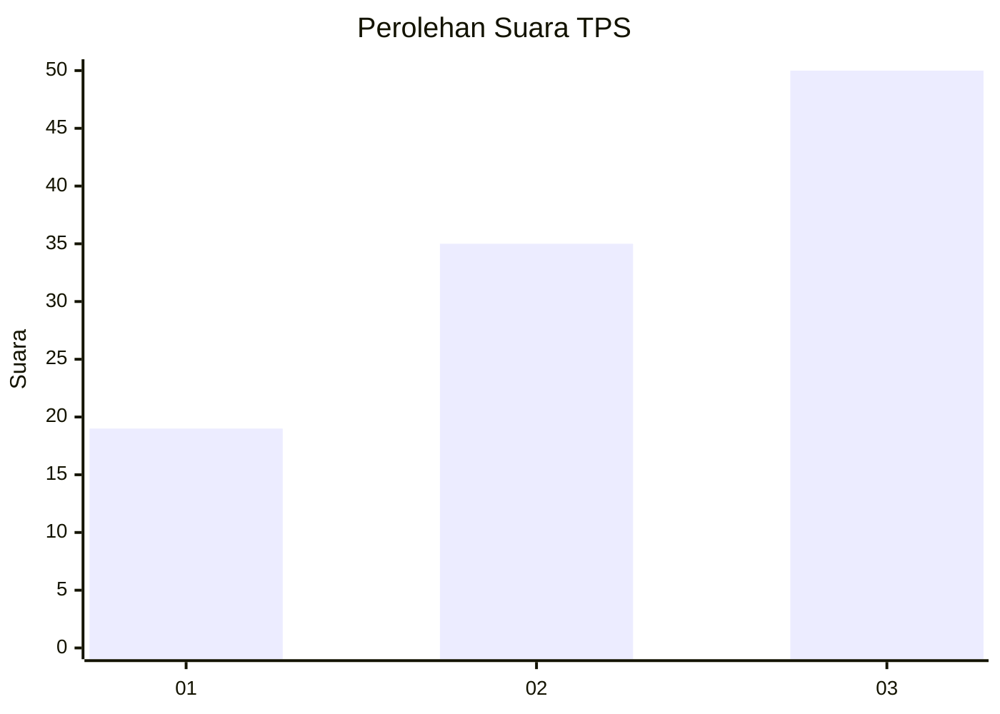
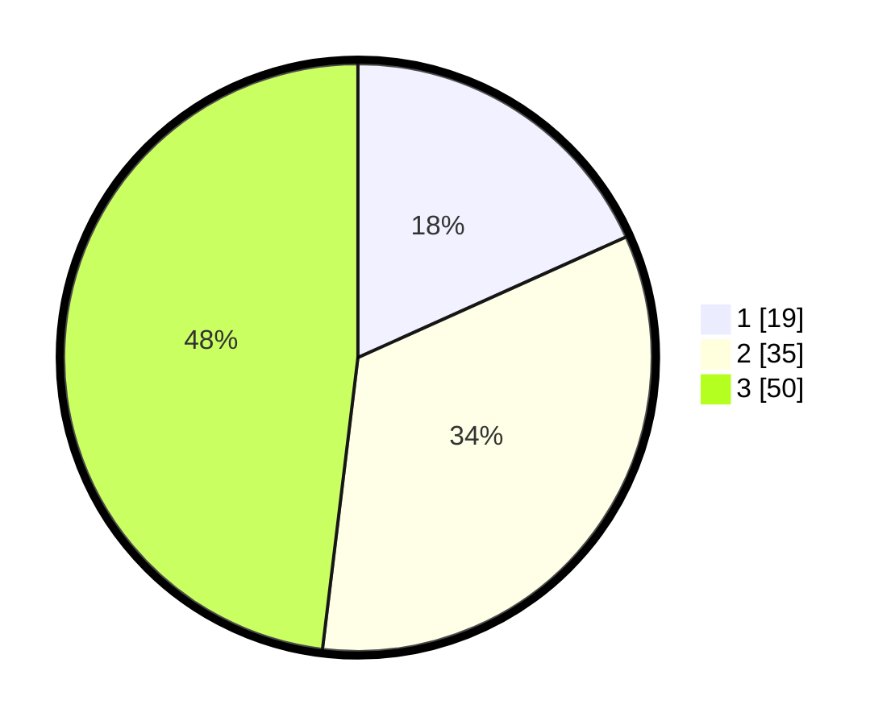

# Hasil

## Grafik

## Tabel

| No. | Nama Paslon    | Suara | Suara (raw) | Persentase |
|:--- |:-------------- | -----:| -----------:| ----------:|
| 1   | ANIES MUHAIMIN | 19    | [19][p-1]   | 18,27      |
| 2   | PRABOWO GIBRAN | 35    | [35][p-2]   | 33,65      |
| 3   | GANJAR MAHFUD  | 50    | [50][p-3]   | 48,08      |

[p-1]: https://github.com/gigit-pemilu/pemilu-2024-33-jawa-tengah/blob/main/pilpres/hitung-suara/sub/33-jawa-tengah/sub/06-purworejo/sub/15-loano/sub/2002-trirejo/sub/001-tps/sub/paslon-1.txt
[p-2]: https://github.com/gigit-pemilu/pemilu-2024-33-jawa-tengah/blob/main/pilpres/hitung-suara/sub/33-jawa-tengah/sub/06-purworejo/sub/15-loano/sub/2002-trirejo/sub/001-tps/sub/paslon-2.txt
[p-3]: https://github.com/gigit-pemilu/pemilu-2024-33-jawa-tengah/blob/main/pilpres/hitung-suara/sub/33-jawa-tengah/sub/06-purworejo/sub/15-loano/sub/2002-trirejo/sub/001-tps/sub/paslon-3.txt

## Foto C Plano

https://sirekap-obj-formc.kpu.go.id/437f/pemilu/ppwp/33/06/15/20/02/3306152002001-20240218-130502--e2e56e59-191f-4ccf-899e-19a039c6b66e.jpg

https://sirekap-obj-formc.kpu.go.id/437f/pemilu/ppwp/33/06/15/20/02/3306152002001-20240218-130547--a0551b1a-fe84-4fdc-8c93-c8e501981798.jpg

https://sirekap-obj-formc.kpu.go.id/437f/pemilu/ppwp/33/06/15/20/02/3306152002001-20240218-130646--dffdedd1-5f20-4873-b1b6-58367c49566b.jpg

## Metadata

| Key        | Value               |
| ---------- | ------------------- |
| Time Stamp | 2024-02-25 12:00:00 |

