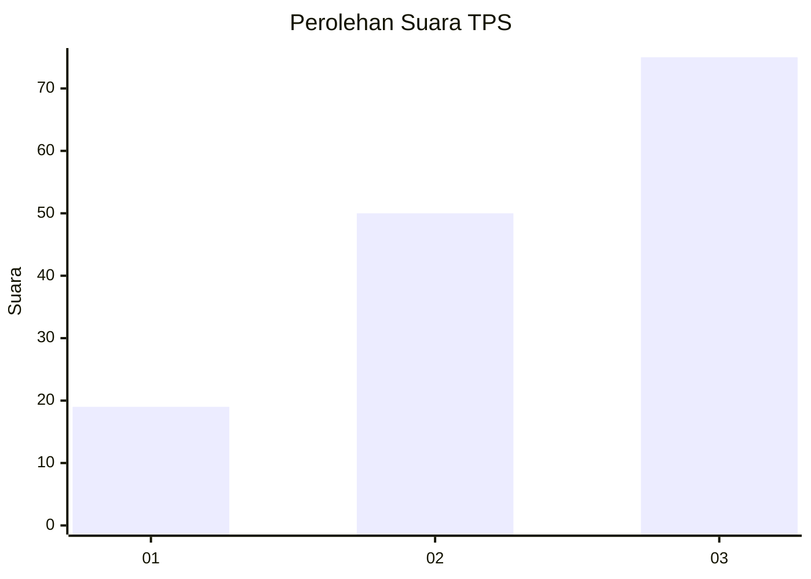
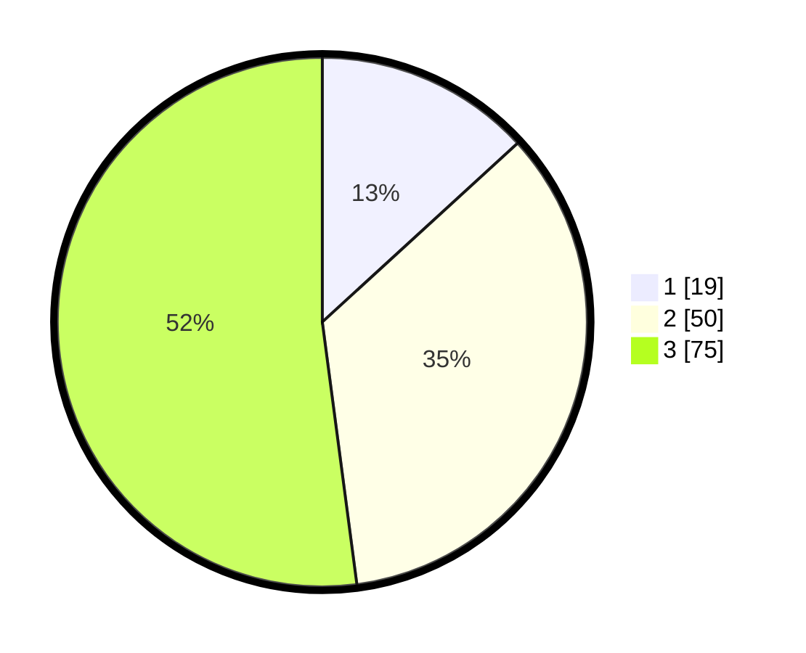

# Hasil

## Grafik

## Tabel

| No. | Nama Paslon    | Suara | Suara (raw) | Persentase |
|:--- |:-------------- | -----:| -----------:| ----------:|
| 1   | ANIES MUHAIMIN | 19    | [19][p-1]   | 13,19      |
| 2   | PRABOWO GIBRAN | 50    | [50][p-2]   | 34,72      |
| 3   | GANJAR MAHFUD  | 75    | [75][p-3]   | 52,08      |

[p-1]: https://github.com/gigit-pemilu/pemilu-2024-33-jawa-tengah/blob/main/pilpres/hitung-suara/sub/33-jawa-tengah/sub/06-purworejo/sub/15-loano/sub/2002-trirejo/sub/002-tps/sub/paslon-1.txt
[p-2]: https://github.com/gigit-pemilu/pemilu-2024-33-jawa-tengah/blob/main/pilpres/hitung-suara/sub/33-jawa-tengah/sub/06-purworejo/sub/15-loano/sub/2002-trirejo/sub/002-tps/sub/paslon-2.txt
[p-3]: https://github.com/gigit-pemilu/pemilu-2024-33-jawa-tengah/blob/main/pilpres/hitung-suara/sub/33-jawa-tengah/sub/06-purworejo/sub/15-loano/sub/2002-trirejo/sub/002-tps/sub/paslon-3.txt

## Foto C Plano

https://sirekap-obj-formc.kpu.go.id/e3f2/pemilu/ppwp/33/06/15/20/02/3306152002002-20240218-125349--38b7389d-07b4-482e-bc12-3063372cefbf.jpg

https://sirekap-obj-formc.kpu.go.id/e3f2/pemilu/ppwp/33/06/15/20/02/3306152002002-20240217-114713--21c42e1f-ecb9-4e45-a781-d1f119373650.jpg

https://sirekap-obj-formc.kpu.go.id/e3f2/pemilu/ppwp/33/06/15/20/02/3306152002002-20240217-115316--1a11f348-5fd0-4e79-8309-cf3748e9fe2c.jpg

## Metadata

| Key        | Value               |
| ---------- | ------------------- |
| Time Stamp | 2024-02-19 06:16:00 |

