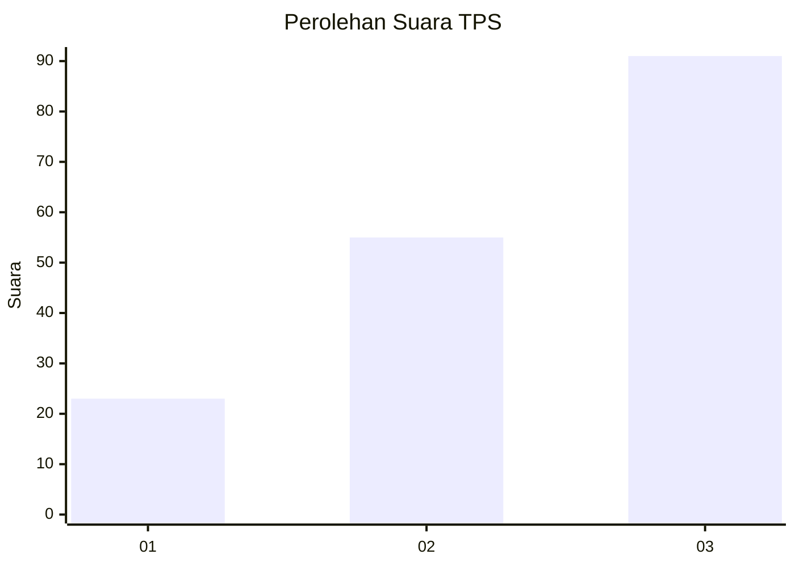
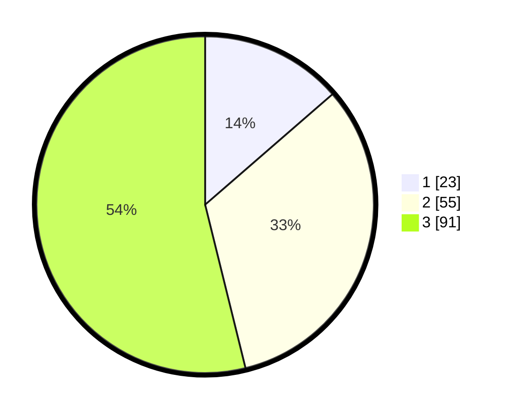

# Hasil

## Grafik

## Tabel

| No. | Nama Paslon    | Suara | Suara (raw) | Persentase |
|:--- |:-------------- | -----:| -----------:| ----------:|
| 1   | ANIES MUHAIMIN | 23    | [23][p-1]   | 13,61      |
| 2   | PRABOWO GIBRAN | 55    | [55][p-2]   | 32,54      |
| 3   | GANJAR MAHFUD  | 91    | [91][p-3]   | 53,85      |

[p-1]: https://github.com/gigit-pemilu/pemilu-2024/blob/main/pilpres/hitung-suara/sub/33-jawa-tengah/sub/06-purworejo/sub/15-loano/sub/2008-tridadi/sub/001-tps/sub/paslon-1.txt
[p-2]: https://github.com/gigit-pemilu/pemilu-2024/blob/main/pilpres/hitung-suara/sub/33-jawa-tengah/sub/06-purworejo/sub/15-loano/sub/2008-tridadi/sub/001-tps/sub/paslon-2.txt
[p-3]: https://github.com/gigit-pemilu/pemilu-2024/blob/main/pilpres/hitung-suara/sub/33-jawa-tengah/sub/06-purworejo/sub/15-loano/sub/2008-tridadi/sub/001-tps/sub/paslon-3.txt

## Foto C Plano

https://sirekap-obj-formc.kpu.go.id/f70f/pemilu/ppwp/33/06/15/20/08/3306152008001-20240214-195424--ebb5e3e3-c437-47c9-9a5a-a45cd25060cd.jpg

https://sirekap-obj-formc.kpu.go.id/f70f/pemilu/ppwp/33/06/15/20/08/3306152008001-20240214-195924--325d0019-97f2-49c4-8cd2-c49c6a1c7309.jpg

https://sirekap-obj-formc.kpu.go.id/f70f/pemilu/ppwp/33/06/15/20/08/3306152008001-20240214-195605--b3ae1425-2f11-4dab-9906-58c23056471a.jpg

## Metadata

| Key        | Value               |
| ---------- | ------------------- |
| Time Stamp | 2024-02-16 23:30:00 |

