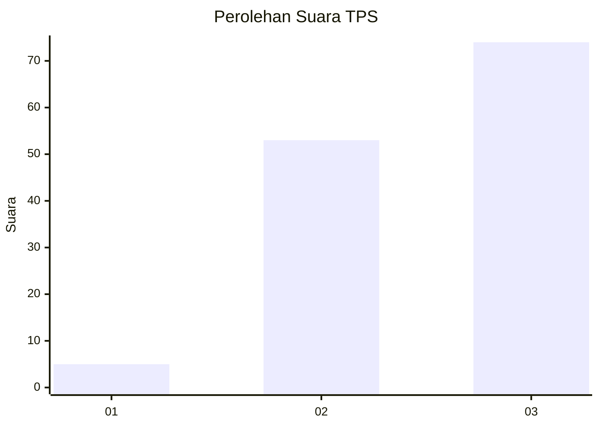
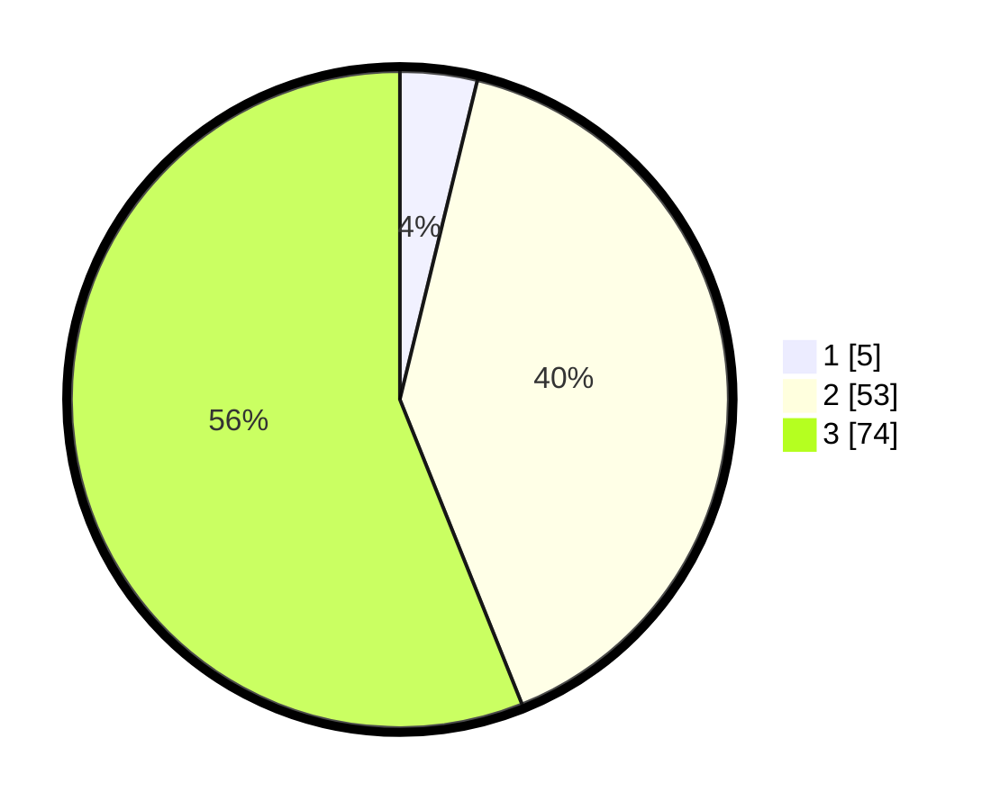

# Hasil

## Grafik

## Tabel

| No. | Nama Paslon    | Suara | Suara (raw) | Persentase |
|:--- |:-------------- | -----:| -----------:| ----------:|
| 1   | ANIES MUHAIMIN | 5     | [5][p-1]    | 3,79       |
| 2   | PRABOWO GIBRAN | 53    | [53][p-2]   | 40,15      |
| 3   | GANJAR MAHFUD  | 74    | [74][p-3]   | 56,06      |

[p-1]: https://github.com/gigit-pemilu/pemilu-2024/blob/main/pilpres/hitung-suara/sub/33-jawa-tengah/sub/06-purworejo/sub/15-loano/sub/2012-loano/sub/003-tps/sub/paslon-1.txt
[p-2]: https://github.com/gigit-pemilu/pemilu-2024/blob/main/pilpres/hitung-suara/sub/33-jawa-tengah/sub/06-purworejo/sub/15-loano/sub/2012-loano/sub/003-tps/sub/paslon-2.txt
[p-3]: https://github.com/gigit-pemilu/pemilu-2024/blob/main/pilpres/hitung-suara/sub/33-jawa-tengah/sub/06-purworejo/sub/15-loano/sub/2012-loano/sub/003-tps/sub/paslon-3.txt

## Foto C Plano

https://sirekap-obj-formc.kpu.go.id/a1f2/pemilu/ppwp/33/06/15/20/12/3306152012003-20240218-144217--a0aeccfc-a543-4035-8922-467921bd6a3f.jpg

https://sirekap-obj-formc.kpu.go.id/a1f2/pemilu/ppwp/33/06/15/20/12/3306152012003-20240218-140541--9da069a7-24bc-4747-b967-88652bf223fa.jpg

https://sirekap-obj-formc.kpu.go.id/a1f2/pemilu/ppwp/33/06/15/20/12/3306152012003-20240218-145230--fba0924d-003a-4d96-a772-6a87f8eaff92.jpg

## Metadata

| Key        | Value               |
| ---------- | ------------------- |
| Time Stamp | 2024-02-25 22:00:00 |

