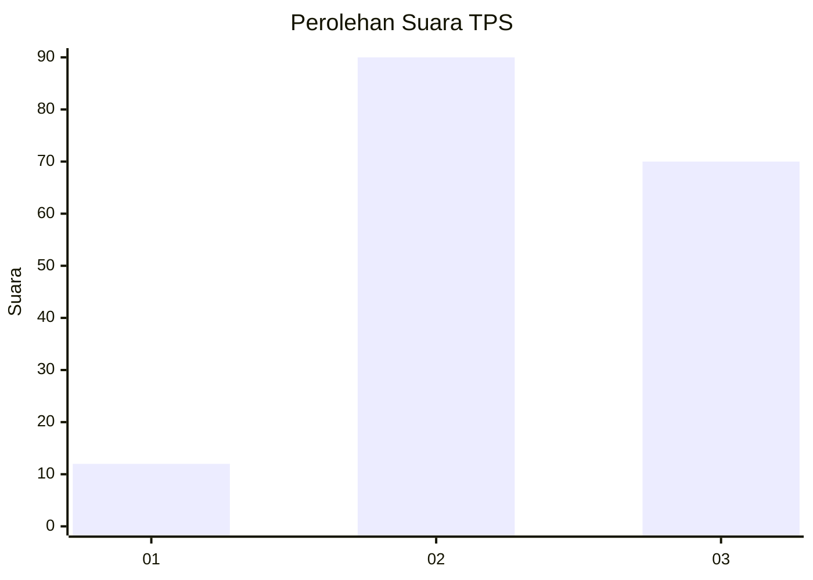
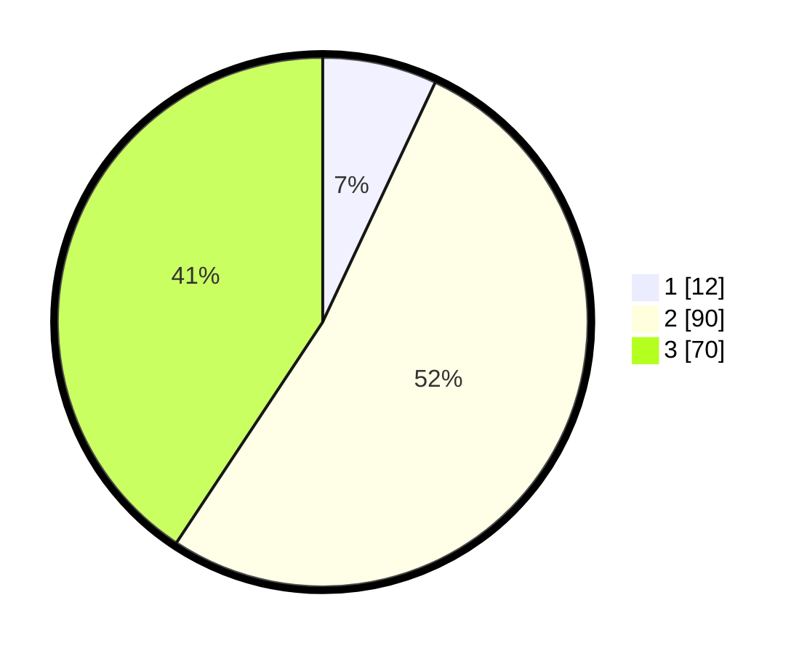

# Hasil

## Grafik

## Tabel

| No. | Nama Paslon    | Suara | Suara (raw) | Persentase |
|:--- |:-------------- | -----:| -----------:| ----------:|
| 1   | ANIES MUHAIMIN | 12    | [12][p-1]   | 6,98       |
| 2   | PRABOWO GIBRAN | 90    | [90][p-2]   | 52,33      |
| 3   | GANJAR MAHFUD  | 70    | [70][p-3]   | 40,70      |

[p-1]: https://github.com/gigit-pemilu/pemilu-2024-33-jawa-tengah/blob/main/pilpres/hitung-suara/sub/33-jawa-tengah/sub/06-purworejo/sub/15-loano/sub/2014-kedungpoh/sub/001-tps/sub/paslon-1.txt
[p-2]: https://github.com/gigit-pemilu/pemilu-2024-33-jawa-tengah/blob/main/pilpres/hitung-suara/sub/33-jawa-tengah/sub/06-purworejo/sub/15-loano/sub/2014-kedungpoh/sub/001-tps/sub/paslon-2.txt
[p-3]: https://github.com/gigit-pemilu/pemilu-2024-33-jawa-tengah/blob/main/pilpres/hitung-suara/sub/33-jawa-tengah/sub/06-purworejo/sub/15-loano/sub/2014-kedungpoh/sub/001-tps/sub/paslon-3.txt

## Foto C Plano

https://sirekap-obj-formc.kpu.go.id/ee43/pemilu/ppwp/33/06/15/20/14/3306152014001-20240214-225017--466c1ad1-d72f-4078-bea7-c2d1849a668b.jpg

https://sirekap-obj-formc.kpu.go.id/ee43/pemilu/ppwp/33/06/15/20/14/3306152014001-20240214-210913--6c614097-e5a4-49f3-a115-f198f5eddd42.jpg

https://sirekap-obj-formc.kpu.go.id/ee43/pemilu/ppwp/33/06/15/20/14/3306152014001-20240214-211309--a94728a0-9db6-4605-b5b0-9ec11f796907.jpg

## Metadata

| Key        | Value               |
| ---------- | ------------------- |
| Time Stamp | 2024-02-16 23:30:00 |

