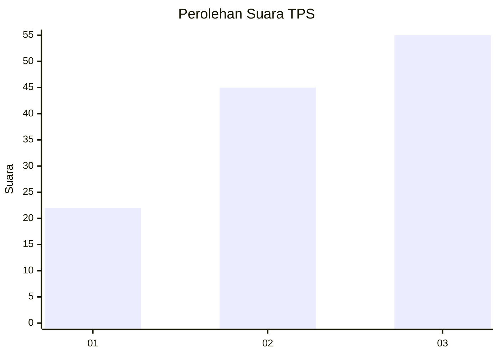
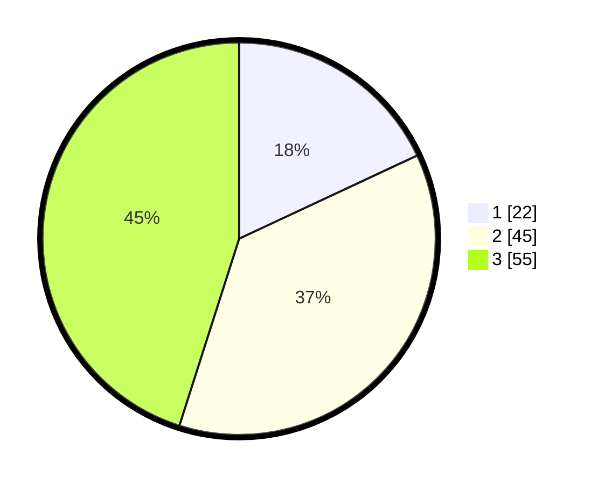

# Hasil

## Grafik

## Tabel

| No. | Nama Paslon    | Suara | Suara (raw) | Persentase |
|:--- |:-------------- | -----:| -----------:| ----------:|
| 1   | ANIES MUHAIMIN | 22    | [22][p-1]   | 18,03      |
| 2   | PRABOWO GIBRAN | 45    | [45][p-2]   | 36,89      |
| 3   | GANJAR MAHFUD  | 55    | [55][p-3]   | 45,08      |

[p-1]: https://github.com/gigit-pemilu/pemilu-2024-33-jawa-tengah/blob/main/pilpres/hitung-suara/sub/33-jawa-tengah/sub/06-purworejo/sub/15-loano/sub/2016-kebongunung/sub/007-tps/sub/paslon-1.txt
[p-2]: https://github.com/gigit-pemilu/pemilu-2024-33-jawa-tengah/blob/main/pilpres/hitung-suara/sub/33-jawa-tengah/sub/06-purworejo/sub/15-loano/sub/2016-kebongunung/sub/007-tps/sub/paslon-2.txt
[p-3]: https://github.com/gigit-pemilu/pemilu-2024-33-jawa-tengah/blob/main/pilpres/hitung-suara/sub/33-jawa-tengah/sub/06-purworejo/sub/15-loano/sub/2016-kebongunung/sub/007-tps/sub/paslon-3.txt

## Foto C Plano

https://sirekap-obj-formc.kpu.go.id/d571/pemilu/ppwp/33/06/15/20/16/3306152016007-20240215-023208--e21115c1-de65-4c76-a8f6-f1aff6982567.jpg

https://sirekap-obj-formc.kpu.go.id/d571/pemilu/ppwp/33/06/15/20/16/3306152016007-20240215-023348--e7f7e1c1-9ca5-44b8-90cf-3f8fe62bbeab.jpg

https://sirekap-obj-formc.kpu.go.id/d571/pemilu/ppwp/33/06/15/20/16/3306152016007-20240215-001541--dff5ea4f-0a84-4db9-9bd4-cadadee76dcb.jpg

## Metadata

| Key        | Value               |
| ---------- | ------------------- |
| Time Stamp | 2024-02-15 12:00:28 |

