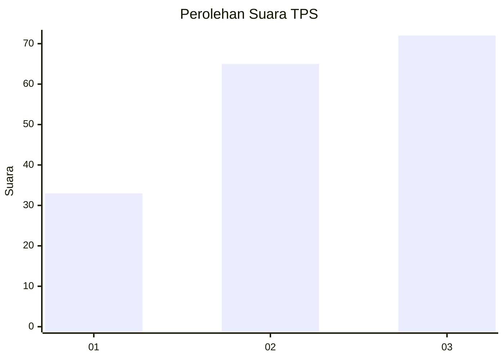
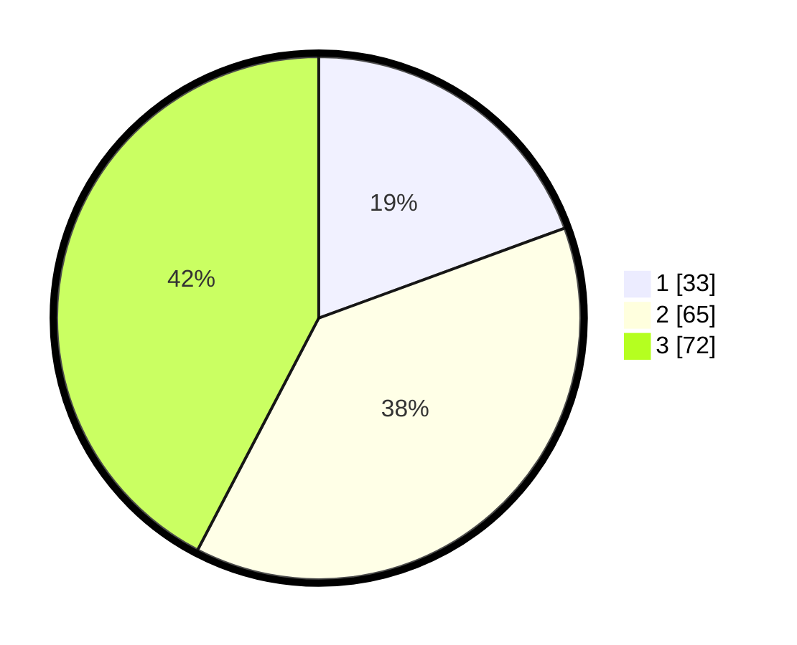

# Hasil

## Grafik

## Tabel

| No. | Nama Paslon    | Suara | Suara (raw) | Persentase |
|:--- |:-------------- | -----:| -----------:| ----------:|
| 1   | ANIES MUHAIMIN | 33    | [33][p-1]   | 19,41      |
| 2   | PRABOWO GIBRAN | 65    | [65][p-2]   | 38,24      |
| 3   | GANJAR MAHFUD  | 72    | [72][p-3]   | 42,35      |

[p-1]: https://github.com/gigit-pemilu/pemilu-2024/blob/main/pilpres/hitung-suara/sub/33-jawa-tengah/sub/06-purworejo/sub/16-bener/sub/2007-kaliurip/sub/007-tps/sub/paslon-1.txt
[p-2]: https://github.com/gigit-pemilu/pemilu-2024/blob/main/pilpres/hitung-suara/sub/33-jawa-tengah/sub/06-purworejo/sub/16-bener/sub/2007-kaliurip/sub/007-tps/sub/paslon-2.txt
[p-3]: https://github.com/gigit-pemilu/pemilu-2024/blob/main/pilpres/hitung-suara/sub/33-jawa-tengah/sub/06-purworejo/sub/16-bener/sub/2007-kaliurip/sub/007-tps/sub/paslon-3.txt

## Foto C Plano

https://sirekap-obj-formc.kpu.go.id/4c02/pemilu/ppwp/33/06/16/20/07/3306162007007-20240216-153331--c3b13d0c-dbcb-44a2-a6f7-5cad61d4e12f.jpg

https://sirekap-obj-formc.kpu.go.id/4c02/pemilu/ppwp/33/06/16/20/07/3306162007007-20240215-031446--b5bd388c-391e-424d-a9bc-5ce57316046d.jpg

https://sirekap-obj-formc.kpu.go.id/4c02/pemilu/ppwp/33/06/16/20/07/3306162007007-20240215-023906--8e620241-64cc-4ad8-a521-fb9d43681fdc.jpg

## Metadata

| Key        | Value               |
| ---------- | ------------------- |
| Time Stamp | 2024-02-16 22:01:00 |

