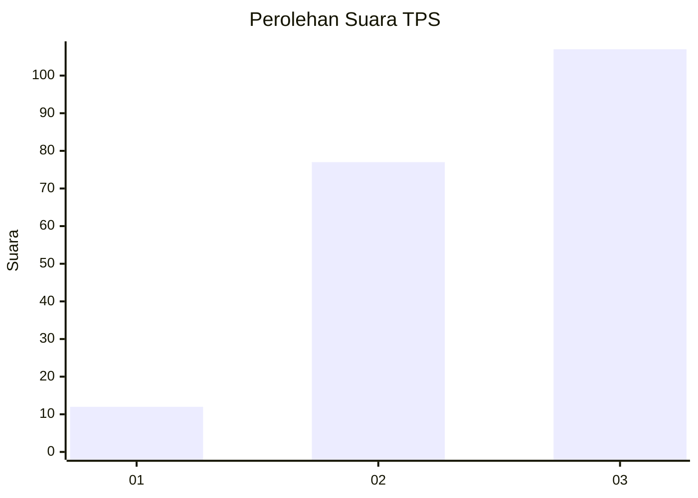
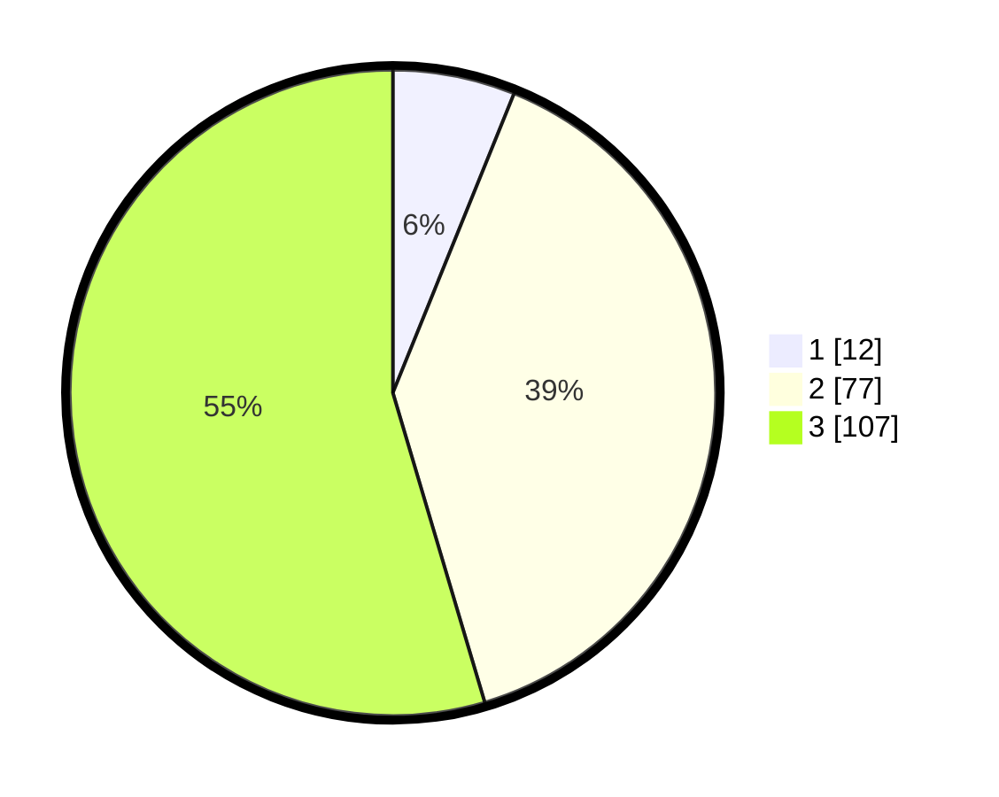

# Hasil

## Grafik

## Tabel

| No. | Nama Paslon    | Suara | Suara (raw) | Persentase |
|:--- |:-------------- | -----:| -----------:| ----------:|
| 1   | ANIES MUHAIMIN | 12    | [12][p-1]   | 6,12       |
| 2   | PRABOWO GIBRAN | 77    | [77][p-2]   | 39,29      |
| 3   | GANJAR MAHFUD  | 107   | [107][p-3]  | 54,59      |

[p-1]: https://github.com/gigit-pemilu/pemilu-2024-33-jawa-tengah/blob/main/pilpres/hitung-suara/sub/33-jawa-tengah/sub/06-purworejo/sub/16-bener/sub/2012-pekacangan/sub/006-tps/sub/paslon-1.txt
[p-2]: https://github.com/gigit-pemilu/pemilu-2024-33-jawa-tengah/blob/main/pilpres/hitung-suara/sub/33-jawa-tengah/sub/06-purworejo/sub/16-bener/sub/2012-pekacangan/sub/006-tps/sub/paslon-2.txt
[p-3]: https://github.com/gigit-pemilu/pemilu-2024-33-jawa-tengah/blob/main/pilpres/hitung-suara/sub/33-jawa-tengah/sub/06-purworejo/sub/16-bener/sub/2012-pekacangan/sub/006-tps/sub/paslon-3.txt

## Foto C Plano

https://sirekap-obj-formc.kpu.go.id/9c3b/pemilu/ppwp/33/06/16/20/12/3306162012006-20240217-094804--c5eb8aa4-9374-4eca-a2cf-19af574188c1.jpg

https://sirekap-obj-formc.kpu.go.id/9c3b/pemilu/ppwp/33/06/16/20/12/3306162012006-20240217-095246--e63cca98-dd53-49fd-ba04-e9e8a3b8ef5b.jpg

https://sirekap-obj-formc.kpu.go.id/9c3b/pemilu/ppwp/33/06/16/20/12/3306162012006-20240217-100455--f8e200e0-e77f-4154-b354-2101ffa3a13a.jpg

## Metadata

| Key        | Value               |
| ---------- | ------------------- |
| Time Stamp | 2024-02-17 10:30:03 |

