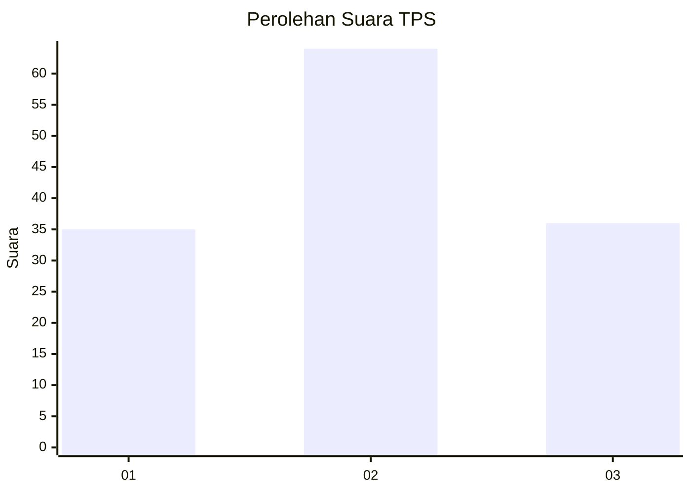
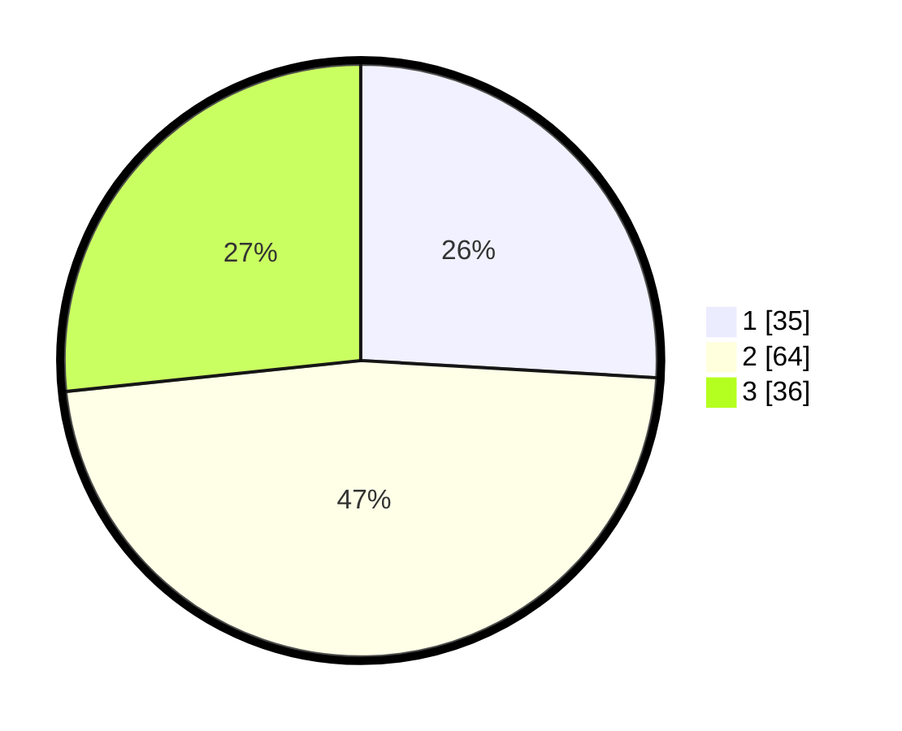

# Hasil

## Grafik

## Tabel

| No. | Nama Paslon    | Suara | Suara (raw) | Persentase |
|:--- |:-------------- | -----:| -----------:| ----------:|
| 1   | ANIES MUHAIMIN | 35    | [35][p-1]   | 25,93      |
| 2   | PRABOWO GIBRAN | 64    | [64][p-2]   | 47,41      |
| 3   | GANJAR MAHFUD  | 36    | [36][p-3]   | 26,67      |

[p-1]: https://github.com/gigit-pemilu/pemilu-2024-33-jawa-tengah/blob/main/pilpres/hitung-suara/sub/33-jawa-tengah/sub/07-wonosobo/sub/01-wadaslintang/sub/1007-wadaslintang/sub/003-tps/sub/paslon-1.txt
[p-2]: https://github.com/gigit-pemilu/pemilu-2024-33-jawa-tengah/blob/main/pilpres/hitung-suara/sub/33-jawa-tengah/sub/07-wonosobo/sub/01-wadaslintang/sub/1007-wadaslintang/sub/003-tps/sub/paslon-2.txt
[p-3]: https://github.com/gigit-pemilu/pemilu-2024-33-jawa-tengah/blob/main/pilpres/hitung-suara/sub/33-jawa-tengah/sub/07-wonosobo/sub/01-wadaslintang/sub/1007-wadaslintang/sub/003-tps/sub/paslon-3.txt

## Foto C Plano

https://sirekap-obj-formc.kpu.go.id/c4ee/pemilu/ppwp/33/07/01/10/07/3307011007003-20240214-220707--863d5ae7-5d37-4902-9b9b-1aeff8e40f29.jpg

https://sirekap-obj-formc.kpu.go.id/c4ee/pemilu/ppwp/33/07/01/10/07/3307011007003-20240214-220946--a995fc7b-fb93-4696-8459-a4faf433679d.jpg

https://sirekap-obj-formc.kpu.go.id/c4ee/pemilu/ppwp/33/07/01/10/07/3307011007003-20240214-221035--b388fb5b-4ca0-4246-8d5d-3570d4319285.jpg

## Metadata

| Key        | Value               |
| ---------- | ------------------- |
| Time Stamp | 2024-02-16 14:30:33 |

## DATA PEMILIH TETAP

Jumlah pemilih dalam DPT: **182**.
 * L: **88**.
 * P: **94**.

## DATA PENGGUNA HAK PILIH

Jumlah pengguna hak pilih dalam DPT: **160**.
 * L: **66**.
 * P: **74**.

Jumlah pengguna hak pilih dalam DPTb: **0**.
 * L: **0**.
 * P: **0**.

Jumlah pengguna hak pilih dalam DPK: **0**.
 * L: **1**.
 * P: **0**.

Jumlah pengguna hak pilih: **141**.
 * L: **67**.
 * P: **74**.

## JUMLAH SUARA SAH DAN TIDAK SAH

JUMLAH SELURUH SUARA SAH: **135**.

JUMLAH SUARA TIDAK SAH: **6**.

JUMLAH SELURUH SUARA SAH DAN SUARA TIDAK SAH: **141**.

