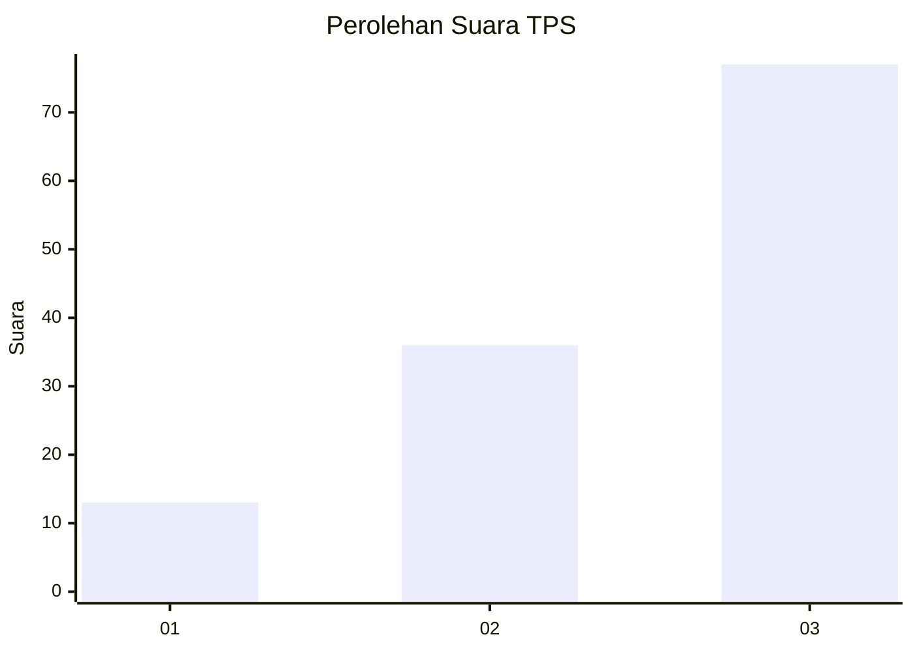
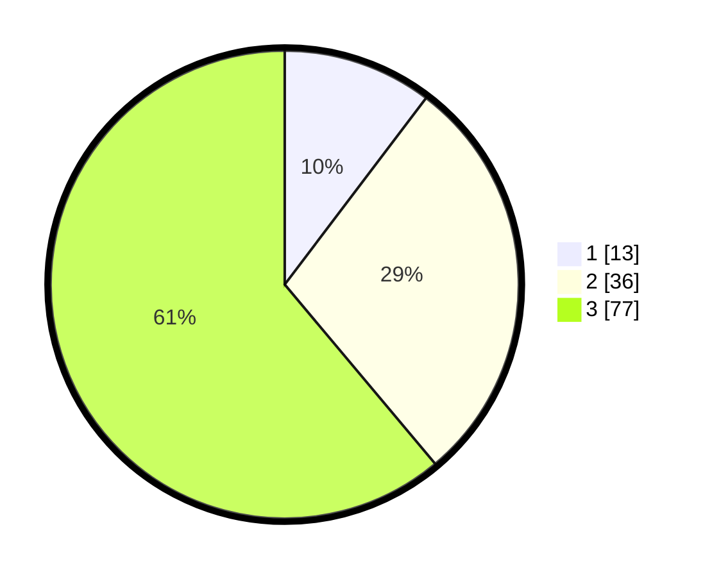

# Hasil

## Grafik

## Tabel

| No. | Nama Paslon    | Suara | Suara (raw) | Persentase |
|:--- |:-------------- | -----:| -----------:| ----------:|
| 1   | ANIES MUHAIMIN | 13    | [13][p-1]   | 10,32      |
| 2   | PRABOWO GIBRAN | 36    | [36][p-2]   | 28,57      |
| 3   | GANJAR MAHFUD  | 77    | [77][p-3]   | 61,11      |

[p-1]: https://github.com/gigit-pemilu/pemilu-2024/blob/main/pilpres/hitung-suara/sub/33-jawa-tengah/sub/07-wonosobo/sub/01-wadaslintang/sub/1007-wadaslintang/sub/008-tps/sub/paslon-1.txt
[p-2]: https://github.com/gigit-pemilu/pemilu-2024/blob/main/pilpres/hitung-suara/sub/33-jawa-tengah/sub/07-wonosobo/sub/01-wadaslintang/sub/1007-wadaslintang/sub/008-tps/sub/paslon-2.txt
[p-3]: https://github.com/gigit-pemilu/pemilu-2024/blob/main/pilpres/hitung-suara/sub/33-jawa-tengah/sub/07-wonosobo/sub/01-wadaslintang/sub/1007-wadaslintang/sub/008-tps/sub/paslon-3.txt

## Foto C Plano

https://sirekap-obj-formc.kpu.go.id/699e/pemilu/ppwp/33/07/01/10/07/3307011007008-20240214-192324--6d837a41-fc3d-49ca-996d-94145211805d.jpg

https://sirekap-obj-formc.kpu.go.id/699e/pemilu/ppwp/33/07/01/10/07/3307011007008-20240214-220539--e4555d7c-4728-47a1-8c80-5e5a54db11ea.jpg

https://sirekap-obj-formc.kpu.go.id/699e/pemilu/ppwp/33/07/01/10/07/3307011007008-20240214-192504--497e098e-6850-4649-bed4-3d5f6c826b4f.jpg

## Metadata

| Key        | Value               |
| ---------- | ------------------- |
| Time Stamp | 2024-02-17 09:00:02 |

