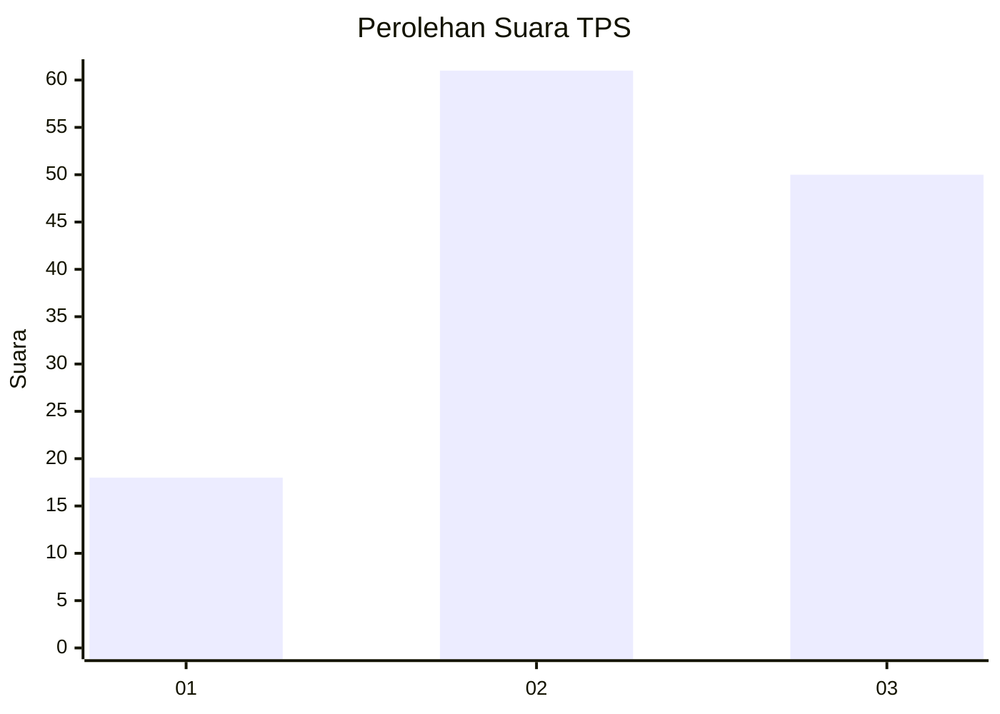
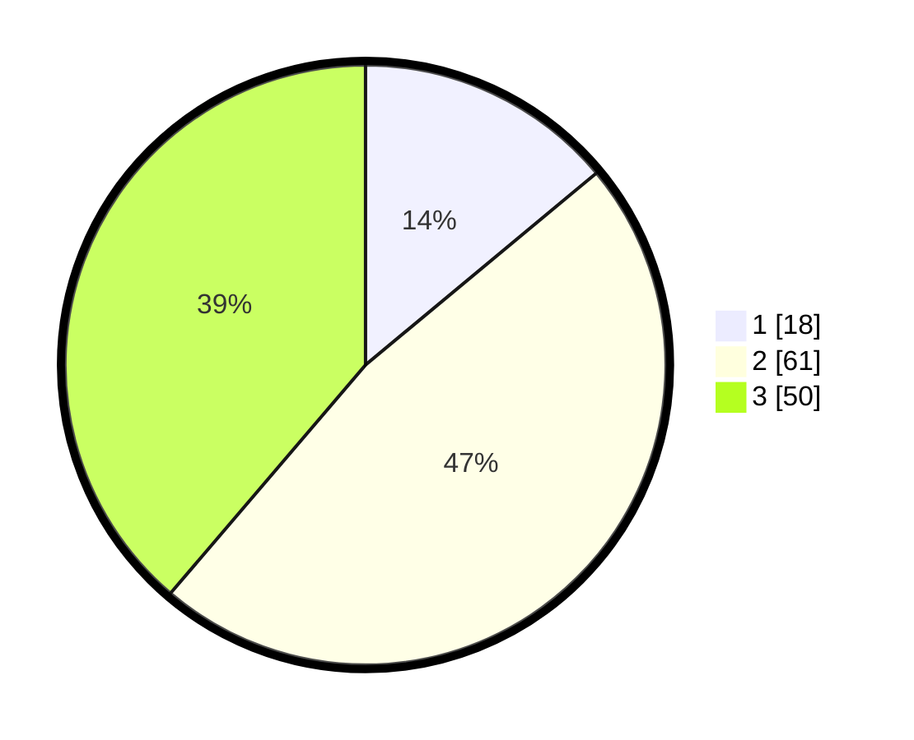

# Hasil

## Grafik

## Tabel

| No. | Nama Paslon    | Suara | Suara (raw) | Persentase |
|:--- |:-------------- | -----:| -----------:| ----------:|
| 1   | ANIES MUHAIMIN | 18    | [18][p-1]   | 13,95      |
| 2   | PRABOWO GIBRAN | 61    | [61][p-2]   | 47,29      |
| 3   | GANJAR MAHFUD  | 50    | [50][p-3]   | 38,76      |

[p-1]: https://github.com/gigit-pemilu/pemilu-2024/blob/main/pilpres/hitung-suara/sub/33-jawa-tengah/sub/07-wonosobo/sub/01-wadaslintang/sub/2008-plunjaran/sub/004-tps/sub/paslon-1.txt
[p-2]: https://github.com/gigit-pemilu/pemilu-2024/blob/main/pilpres/hitung-suara/sub/33-jawa-tengah/sub/07-wonosobo/sub/01-wadaslintang/sub/2008-plunjaran/sub/004-tps/sub/paslon-2.txt
[p-3]: https://github.com/gigit-pemilu/pemilu-2024/blob/main/pilpres/hitung-suara/sub/33-jawa-tengah/sub/07-wonosobo/sub/01-wadaslintang/sub/2008-plunjaran/sub/004-tps/sub/paslon-3.txt

## Foto C Plano

https://sirekap-obj-formc.kpu.go.id/f27b/pemilu/ppwp/33/07/01/20/08/3307012008004-20240215-011020--7a81bb9b-a80b-4977-afcf-5cf844b2a0fa.jpg

https://sirekap-obj-formc.kpu.go.id/f27b/pemilu/ppwp/33/07/01/20/08/3307012008004-20240215-011154--2c0ae4d5-caa8-4821-989a-821a703db33e.jpg

https://sirekap-obj-formc.kpu.go.id/f27b/pemilu/ppwp/33/07/01/20/08/3307012008004-20240215-011335--a7f37e38-ee7f-41f8-8d7c-753a5bc58037.jpg

## Metadata

| Key        | Value               |
| ---------- | ------------------- |
| Time Stamp | 2024-02-15 15:00:29 |

