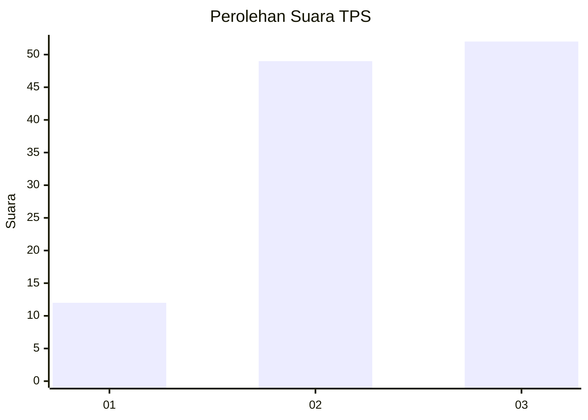
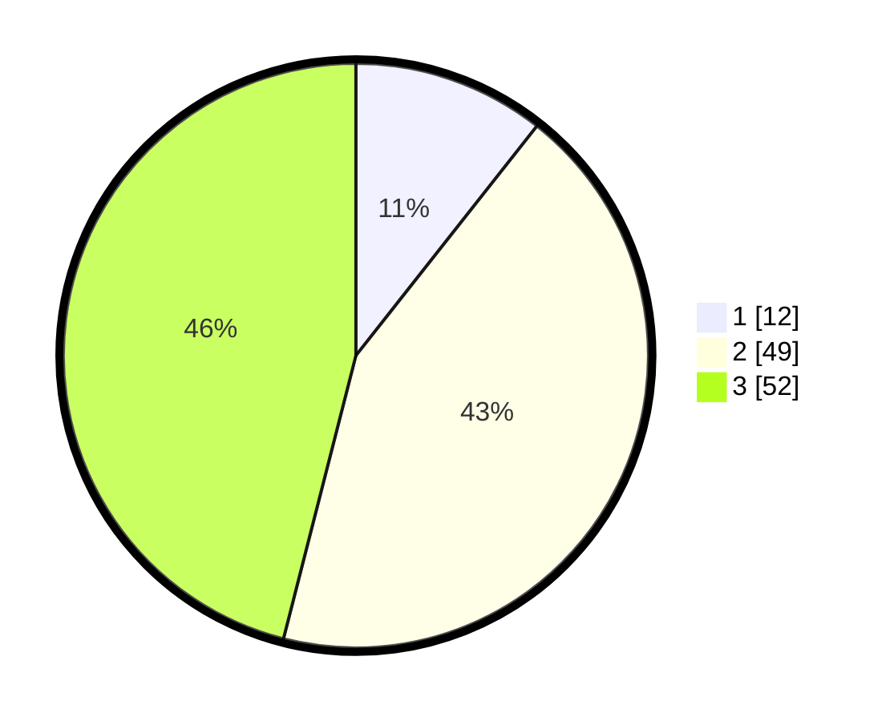

# Hasil

## Grafik

## Tabel

| No. | Nama Paslon    | Suara | Suara (raw) | Persentase |
|:--- |:-------------- | -----:| -----------:| ----------:|
| 1   | ANIES MUHAIMIN | 12    | [12][p-1]   | 10,62      |
| 2   | PRABOWO GIBRAN | 49    | [49][p-2]   | 43,36      |
| 3   | GANJAR MAHFUD  | 52    | [52][p-3]   | 46,02      |

[p-1]: https://github.com/gigit-pemilu/pemilu-2024/blob/main/pilpres/hitung-suara/sub/33-jawa-tengah/sub/07-wonosobo/sub/01-wadaslintang/sub/2008-plunjaran/sub/005-tps/sub/paslon-1.txt
[p-2]: https://github.com/gigit-pemilu/pemilu-2024/blob/main/pilpres/hitung-suara/sub/33-jawa-tengah/sub/07-wonosobo/sub/01-wadaslintang/sub/2008-plunjaran/sub/005-tps/sub/paslon-2.txt
[p-3]: https://github.com/gigit-pemilu/pemilu-2024/blob/main/pilpres/hitung-suara/sub/33-jawa-tengah/sub/07-wonosobo/sub/01-wadaslintang/sub/2008-plunjaran/sub/005-tps/sub/paslon-3.txt

## Foto C Plano

https://sirekap-obj-formc.kpu.go.id/4beb/pemilu/ppwp/33/07/01/20/08/3307012008005-20240214-234841--9b463251-174d-46b2-a178-a7996beecf8d.jpg

https://sirekap-obj-formc.kpu.go.id/4beb/pemilu/ppwp/33/07/01/20/08/3307012008005-20240214-235655--cd2eab61-954c-4c0b-bfec-fdfbeff7c51b.jpg

https://sirekap-obj-formc.kpu.go.id/4beb/pemilu/ppwp/33/07/01/20/08/3307012008005-20240214-205940--2617d628-f3aa-4d81-bcf9-69a81ee82472.jpg

## Metadata

| Key        | Value               |
| ---------- | ------------------- |
| Time Stamp | 2024-02-15 12:00:28 |

