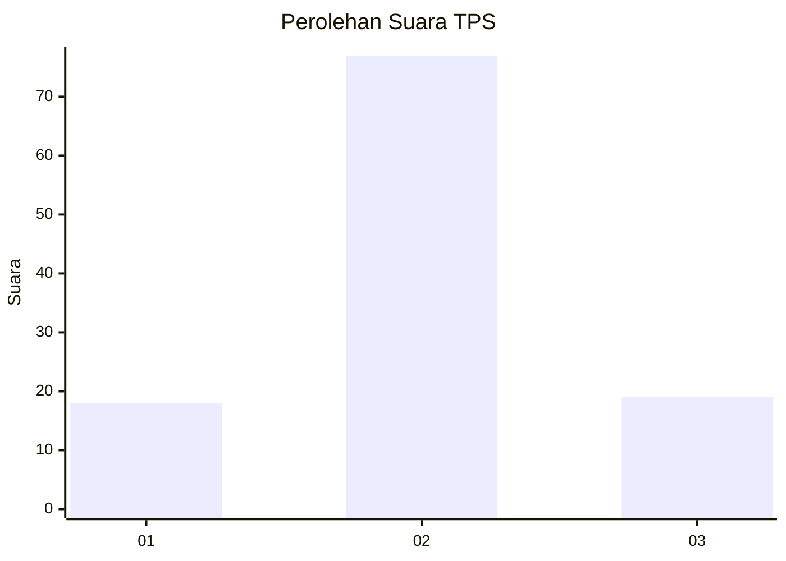
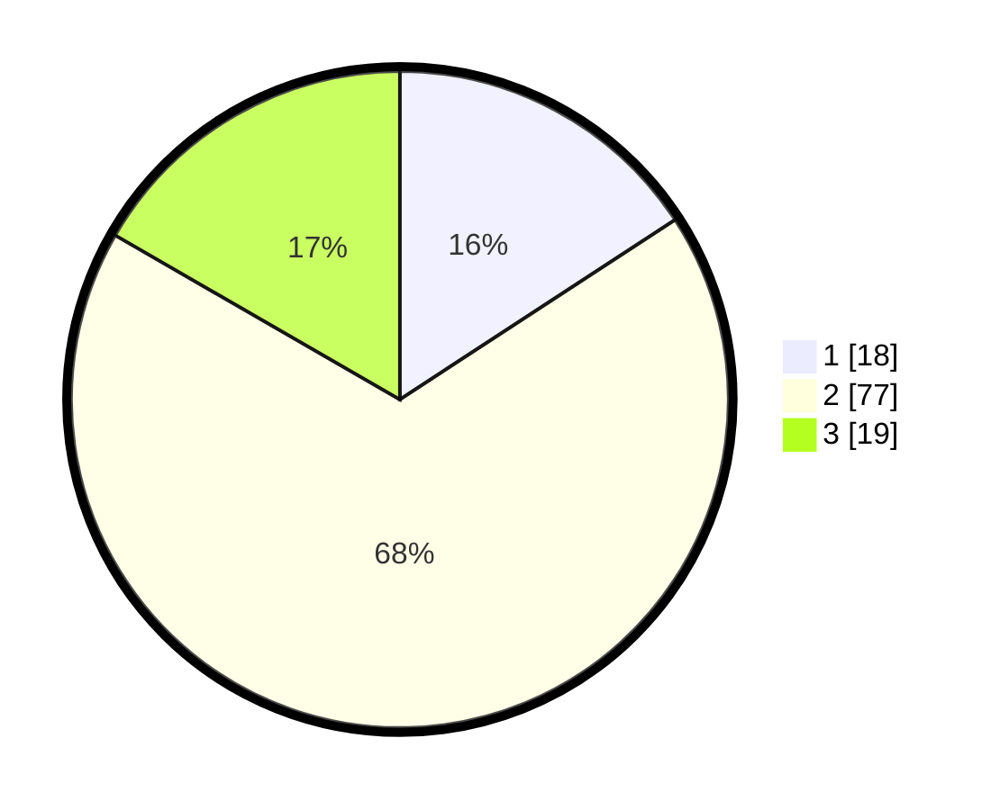

# Hasil

## Grafik

## Tabel

| No. | Nama Paslon    | Suara | Suara (raw) | Persentase |
|:--- |:-------------- | -----:| -----------:| ----------:|
| 1   | ANIES MUHAIMIN | 18    | [18][p-1]   | 15,79      |
| 2   | PRABOWO GIBRAN | 77    | [77][p-2]   | 67,54      |
| 3   | GANJAR MAHFUD  | 19    | [19][p-3]   | 16,67      |

[p-1]: https://github.com/gigit-pemilu/pemilu-2024-33-jawa-tengah/blob/main/pilpres/hitung-suara/sub/33-jawa-tengah/sub/07-wonosobo/sub/01-wadaslintang/sub/2011-somogede/sub/003-tps/sub/paslon-1.txt
[p-2]: https://github.com/gigit-pemilu/pemilu-2024-33-jawa-tengah/blob/main/pilpres/hitung-suara/sub/33-jawa-tengah/sub/07-wonosobo/sub/01-wadaslintang/sub/2011-somogede/sub/003-tps/sub/paslon-2.txt
[p-3]: https://github.com/gigit-pemilu/pemilu-2024-33-jawa-tengah/blob/main/pilpres/hitung-suara/sub/33-jawa-tengah/sub/07-wonosobo/sub/01-wadaslintang/sub/2011-somogede/sub/003-tps/sub/paslon-3.txt

## Foto C Plano

https://sirekap-obj-formc.kpu.go.id/6d50/pemilu/ppwp/33/07/01/20/11/3307012011003-20240214-202553--6c59ac91-1e78-409a-a5f7-91c2b56e500d.jpg

https://sirekap-obj-formc.kpu.go.id/6d50/pemilu/ppwp/33/07/01/20/11/3307012011003-20240214-210512--3b186ee1-dbb4-42d3-91a8-1047970a708c.jpg

https://sirekap-obj-formc.kpu.go.id/6d50/pemilu/ppwp/33/07/01/20/11/3307012011003-20240214-214707--2e9f3237-edd1-47bd-a2d1-7a95eac2dd69.jpg

## Metadata

| Key        | Value               |
| ---------- | ------------------- |
| Time Stamp | 2024-02-15 15:00:29 |

