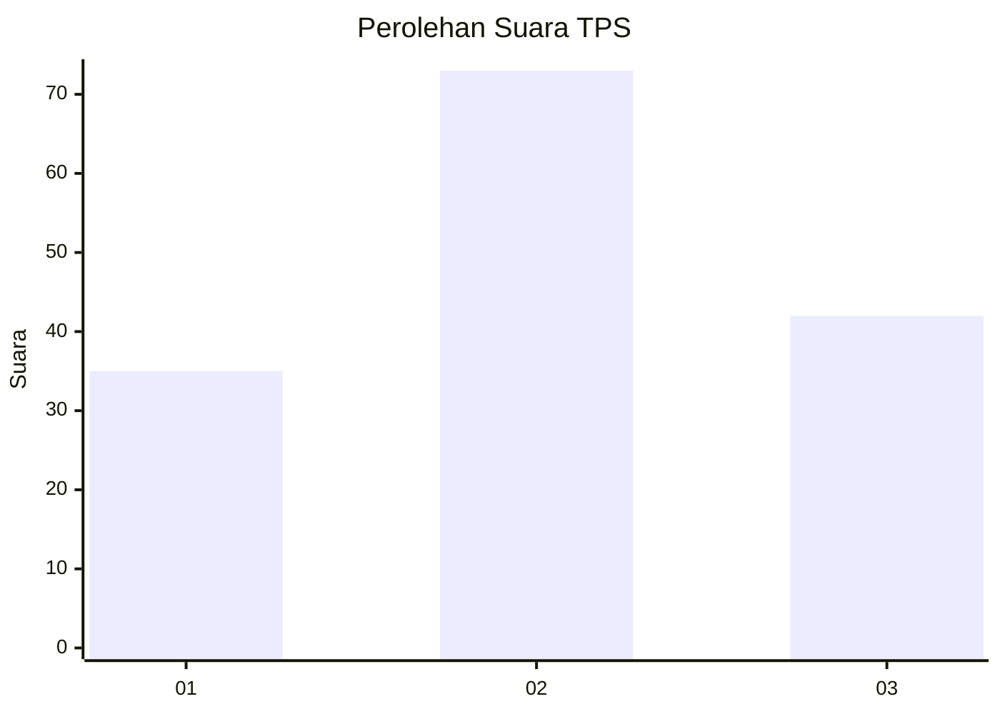
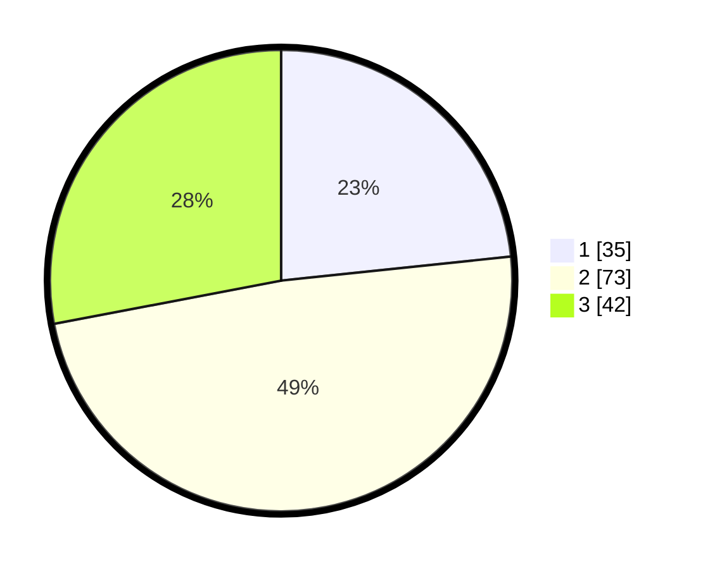

# Hasil

## Grafik

## Tabel

| No. | Nama Paslon    | Suara | Suara (raw) | Persentase |
|:--- |:-------------- | -----:| -----------:| ----------:|
| 1   | ANIES MUHAIMIN | 35    | [35][p-1]   | 23,33      |
| 2   | PRABOWO GIBRAN | 73    | [73][p-2]   | 48,67      |
| 3   | GANJAR MAHFUD  | 42    | [42][p-3]   | 28,00      |

[p-1]: https://github.com/gigit-pemilu/pemilu-2024-33-jawa-tengah/blob/main/pilpres/hitung-suara/sub/33-jawa-tengah/sub/07-wonosobo/sub/01-wadaslintang/sub/2011-somogede/sub/009-tps/sub/paslon-1.txt
[p-2]: https://github.com/gigit-pemilu/pemilu-2024-33-jawa-tengah/blob/main/pilpres/hitung-suara/sub/33-jawa-tengah/sub/07-wonosobo/sub/01-wadaslintang/sub/2011-somogede/sub/009-tps/sub/paslon-2.txt
[p-3]: https://github.com/gigit-pemilu/pemilu-2024-33-jawa-tengah/blob/main/pilpres/hitung-suara/sub/33-jawa-tengah/sub/07-wonosobo/sub/01-wadaslintang/sub/2011-somogede/sub/009-tps/sub/paslon-3.txt

## Foto C Plano

https://sirekap-obj-formc.kpu.go.id/f762/pemilu/ppwp/33/07/01/20/11/3307012011009-20240214-141011--4f495f38-cc44-4bce-bc11-111956965f29.jpg

https://sirekap-obj-formc.kpu.go.id/f762/pemilu/ppwp/33/07/01/20/11/3307012011009-20240214-141051--6ef24027-34b2-4926-b283-37befe49dc87.jpg

https://sirekap-obj-formc.kpu.go.id/f762/pemilu/ppwp/33/07/01/20/11/3307012011009-20240214-141130--69acab90-0cdd-46e0-ba5a-76b80fa85677.jpg

## Metadata

| Key        | Value               |
| ---------- | ------------------- |
| Time Stamp | 2024-02-14 21:46:01 |

