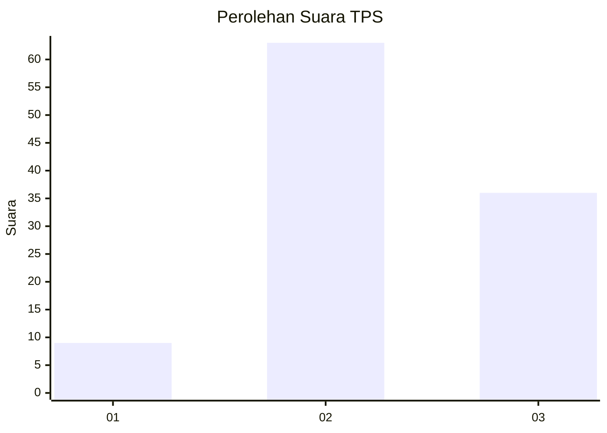
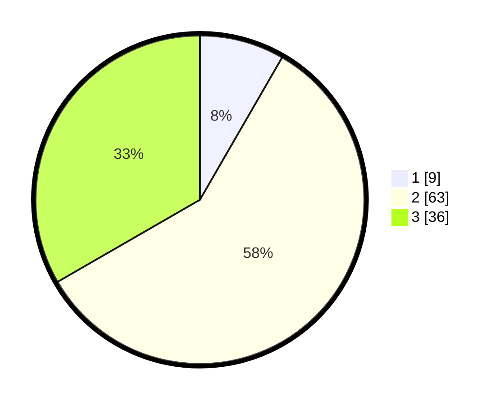

# Hasil

## Grafik

## Tabel

| No. | Nama Paslon    | Suara | Suara (raw) | Persentase |
|:--- |:-------------- | -----:| -----------:| ----------:|
| 1   | ANIES MUHAIMIN | 9     | [9][p-1]    | 8,33       |
| 2   | PRABOWO GIBRAN | 63    | [63][p-2]   | 58,33      |
| 3   | GANJAR MAHFUD  | 36    | [36][p-3]   | 33,33      |

[p-1]: https://github.com/gigit-pemilu/pemilu-2024/blob/main/pilpres/hitung-suara/sub/33-jawa-tengah/sub/07-wonosobo/sub/01-wadaslintang/sub/2012-trimulyo/sub/011-tps/sub/paslon-1.txt
[p-2]: https://github.com/gigit-pemilu/pemilu-2024/blob/main/pilpres/hitung-suara/sub/33-jawa-tengah/sub/07-wonosobo/sub/01-wadaslintang/sub/2012-trimulyo/sub/011-tps/sub/paslon-2.txt
[p-3]: https://github.com/gigit-pemilu/pemilu-2024/blob/main/pilpres/hitung-suara/sub/33-jawa-tengah/sub/07-wonosobo/sub/01-wadaslintang/sub/2012-trimulyo/sub/011-tps/sub/paslon-3.txt

## Foto C Plano

https://sirekap-obj-formc.kpu.go.id/fe2a/pemilu/ppwp/33/07/01/20/12/3307012012011-20240214-141442--d5064245-d192-491f-9528-8b1e5d3e1b22.jpg

https://sirekap-obj-formc.kpu.go.id/fe2a/pemilu/ppwp/33/07/01/20/12/3307012012011-20240214-141710--d6eaed7a-68a2-4da3-ad47-58fc96bd6cfc.jpg

https://sirekap-obj-formc.kpu.go.id/fe2a/pemilu/ppwp/33/07/01/20/12/3307012012011-20240215-062624--e007e480-5153-4152-8ec1-f43900c74e28.jpg

## Metadata

| Key        | Value               |
| ---------- | ------------------- |
| Time Stamp | 2024-02-15 15:00:29 |

