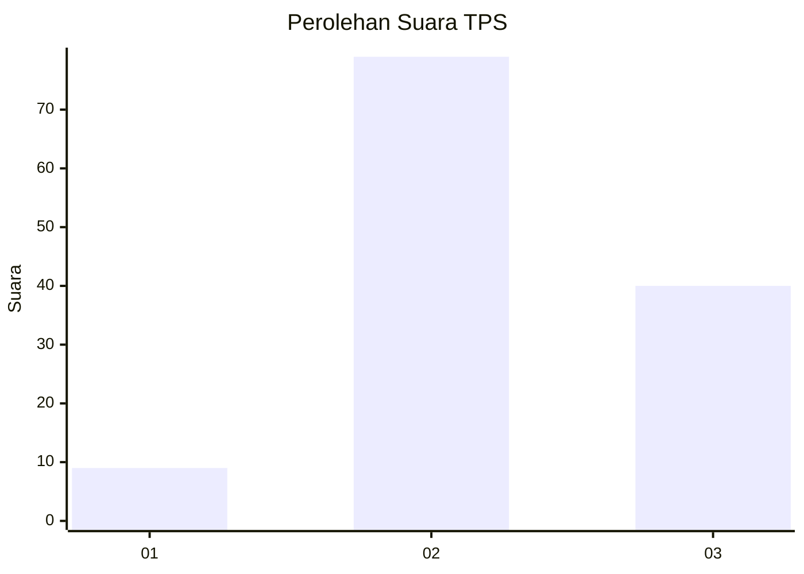
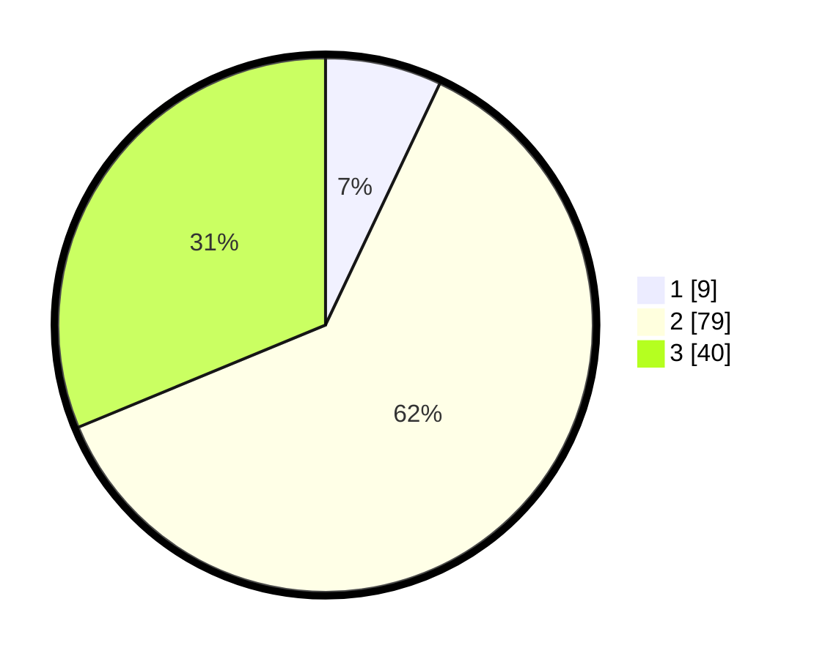

# Hasil

## Grafik

## Tabel

| No. | Nama Paslon    | Suara | Suara (raw) | Persentase |
|:--- |:-------------- | -----:| -----------:| ----------:|
| 1   | ANIES MUHAIMIN | 9     | [9][p-1]    | 7,03       |
| 2   | PRABOWO GIBRAN | 79    | [79][p-2]   | 61,72      |
| 3   | GANJAR MAHFUD  | 40    | [40][p-3]   | 31,25      |

[p-1]: https://github.com/gigit-pemilu/pemilu-2024-33-jawa-tengah/blob/main/pilpres/hitung-suara/sub/33-jawa-tengah/sub/07-wonosobo/sub/01-wadaslintang/sub/2012-trimulyo/sub/021-tps/sub/paslon-1.txt
[p-2]: https://github.com/gigit-pemilu/pemilu-2024-33-jawa-tengah/blob/main/pilpres/hitung-suara/sub/33-jawa-tengah/sub/07-wonosobo/sub/01-wadaslintang/sub/2012-trimulyo/sub/021-tps/sub/paslon-2.txt
[p-3]: https://github.com/gigit-pemilu/pemilu-2024-33-jawa-tengah/blob/main/pilpres/hitung-suara/sub/33-jawa-tengah/sub/07-wonosobo/sub/01-wadaslintang/sub/2012-trimulyo/sub/021-tps/sub/paslon-3.txt

## Foto C Plano

https://sirekap-obj-formc.kpu.go.id/0e7a/pemilu/ppwp/33/07/01/20/12/3307012012021-20240214-221804--dae9349c-9ace-4190-ae1a-3dcf424a668d.jpg

https://sirekap-obj-formc.kpu.go.id/0e7a/pemilu/ppwp/33/07/01/20/12/3307012012021-20240214-222008--240cbe36-c8fd-4e8f-add5-a34952b46e9e.jpg

https://sirekap-obj-formc.kpu.go.id/0e7a/pemilu/ppwp/33/07/01/20/12/3307012012021-20240214-222134--fbf4b73b-8d92-478c-ad2d-c857905b4da6.jpg

## Metadata

| Key        | Value               |
| ---------- | ------------------- |
| Time Stamp | 2024-02-15 15:00:29 |

