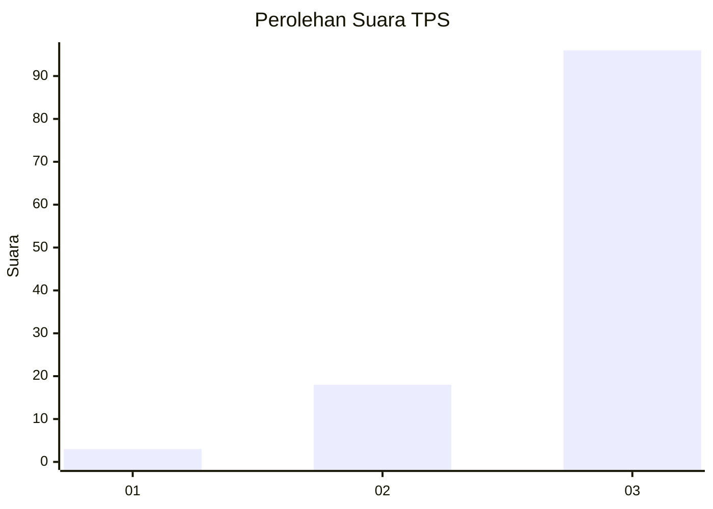
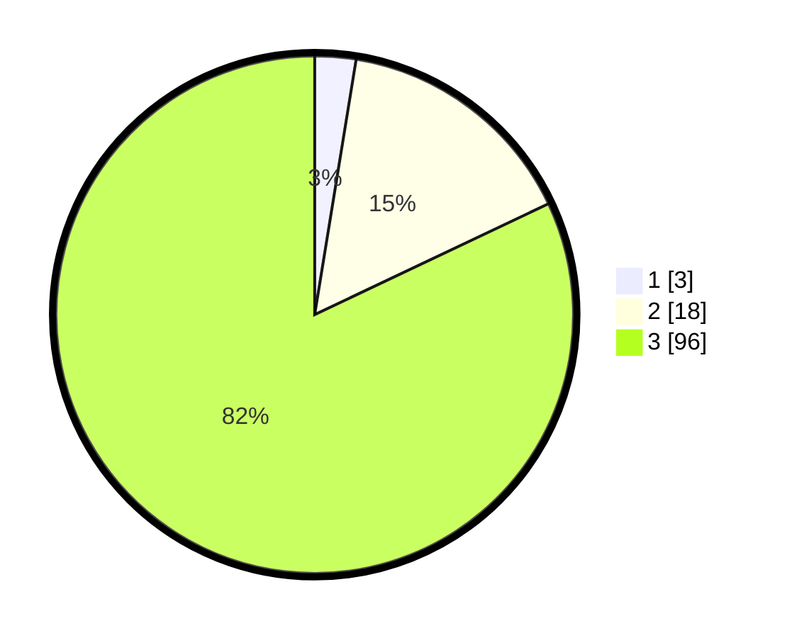

# Hasil

## Grafik

## Tabel

| No. | Nama Paslon    | Suara | Suara (raw) | Persentase |
|:--- |:-------------- | -----:| -----------:| ----------:|
| 1   | ANIES MUHAIMIN | 3     | [3][p-1]    | 2,56       |
| 2   | PRABOWO GIBRAN | 18    | [18][p-2]   | 15,38      |
| 3   | GANJAR MAHFUD  | 96    | [96][p-3]   | 82,05      |

[p-1]: https://github.com/gigit-pemilu/pemilu-2024-33-jawa-tengah/blob/main/pilpres/hitung-suara/sub/33-jawa-tengah/sub/07-wonosobo/sub/02-kepil/sub/1008-kepil/sub/003-tps/sub/paslon-1.txt
[p-2]: https://github.com/gigit-pemilu/pemilu-2024-33-jawa-tengah/blob/main/pilpres/hitung-suara/sub/33-jawa-tengah/sub/07-wonosobo/sub/02-kepil/sub/1008-kepil/sub/003-tps/sub/paslon-2.txt
[p-3]: https://github.com/gigit-pemilu/pemilu-2024-33-jawa-tengah/blob/main/pilpres/hitung-suara/sub/33-jawa-tengah/sub/07-wonosobo/sub/02-kepil/sub/1008-kepil/sub/003-tps/sub/paslon-3.txt

## Foto C Plano

https://sirekap-obj-formc.kpu.go.id/353e/pemilu/ppwp/33/07/02/10/08/3307021008003-20240214-232158--330fc87a-2439-4f23-9090-36ace8c5edbf.jpg

https://sirekap-obj-formc.kpu.go.id/353e/pemilu/ppwp/33/07/02/10/08/3307021008003-20240214-141302--66ae06ad-f7dd-4765-9911-3500a497d09c.jpg

## Metadata

| Key        | Value               |
| ---------- | ------------------- |
| Time Stamp | 2024-02-15 12:00:28 |

