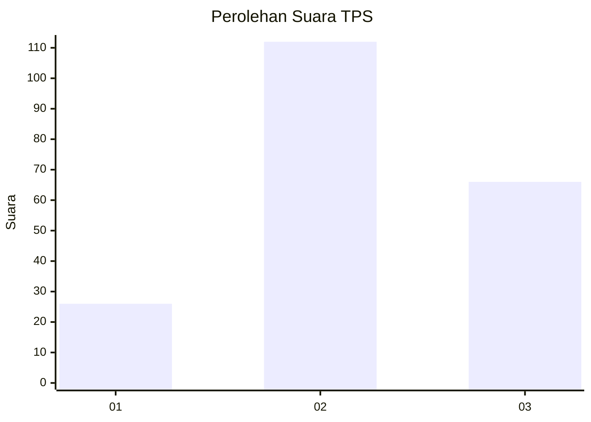
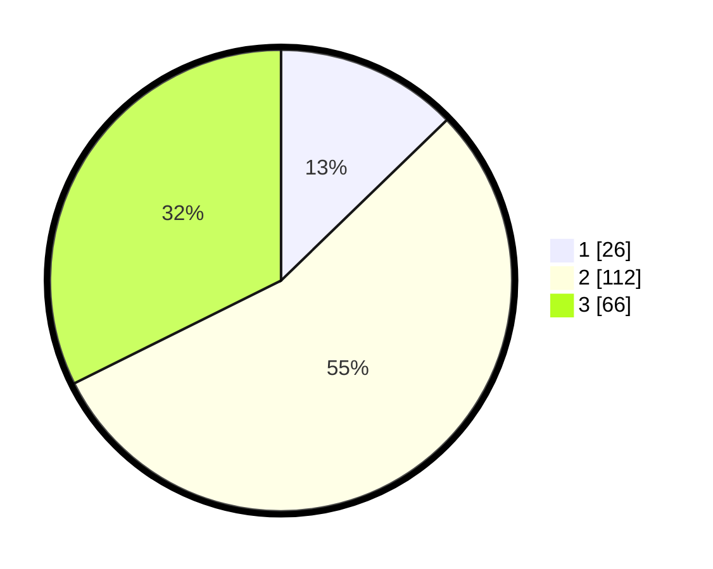

# Hasil

## Grafik

## Tabel

| No. | Nama Paslon    | Suara | Suara (raw) | Persentase |
|:--- |:-------------- | -----:| -----------:| ----------:|
| 1   | ANIES MUHAIMIN | 26    | [26][p-1]   | 12,75      |
| 2   | PRABOWO GIBRAN | 112   | [112][p-2]  | 54,90      |
| 3   | GANJAR MAHFUD  | 66    | [66][p-3]   | 32,35      |

[p-1]: https://github.com/gigit-pemilu/pemilu-2024/blob/main/pilpres/hitung-suara/sub/33-jawa-tengah/sub/07-wonosobo/sub/02-kepil/sub/1008-kepil/sub/004-tps/sub/paslon-1.txt
[p-2]: https://github.com/gigit-pemilu/pemilu-2024/blob/main/pilpres/hitung-suara/sub/33-jawa-tengah/sub/07-wonosobo/sub/02-kepil/sub/1008-kepil/sub/004-tps/sub/paslon-2.txt
[p-3]: https://github.com/gigit-pemilu/pemilu-2024/blob/main/pilpres/hitung-suara/sub/33-jawa-tengah/sub/07-wonosobo/sub/02-kepil/sub/1008-kepil/sub/004-tps/sub/paslon-3.txt

## Foto C Plano

https://sirekap-obj-formc.kpu.go.id/d844/pemilu/ppwp/33/07/02/10/08/3307021008004-20240215-014343--ea93336e-be36-4ccf-abb2-5b8cc4172a3d.jpg

https://sirekap-obj-formc.kpu.go.id/d844/pemilu/ppwp/33/07/02/10/08/3307021008004-20240215-014259--3c51fedc-4430-47fa-ba8b-987582fa211d.jpg

https://sirekap-obj-formc.kpu.go.id/d844/pemilu/ppwp/33/07/02/10/08/3307021008004-20240215-015229--49e14c94-6fce-4a0f-99c6-2d148cea7baa.jpg

## Metadata

| Key        | Value               |
| ---------- | ------------------- |
| Time Stamp | 2024-02-24 22:31:28 |

