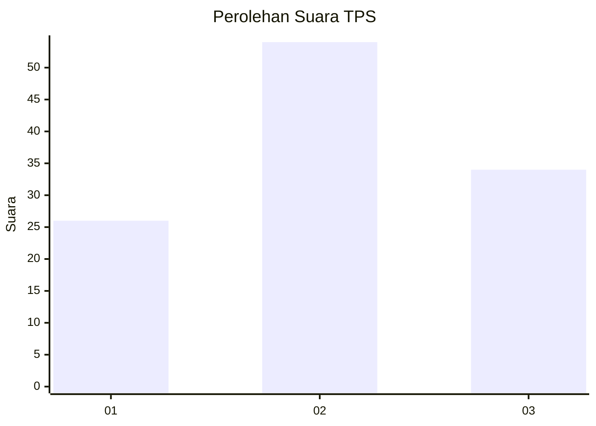
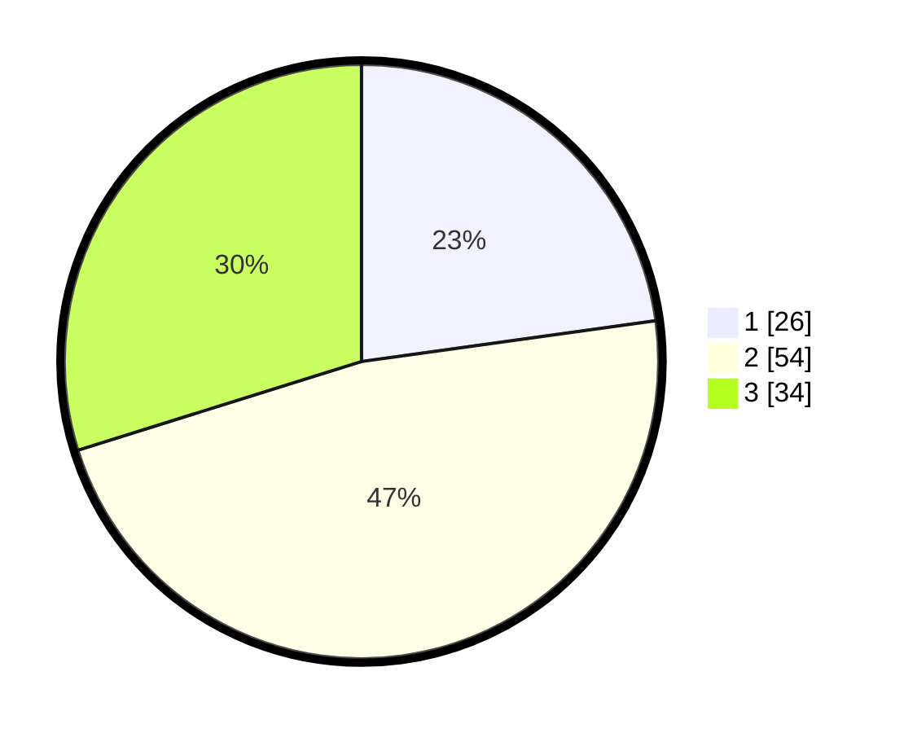

# Hasil

## Grafik

## Tabel

| No. | Nama Paslon    | Suara | Suara (raw) | Persentase |
|:--- |:-------------- | -----:| -----------:| ----------:|
| 1   | ANIES MUHAIMIN | 26    | [26][p-1]   | 22,81      |
| 2   | PRABOWO GIBRAN | 54    | [54][p-2]   | 47,37      |
| 3   | GANJAR MAHFUD  | 34    | [34][p-3]   | 29,82      |

[p-1]: https://github.com/gigit-pemilu/pemilu-2024/blob/main/pilpres/hitung-suara/sub/33-jawa-tengah/sub/07-wonosobo/sub/02-kepil/sub/1008-kepil/sub/007-tps/sub/paslon-1.txt
[p-2]: https://github.com/gigit-pemilu/pemilu-2024/blob/main/pilpres/hitung-suara/sub/33-jawa-tengah/sub/07-wonosobo/sub/02-kepil/sub/1008-kepil/sub/007-tps/sub/paslon-2.txt
[p-3]: https://github.com/gigit-pemilu/pemilu-2024/blob/main/pilpres/hitung-suara/sub/33-jawa-tengah/sub/07-wonosobo/sub/02-kepil/sub/1008-kepil/sub/007-tps/sub/paslon-3.txt

## Foto C Plano

https://sirekap-obj-formc.kpu.go.id/8899/pemilu/ppwp/33/07/02/10/08/3307021008007-20240214-213904--53d44921-8031-4f7a-8b0e-e76b2e422644.jpg

https://sirekap-obj-formc.kpu.go.id/8899/pemilu/ppwp/33/07/02/10/08/3307021008007-20240214-213928--8deee48f-3f80-4240-b0ef-ab6f5b2778d5.jpg

https://sirekap-obj-formc.kpu.go.id/8899/pemilu/ppwp/33/07/02/10/08/3307021008007-20240214-221748--a0109c77-954f-49b8-8bc9-c58560bb9792.jpg

## Metadata

| Key        | Value               |
| ---------- | ------------------- |
| Time Stamp | 2024-02-15 12:00:28 |

