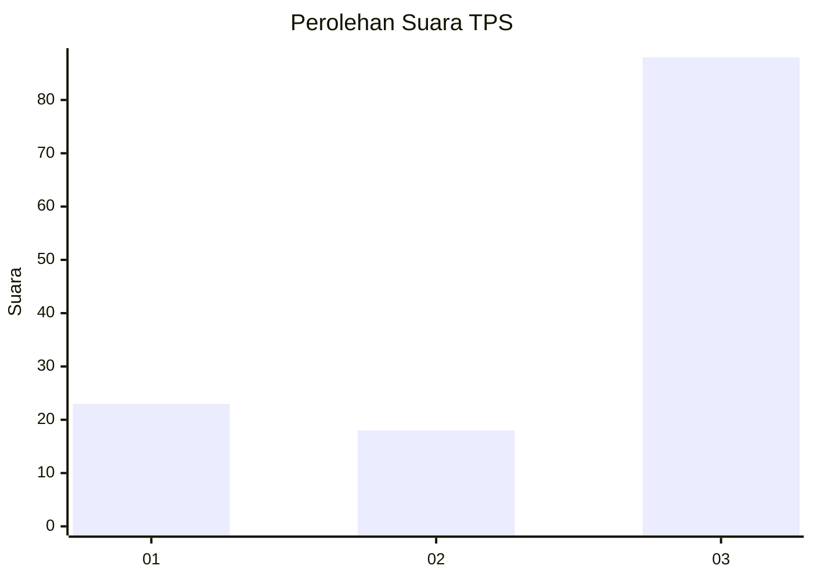
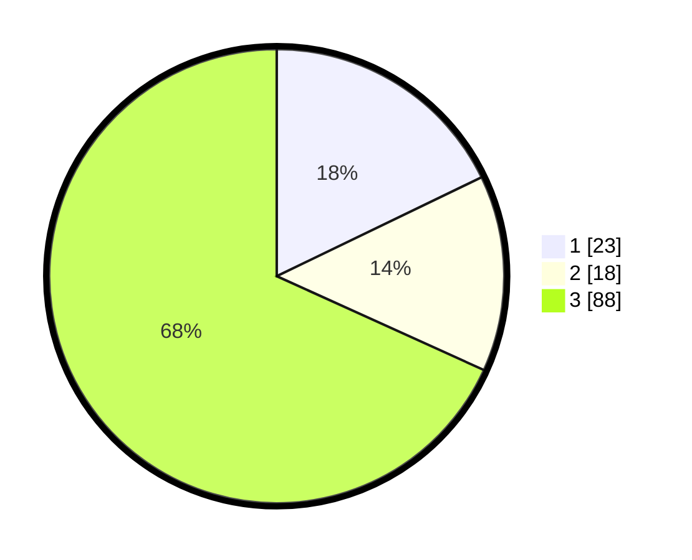

# Hasil

## Grafik

## Tabel

| No. | Nama Paslon    | Suara | Suara (raw) | Persentase |
|:--- |:-------------- | -----:| -----------:| ----------:|
| 1   | ANIES MUHAIMIN | 23    | [23][p-1]   | 17,83      |
| 2   | PRABOWO GIBRAN | 18    | [18][p-2]   | 13,95      |
| 3   | GANJAR MAHFUD  | 88    | [88][p-3]   | 68,22      |

[p-1]: https://github.com/gigit-pemilu/pemilu-2024/blob/main/pilpres/hitung-suara/sub/33-jawa-tengah/sub/07-wonosobo/sub/02-kepil/sub/1008-kepil/sub/012-tps/sub/paslon-1.txt
[p-2]: https://github.com/gigit-pemilu/pemilu-2024/blob/main/pilpres/hitung-suara/sub/33-jawa-tengah/sub/07-wonosobo/sub/02-kepil/sub/1008-kepil/sub/012-tps/sub/paslon-2.txt
[p-3]: https://github.com/gigit-pemilu/pemilu-2024/blob/main/pilpres/hitung-suara/sub/33-jawa-tengah/sub/07-wonosobo/sub/02-kepil/sub/1008-kepil/sub/012-tps/sub/paslon-3.txt

## Foto C Plano

https://sirekap-obj-formc.kpu.go.id/a7f0/pemilu/ppwp/33/07/02/10/08/3307021008012-20240214-220053--20342ccf-6257-4ae7-8bb1-fa29c7d2e1a3.jpg

https://sirekap-obj-formc.kpu.go.id/a7f0/pemilu/ppwp/33/07/02/10/08/3307021008012-20240214-225729--0bfb8937-5efc-41a9-8965-34446765958f.jpg

https://sirekap-obj-formc.kpu.go.id/a7f0/pemilu/ppwp/33/07/02/10/08/3307021008012-20240214-220203--a5ceb7aa-e950-496a-8a37-9fff19b90f7d.jpg

## Metadata

| Key        | Value               |
| ---------- | ------------------- |
| Time Stamp | 2024-02-15 12:00:28 |

