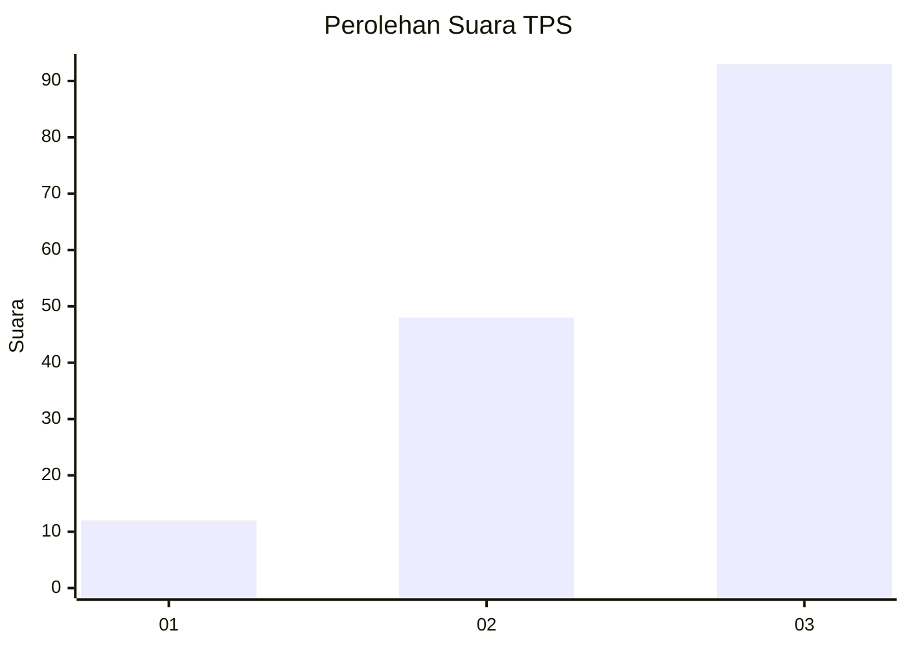
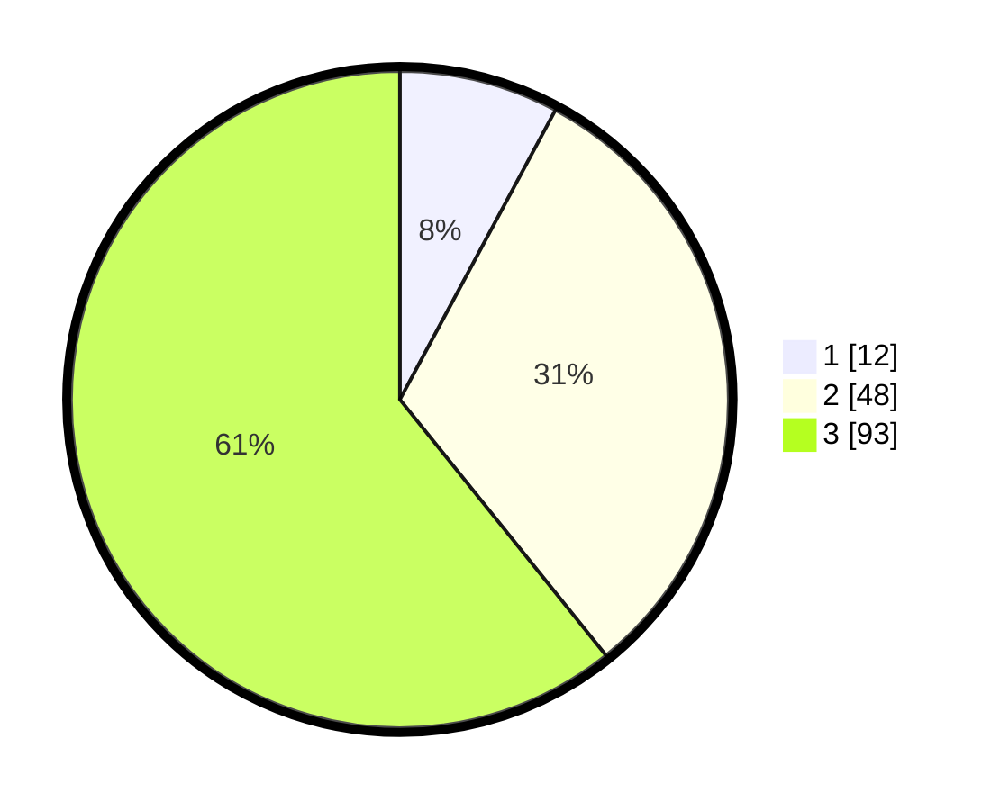

# Hasil

## Grafik

## Tabel

| No. | Nama Paslon    | Suara | Suara (raw) | Persentase |
|:--- |:-------------- | -----:| -----------:| ----------:|
| 1   | ANIES MUHAIMIN | 12    | [12][p-1]   | 7,84       |
| 2   | PRABOWO GIBRAN | 48    | [48][p-2]   | 31,37      |
| 3   | GANJAR MAHFUD  | 93    | [93][p-3]   | 60,78      |

[p-1]: https://github.com/gigit-pemilu/pemilu-2024-33-jawa-tengah/blob/main/pilpres/hitung-suara/sub/33-jawa-tengah/sub/07-wonosobo/sub/02-kepil/sub/1008-kepil/sub/014-tps/sub/paslon-1.txt
[p-2]: https://github.com/gigit-pemilu/pemilu-2024-33-jawa-tengah/blob/main/pilpres/hitung-suara/sub/33-jawa-tengah/sub/07-wonosobo/sub/02-kepil/sub/1008-kepil/sub/014-tps/sub/paslon-2.txt
[p-3]: https://github.com/gigit-pemilu/pemilu-2024-33-jawa-tengah/blob/main/pilpres/hitung-suara/sub/33-jawa-tengah/sub/07-wonosobo/sub/02-kepil/sub/1008-kepil/sub/014-tps/sub/paslon-3.txt

## Foto C Plano

https://sirekap-obj-formc.kpu.go.id/329d/pemilu/ppwp/33/07/02/10/08/3307021008014-20240215-012907--97525e94-acba-49da-8bc4-365ac806f5e5.jpg

https://sirekap-obj-formc.kpu.go.id/329d/pemilu/ppwp/33/07/02/10/08/3307021008014-20240215-013013--25d2e22e-6aa8-4956-9c4c-78989fec4706.jpg

https://sirekap-obj-formc.kpu.go.id/329d/pemilu/ppwp/33/07/02/10/08/3307021008014-20240215-013135--7eb63601-4102-4f3b-ae7e-3512be094e1b.jpg

## Metadata

| Key        | Value               |
| ---------- | ------------------- |
| Time Stamp | 2024-02-15 19:00:26 |

