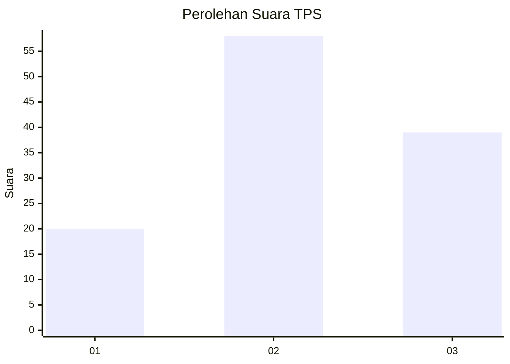
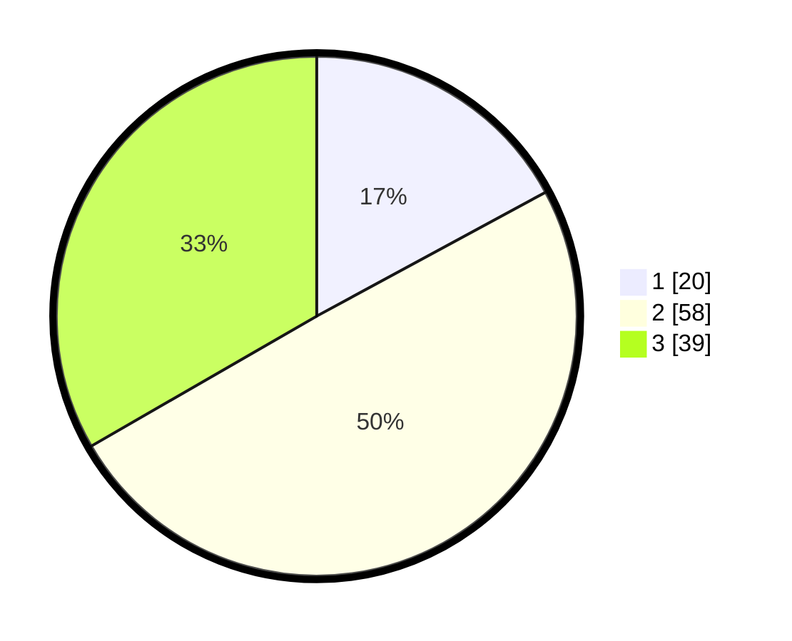

# Hasil

## Grafik

## Tabel

| No. | Nama Paslon    | Suara | Suara (raw) | Persentase |
|:--- |:-------------- | -----:| -----------:| ----------:|
| 1   | ANIES MUHAIMIN | 20    | [20][p-1]   | 17,09      |
| 2   | PRABOWO GIBRAN | 58    | [58][p-2]   | 49,57      |
| 3   | GANJAR MAHFUD  | 39    | [39][p-3]   | 33,33      |

[p-1]: https://github.com/gigit-pemilu/pemilu-2024/blob/main/pilpres/hitung-suara/sub/33-jawa-tengah/sub/07-wonosobo/sub/02-kepil/sub/1008-kepil/sub/022-tps/sub/paslon-1.txt
[p-2]: https://github.com/gigit-pemilu/pemilu-2024/blob/main/pilpres/hitung-suara/sub/33-jawa-tengah/sub/07-wonosobo/sub/02-kepil/sub/1008-kepil/sub/022-tps/sub/paslon-2.txt
[p-3]: https://github.com/gigit-pemilu/pemilu-2024/blob/main/pilpres/hitung-suara/sub/33-jawa-tengah/sub/07-wonosobo/sub/02-kepil/sub/1008-kepil/sub/022-tps/sub/paslon-3.txt

## Foto C Plano

https://sirekap-obj-formc.kpu.go.id/2438/pemilu/ppwp/33/07/02/10/08/3307021008022-20240214-214050--d1063d70-9b58-4241-8673-e437ceb28d35.jpg

https://sirekap-obj-formc.kpu.go.id/2438/pemilu/ppwp/33/07/02/10/08/3307021008022-20240214-214359--6186a68b-4d84-49b6-97f2-b0c6c77fc7ff.jpg

https://sirekap-obj-formc.kpu.go.id/2438/pemilu/ppwp/33/07/02/10/08/3307021008022-20240214-214542--7c1a7a52-23df-4447-a939-edf085dce137.jpg

## Metadata

| Key        | Value               |
| ---------- | ------------------- |
| Time Stamp | 2024-02-15 17:00:25 |

