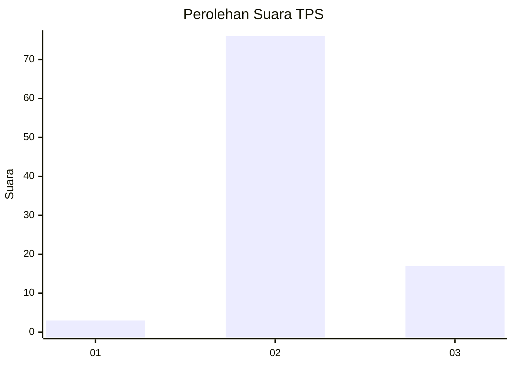
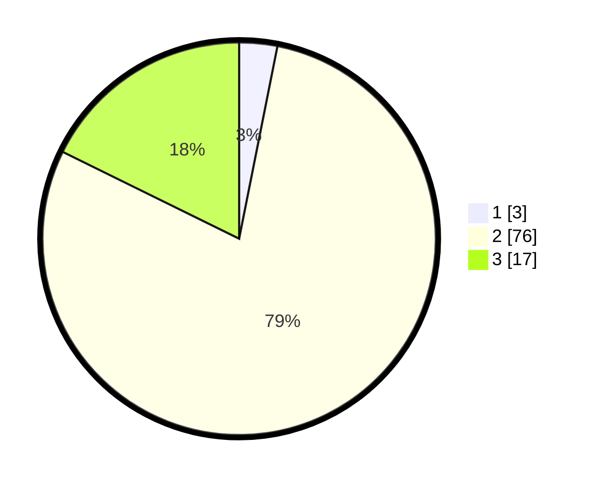

# Hasil

## Grafik

## Tabel

| No. | Nama Paslon    | Suara | Suara (raw) | Persentase |
|:--- |:-------------- | -----:| -----------:| ----------:|
| 1   | ANIES MUHAIMIN | 3     | [3][p-1]    | 3,13       |
| 2   | PRABOWO GIBRAN | 76    | [76][p-2]   | 79,17      |
| 3   | GANJAR MAHFUD  | 17    | [17][p-3]   | 17,71      |

[p-1]: https://github.com/gigit-pemilu/pemilu-2024/blob/main/pilpres/hitung-suara/sub/33-jawa-tengah/sub/07-wonosobo/sub/02-kepil/sub/2001-gondowulan/sub/001-tps/sub/paslon-1.txt
[p-2]: https://github.com/gigit-pemilu/pemilu-2024/blob/main/pilpres/hitung-suara/sub/33-jawa-tengah/sub/07-wonosobo/sub/02-kepil/sub/2001-gondowulan/sub/001-tps/sub/paslon-2.txt
[p-3]: https://github.com/gigit-pemilu/pemilu-2024/blob/main/pilpres/hitung-suara/sub/33-jawa-tengah/sub/07-wonosobo/sub/02-kepil/sub/2001-gondowulan/sub/001-tps/sub/paslon-3.txt

## Foto C Plano

https://sirekap-obj-formc.kpu.go.id/14b9/pemilu/ppwp/33/07/02/20/01/3307022001001-20240214-203532--805e6cf5-63b1-4c77-944b-f5a1ce3d5dcc.jpg

https://sirekap-obj-formc.kpu.go.id/14b9/pemilu/ppwp/33/07/02/20/01/3307022001001-20240214-203302--03a7f37e-a0ad-4871-814c-10ac26f3d6b8.jpg

https://sirekap-obj-formc.kpu.go.id/14b9/pemilu/ppwp/33/07/02/20/01/3307022001001-20240214-202827--183d7b74-69cf-4c63-839b-cc332aa051d2.jpg

## Metadata

| Key        | Value               |
| ---------- | ------------------- |
| Time Stamp | 2024-02-15 12:00:28 |

