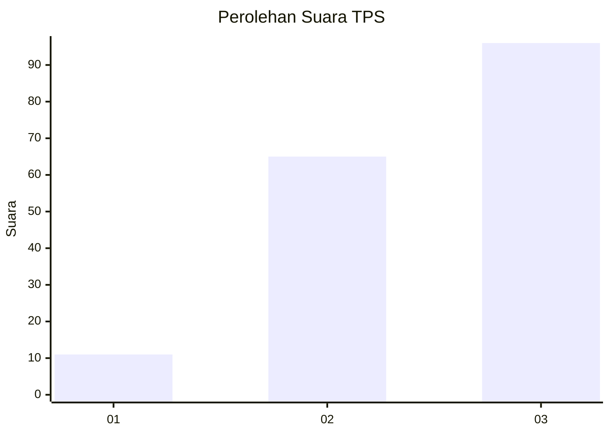
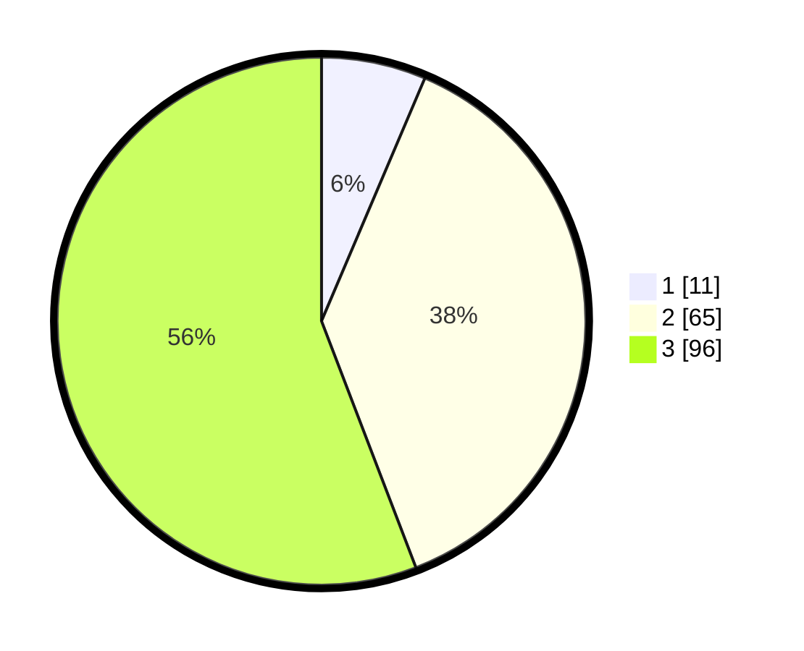

# Hasil

## Grafik

## Tabel

| No. | Nama Paslon    | Suara | Suara (raw) | Persentase |
|:--- |:-------------- | -----:| -----------:| ----------:|
| 1   | ANIES MUHAIMIN | 11    | [11][p-1]   | 6,40       |
| 2   | PRABOWO GIBRAN | 65    | [65][p-2]   | 37,79      |
| 3   | GANJAR MAHFUD  | 96    | [96][p-3]   | 55,81      |

[p-1]: https://github.com/gigit-pemilu/pemilu-2024-33-jawa-tengah/blob/main/pilpres/hitung-suara/sub/33-jawa-tengah/sub/07-wonosobo/sub/02-kepil/sub/2002-jangkrikan/sub/003-tps/sub/paslon-1.txt
[p-2]: https://github.com/gigit-pemilu/pemilu-2024-33-jawa-tengah/blob/main/pilpres/hitung-suara/sub/33-jawa-tengah/sub/07-wonosobo/sub/02-kepil/sub/2002-jangkrikan/sub/003-tps/sub/paslon-2.txt
[p-3]: https://github.com/gigit-pemilu/pemilu-2024-33-jawa-tengah/blob/main/pilpres/hitung-suara/sub/33-jawa-tengah/sub/07-wonosobo/sub/02-kepil/sub/2002-jangkrikan/sub/003-tps/sub/paslon-3.txt

## Foto C Plano

https://sirekap-obj-formc.kpu.go.id/ec97/pemilu/ppwp/33/07/02/20/02/3307022002003-20240214-224729--4b9eb7fd-42af-475c-b35f-0c1c3254d00a.jpg

https://sirekap-obj-formc.kpu.go.id/ec97/pemilu/ppwp/33/07/02/20/02/3307022002003-20240214-141458--f70b772b-5b0d-4412-95e9-71f18fa1d322.jpg

https://sirekap-obj-formc.kpu.go.id/ec97/pemilu/ppwp/33/07/02/20/02/3307022002003-20240214-141755--dcfc01d6-7fcc-4383-a99f-42aa6cab894c.jpg

## Metadata

| Key        | Value               |
| ---------- | ------------------- |
| Time Stamp | 2024-02-15 15:00:29 |

