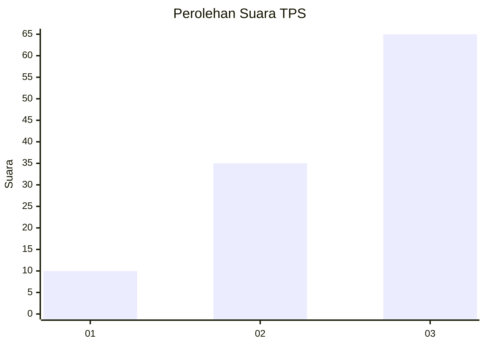
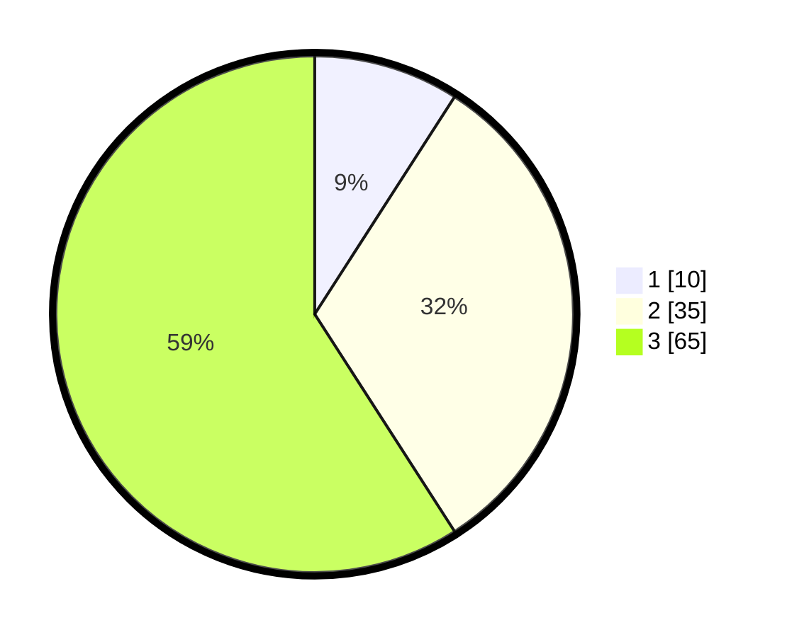

# Hasil

## Grafik

## Tabel

| No. | Nama Paslon    | Suara | Suara (raw) | Persentase |
|:--- |:-------------- | -----:| -----------:| ----------:|
| 1   | ANIES MUHAIMIN | 10    | [10][p-1]   | 9,09       |
| 2   | PRABOWO GIBRAN | 35    | [35][p-2]   | 31,82      |
| 3   | GANJAR MAHFUD  | 65    | [65][p-3]   | 59,09      |

[p-1]: https://github.com/gigit-pemilu/pemilu-2024-33-jawa-tengah/blob/main/pilpres/hitung-suara/sub/33-jawa-tengah/sub/07-wonosobo/sub/02-kepil/sub/2002-jangkrikan/sub/008-tps/sub/paslon-1.txt
[p-2]: https://github.com/gigit-pemilu/pemilu-2024-33-jawa-tengah/blob/main/pilpres/hitung-suara/sub/33-jawa-tengah/sub/07-wonosobo/sub/02-kepil/sub/2002-jangkrikan/sub/008-tps/sub/paslon-2.txt
[p-3]: https://github.com/gigit-pemilu/pemilu-2024-33-jawa-tengah/blob/main/pilpres/hitung-suara/sub/33-jawa-tengah/sub/07-wonosobo/sub/02-kepil/sub/2002-jangkrikan/sub/008-tps/sub/paslon-3.txt

## Foto C Plano

https://sirekap-obj-formc.kpu.go.id/a547/pemilu/ppwp/33/07/02/20/02/3307022002008-20240214-220857--45409f28-3d11-4dc0-a155-762ef0b4b950.jpg

https://sirekap-obj-formc.kpu.go.id/a547/pemilu/ppwp/33/07/02/20/02/3307022002008-20240214-220910--3a03cf69-ebf3-4d6c-9170-c391d92a0860.jpg

https://sirekap-obj-formc.kpu.go.id/a547/pemilu/ppwp/33/07/02/20/02/3307022002008-20240215-003257--2b4f4fca-b9d7-4bd2-981b-2aaebe227bcf.jpg

## Metadata

| Key        | Value               |
| ---------- | ------------------- |
| Time Stamp | 2024-02-24 22:31:28 |

