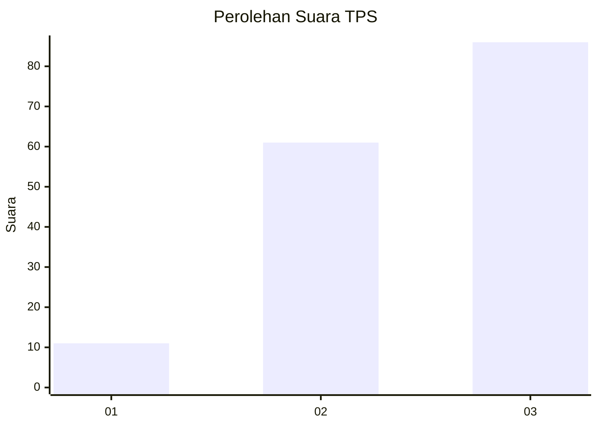
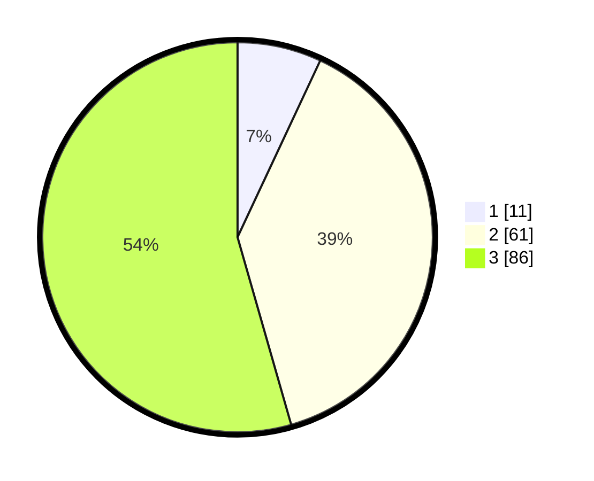

# Hasil

## Grafik

## Tabel

| No. | Nama Paslon    | Suara | Suara (raw) | Persentase |
|:--- |:-------------- | -----:| -----------:| ----------:|
| 1   | ANIES MUHAIMIN | 11    | [11][p-1]   | 6,96       |
| 2   | PRABOWO GIBRAN | 61    | [61][p-2]   | 38,61      |
| 3   | GANJAR MAHFUD  | 86    | [86][p-3]   | 54,43      |

[p-1]: https://github.com/gigit-pemilu/pemilu-2024-33-jawa-tengah/blob/main/pilpres/hitung-suara/sub/33-jawa-tengah/sub/07-wonosobo/sub/02-kepil/sub/2003-tegeswetan/sub/003-tps/sub/paslon-1.txt
[p-2]: https://github.com/gigit-pemilu/pemilu-2024-33-jawa-tengah/blob/main/pilpres/hitung-suara/sub/33-jawa-tengah/sub/07-wonosobo/sub/02-kepil/sub/2003-tegeswetan/sub/003-tps/sub/paslon-2.txt
[p-3]: https://github.com/gigit-pemilu/pemilu-2024-33-jawa-tengah/blob/main/pilpres/hitung-suara/sub/33-jawa-tengah/sub/07-wonosobo/sub/02-kepil/sub/2003-tegeswetan/sub/003-tps/sub/paslon-3.txt

## Foto C Plano

https://sirekap-obj-formc.kpu.go.id/2100/pemilu/ppwp/33/07/02/20/03/3307022003003-20240217-110158--20286540-307a-46ca-b1f7-42769defdfad.jpg

https://sirekap-obj-formc.kpu.go.id/2100/pemilu/ppwp/33/07/02/20/03/3307022003003-20240217-110727--6e5e3819-683c-4bee-9774-e16e9a15e0d4.jpg

https://sirekap-obj-formc.kpu.go.id/2100/pemilu/ppwp/33/07/02/20/03/3307022003003-20240215-021225--37014e6e-4f67-4843-ad9a-879887276565.jpg

## Metadata

| Key        | Value               |
| ---------- | ------------------- |
| Time Stamp | 2024-02-17 13:37:34 |

